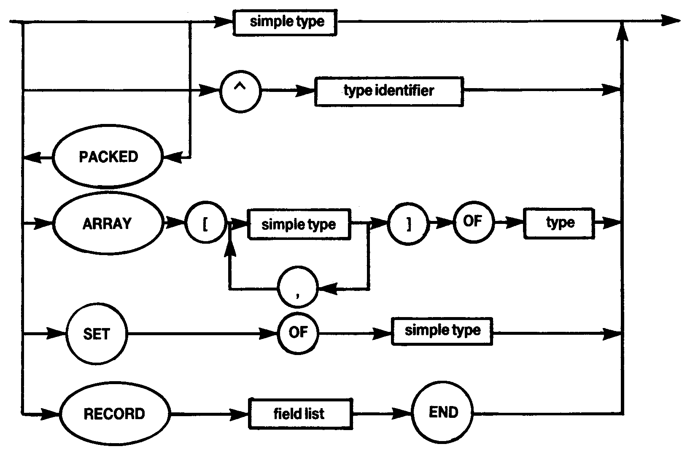

# 1.7 TYPE



The reserved work **PACKED** is accepted but ignored since packing already takes place for arrays of characters etc. The only case in which the packing of arrays would be advantageous is with an array of Booleans — but this is more naturally expressed as a set when packing is required.

## 1.7.1 ARRAYs and SETs

The base type of a set may have up to **256** elements. This enables **SET**s of **CHAR** to be declared together with **SET**s of any user enumerated type. Note, however, that only subranges of integers can be used as base types. All subsets of integers are treated as sets of **0..255**.

Full arrays of arrays, arrays of sets, records of sets etc. are supported.

Two **ARRAY** types are only treated as equivalent if their definition stems from the same use of the reserved word **ARRAY**. Thus the following types are not equivalent:

```
TYPE
	tablea = ARRAY[1..100] OF INTEGER;
	tableb = ARRAY[1..100] OF INTEGER;
```

So a variable of type **tablea** may not be assigned to a variable of type **tableb**. This enables mistakes to be detected such as assigning two tables representing different data. The above restriction does not hold for the special case of arrays of a string type, since arrays of this type are always used to represent similar data.

## 1.7.2 POINTERS

HiSoft Pascal allows the creation of dynamic variables through the use of the Standard Procedure **NEW** (see [Section 2]()). A dynamic variable, unlike a static variable which has memory space allocated for it throughout the block in which it is declared, cannot be referenced directly through an identifier since it does not have an identifier; instead a pointer variable is used. This pointer variable, which is a static variable, contains the address of the dynamic variable and the dynamic variable itself is accessed by including a '**^**' after the pointer variable. Examples of the use of pointer types can be studied in [Appendix 4](man_a4-examples.md).

There are some restrictions on the use of pointers within HiSoft Pascal. These are as follows:

Pointers to types that have not been declared are not allowed. This does not prevent the construction of linked list structures since type definitions may contain pointers to themselves e.g.

```
TYPE
	item=RECORD
		value:INTEGER;
		next:^item
	END;
	link=^item;
```

Pointers to pointers and pointers to files are both not allowed.

Pointers to the same type are regarded as equivalent e.g.

```
VAR
	first:link;
	current:^item;
```

The variables **first** and **current** are equivalent (i.e. structural equivalence is used) and may be assigned to each other or compared.

The predefined constant **NIL** is supported and when this is assigned to a pointer variable then the pointer variable is deemed to contain no address.

## 1.7.3 RECORDs

The implementation of **RECORD**s, structured variables composed of a fixed number of constituents called fields, within HiSoft Pascal is as Standard Pascal except that the variant part of the field list is not supported.

Two **RECORD** types are only treated as equivalent if their declaration stems from the same occurrence of the reserved word **RECORD** see Section 1.7.1 above.

The **WITH** statement may be used to access the different fields within a record in a more compact form.

See [Appendix 4](man_a4-examples.md) for an example of the use of **WITH** and **RECORD**s in general.
