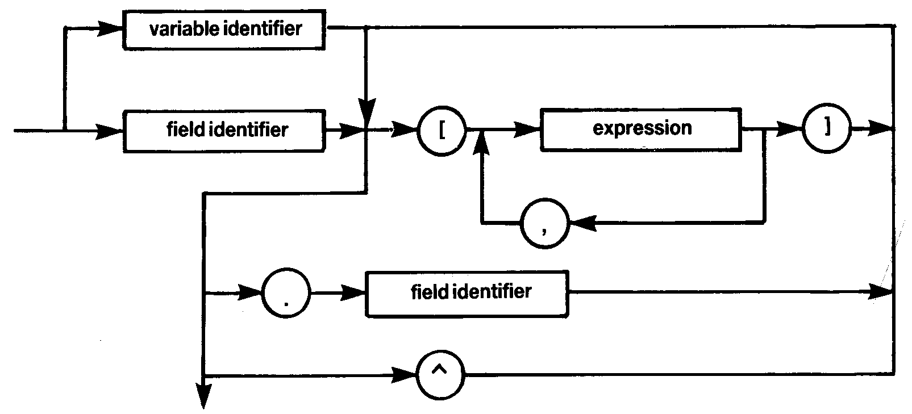

# 1.9 VARIABLE



Two kinds of variables are supported within HiSoft Pascal; static and dynamic variables. Static variables are explicitly declared through **VAR** and memory is allocated for them during the entire execution of the block in which they were declared.

Dynamic variables, however, are created dynamically during program execution by the procedure **NEW**. They are not declared explicitly and cannot be referenced by an identifier. They are referenced indirectly by a static variable of type pointer, which contains the address of the dynamic variable.

See [Section 1.7.2](man_s1-7-type.md) and [Section 2](man_s2-0-index.md) for more details of the use of dynamic variables and [Appendix 4](man_a4-examples.md) for an example.

When specifying elements of multi-dimensional arrays the programmer is not forced to use the same form of index specification in the reference as was used in the declaration.

e.g. if variable a is declared as:

```
ARRAY[1..10] OF ARRAY[1..10] OF INTEGER
```
then either `a[1][1]` or `a[1,1]` may be used to access element **(1,1)** of the array.
