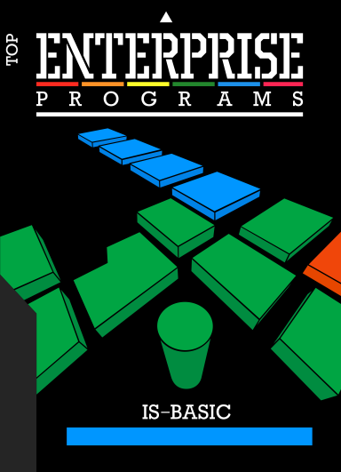

# IS-Basic

 
 

Розробник: [Intelligent Software Ltd.](../companies/intelligent-sofware-ltd.md)  
Автори: [Bruce Tanner](../peoples/ec-uk/pers_bruce-tanner.md) та [Mike Johnson](../peoples/ec-uk/pers_mike-johnson.md) (рання версія написана на С) 

----

[IS-Basic Programming Manual](../manuals/pr-is-basic-manual-en.md)  

 - [список операторів](../manuals/is-basic-man-en/man_3-commands.md)
 - [список системних опцій](../manuals/is-basic-man-en/man_3-moptions.md)
 - [список відеоопцій](../manuals/is-basic-man-en/man_3-vidoptions.md)
 - [список опцій звуку](../manuals/is-basic-man-en/man_3-souoptions.md)
 - [список функцій](../manuals/is-basic-man-en/man_3-functs.md)

## Компілятори

[Zzzip Integer Compiler](zzzip-compiler.md)  

## Додаткова технічна інформація

[Introduction to Extensions](http://enterprise.iko.hu/technical/BOOK16-1_Chapter_16_IS-BASIC_Introduction_to_Extensions.pdf)  
[Data Structures](http://enterprise.iko.hu/technical/BOOK16-1_Chapter_17_IS-BASIC_Data_Structures.pdf)  
[Statement Extensions](http://enterprise.iko.hu/technical/BOOK18-1_Chapter_18_IS-BASIC_Statement_Extensions.pdf)  
[Function Extensions](http://enterprise.iko.hu/technical/BOOK19-1_Chapter_19_IS-BASIC_Function_Extensions.pdf)  
[Variables](http://enterprise.iko.hu/technical/BOOK20-1_Chapter_20_IS-BASIC_Variables.pdf)  
[System Calls](http://enterprise.iko.hu/technical/BOOK21-1_Chapter_21_IS-BASIC_System_Calls.pdf)  

## Розширення команд Бейсіка

Розширення команд дозволяють додавати нові команди до інтерпретатора мови IS-Basic.

Їх можна використовувати у будь-якій комбінації (використовуючи лише потрібні). Проте основним недоліком є те, що коли виникає потреба завантажити або виконати програму, написану з використанням розширень, спочатку необхідно завантажити ці розширення, і, що особливо важливо, дотримуючись того самого порядку, в якому вони були завантажені під час процесу створення програми.

[BoxSoft extensions](is-basic/ext-boxsoft.md)  
[EnterSprite](is-basic/ext_entersprite.md)  
Windows  
Mem  
BasMon  
Ellenor  

