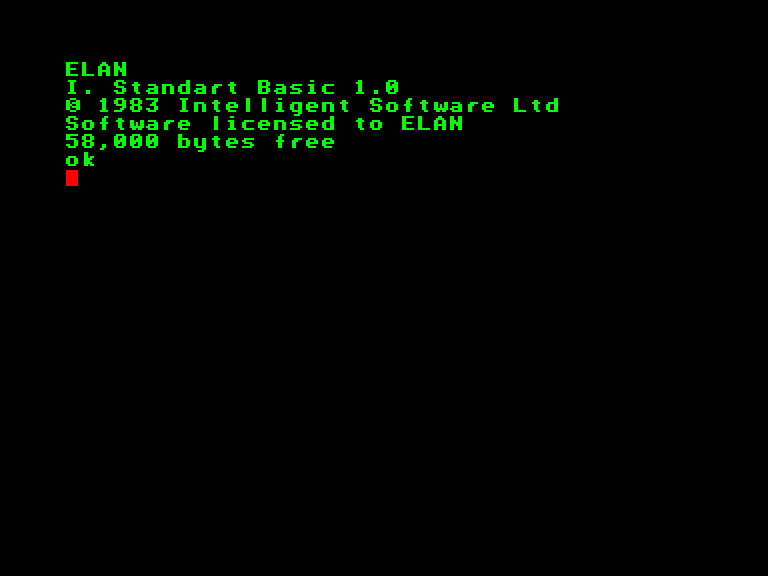
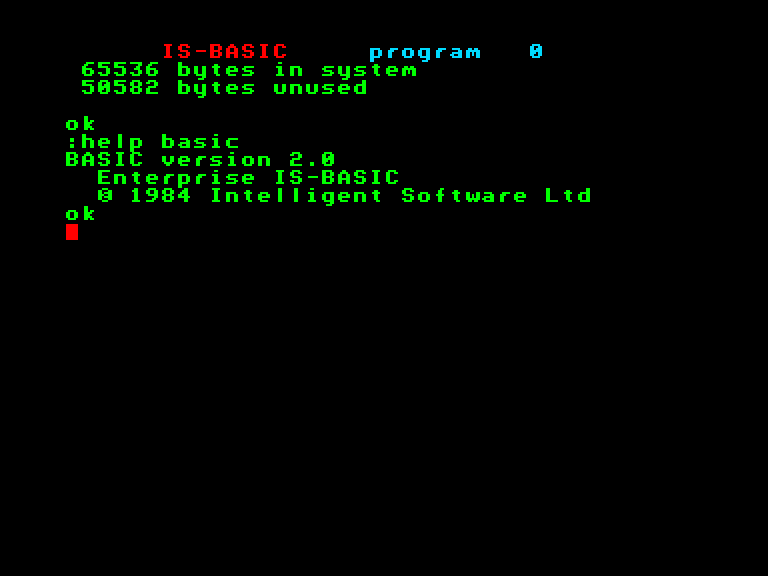
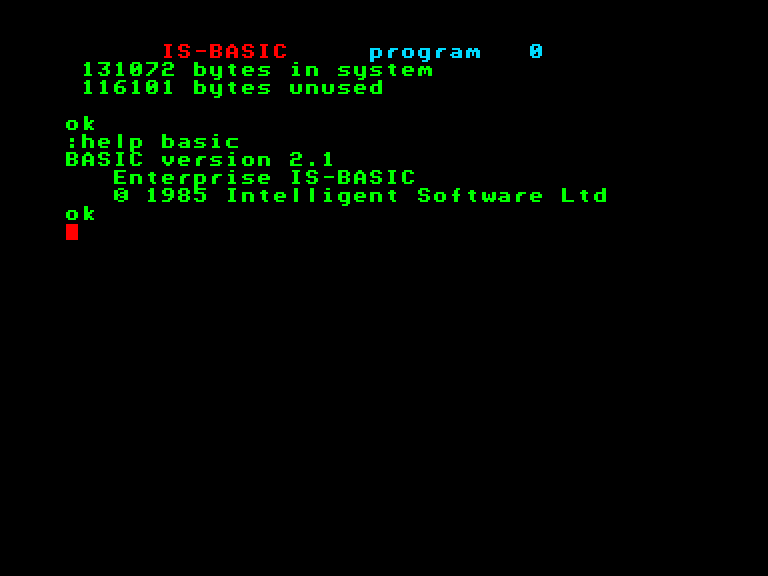

# Версії Бейсіку та історичні подробиці

З початку розробки IS-Basic за планом повинен був бути розміщеним разом з EXOS у внутрішній 32-кілобайтній ПЗП комп'ютера. Але згодом із розширенням функціоналу як системи, так і інтерпретатора  його винесли у картрідж (але у внутрішній ПЗП всеодно лишились деякі частини що відносяться до Бейсіку).

 <i>приблизний вигляд предрелізной версії системи</i>

Разом із "переїздом" інтерпретатора у картрідж, було вилучений або змінений деякий функціонал:

 - **SET BYTE** та **ASK BYTE** повинні були виконувати функціонал **POKE**/**PEEK**. Але в результаті лишились звичні [POKE](../../manuals/is-basic-man-en/commands/man_cs-poke.md) та [PEEK](../../manuals/is-basic-man-en/functions/man_fn-peek.md).
- **SET PIXEL SIZE** - вилучено (можливо відповідала за вибір типу графічних режимів HIRES/LORES).
- **SET CHARACTER SIZE** - вилучено (можливо відповідала за висоту символа або масштабування виводу символів на графічних сторінках).
- **SET BYTE\$**, **SET CAPTURE**, **SET ECHO**, **SET IO**, **SET BACKGROUND COLOR**, **SET CHAR\$**, **SET CHARSET FROM**, **SET CHARACTER HEIGHT**, **SET DESK**, **SET FLASHING**, **SET PAGE SIZE** - видалені або змінили назву.
- **PICTURE** та **MUSIC** - вилучено ("*The Picture function allows a group of graphics statements to be defined and then called from within a program. Music does much the same for sound statements.*")
- **FILL**, **CIRCLE**, **OVAL** - із зміною назви увійшли до команди [PLOT](../../manuals/is-basic-man-en/commands/man_cs-plot.md). **CIRCLE** та **OVAL** були об'єднані під назвою **ELLIPSE**, а **FILL** стала **PAINT**.
- **COLOUR** та **COLOR** - змінили назву на [RGB](../../manuals/is-basic-man-en/functions/man_fn-rgb.md).
- **PLAY**, **PITCH**, **VOLUME** увійшли до складу команди [SOUND](../../manuals/is-basic-man-en/commands/man_cs-sound.md).
- **BANG**, **BEEP**, **BOOM**, **POP**, **SPLAT**, **ZAP** - вилучені: лишилась лише [PING](../../manuals/is-basic-man-en/commands/man_cs-ping.md). Подібні команди можна зустріти у Бейсіках комп'ютерів Oric та SAM Coupé.
- **TUNE** - вилучена ("*The TUNE function provides a macro-language music control*").
- Вилучені додаткові налаштування огинаючої (типу **PIANO** та **VIOLIN**).
- **DEBUG** - скоріш за все змінена на [TRACE](../../manuals/is-basic-man-en/commands/man_cs-trace.md).
- **DESK**, **BREAK**, **DECLARE**, **EXEC**, **GRAPHIC CLEAR**, **GRAPHIC PRINT**, **HELLO**, **PICTURE**, **RESET**, **TABLE**, **VIDEO INPUT**, **VIDEO PRINT**,   - видалені або змінили назву.
- функції **BCHR\$**, **EVAL**, **LSHIFT\$**, **RSHIFT\$** - видалені або змінили назву.
- команди **COPY** / **ECHO** для редагування звичайного тексту вилучені та замість них був створений окремий текстовий процесор [WP](../../software/st-wp.md). ("*To print the whole document, use the COPY command available on a function key. To make the printer work automatically at the end of each paragraph, use the ECHO command also available оп а function key.*")

## Версія 2.0

Використовується у стокових моделях Enterprise 64.

Має деякі особливості з використанням команди [ALLOCATE](../../manuals/is-basic-man-en/commands/man_cs-allocate.md).

## Beрсія 2.1

Поточна версія інтерпретатора, яка входить у комплект із Enterprise 128.

Інтерпретатор що входить до складу EXOS 2.4 має незначні виправлення помилок.

----

Поточну версію інтерпретатора можна взнати за допомогою наступних команд:

`:help basic`

`print ver$` ([детальніше](../../manuals/is-basic-man-en/functions/man_fn-ver.md))

`print vernum` ([детальніше](../../manuals/is-basic-man-en/functions/man_fn-vernum.md))
