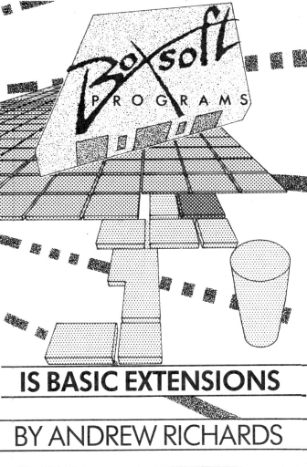

# BoxSoft extensions

 

Видавець: [BoxSoft](../../companies/boxsoft.md)  
Автор: [Andrew Richards](../../peoples/pers_andrew-richards.md)    
Рік: 1987  

(ці розширення також інтегровані у картрідж [Enterprise Plus](../../hardware/cartridge/enterprise-plus.md))

 - BASX_A (асемблерні вставки)
 - BASX_C (робота з шрифтами)
 - BASX_G (загальні функції)
 - BASX_M (функції для меню)
 - BASX_S (програмні спрайти)

[HU info](https://ep128.hu/Ep_Util/BASIC_Extensions.htm)

Manual
