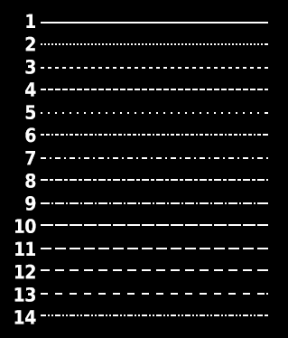

# LINE STYLE

`SET £chan:LINE STYLE parameter`

The current line-style may be set to any value in the range **1**-**14**, enabling various types of broken line to be plotted. Channel number defaults to **£101**.

