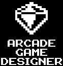

# MPAGD (Multi-Platform Arcade Game Designer)

Автор: Jonathan Cauldwell

> Ця програма є зручним у використанні інструментом для створення ігор для 8-бітних комп'ютерів. Серед підтримуваних платформ: ZX Spectrum, MSX, Amstrad CPC, BBC Model B, Dragon 32/64, Acorn Atom, Enterprise та VZ200, причому цей перелік постійно розширюється.
> 
> Можна створювати блоки, спрайти та екрани. Введення коду здійснюється за допомогою простої скриптової мови, що базується на BASIC, або через використання вбудованого генератора скриптів. Це дозволяє створювати швидкі та плавні 8-бітні ігри, які за якістю не поступатимуться оригінальним розробкам минулого.
> 
> Достатньо натиснути одну клавішу, і MPAGD збере ваш проєкт, автоматично запустить емулятор та завантажить гру для негайного тестування. Попередній досвід програмування не є обов'язковим: це ефективний засіб для самостійного вивчення кодування або для навчання дітей.
 
Проекти для Ентерпрайзу створюються на базі проектів для Спектрума (можна навіть оригінальний проект для ZX Spectrum без змін зібрати у готову програму що можна запустити на Enterprise). 

[Сторінка проекту](https://jonathan-cauldwell.itch.io/multi-platform-arcade-game-designer)

[Форум](https://arcadegamedesigner.proboards.com)
