# Приклади впливу бітів ALTINDx на вивід текстових даних

Для спрощення використовується наступна палітра кольорів

Кількість символів залежить від текстового режиму, а кількість колірних пар (та іх "розміщення") залежить від бітів **ALTINDx**.

|             | ALTIND1 = 0 |     ALTIND1 = 1      |
| ----------- |:-----------:|:--------------------:|
| ALTIND0 = 0 |    (0,1)    |      (0,1)(2,3)      |
| ALTIND0 = 1 | (0,1)(4,5)  | (0,1)(4,5)(2,3)(6,7) |

EXOS використовує апаратний текстовий режим лише такий: **CH128**; **ALTIND0** = **0**; **ALTIND1** = **1**. Тобто 128-байтовий шрифт з двома колірними парами (0,1)+(2,3)

На прикладах використано шрифт узятий з ПК.

## CH64

| ALTIND0 = 0; ALTIND1 = 0 | ALTIND0 = 0; ALTIND1 = 1 |
|:------------------------:|:------------------------:|
|  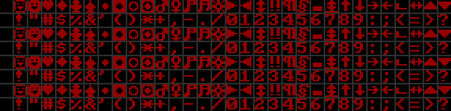  |  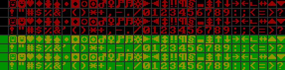  |

| ALTIND0 = 1; ALTIND1 = 0 | ALTIND0 = 1; ALTIND1 = 1 |
|:------------------------:|:------------------------:|
|  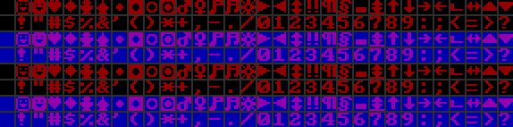  |  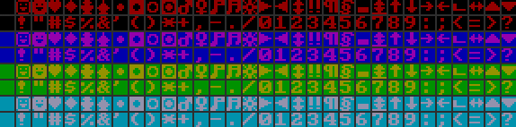  |

## CH128

| ALTIND0 = 0; ALTIND1 = 0 | ALTIND0 = 0; ALTIND1 = 1 EXOS |
|:------------------------:|:-------------------------------------------------:|
| 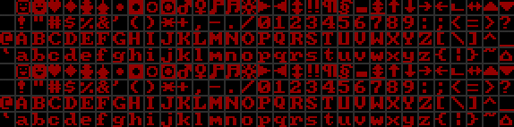  |              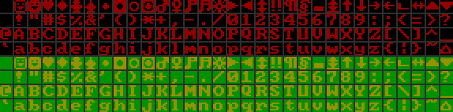              |

| ALTIND0 = 1; ALTIND1 = 0 | ALTIND0 = 1; ALTIND1 = 1 |
|:------------------------:|:------------------------:|
| 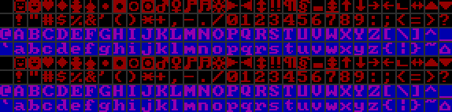  | 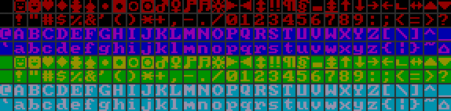  |

## CH256

| ALTIND0 = 0; ALTIND1 = 0 | ALTIND0 = 0; ALTIND1 = 1 |
|:------------------------:|:------------------------:|
| 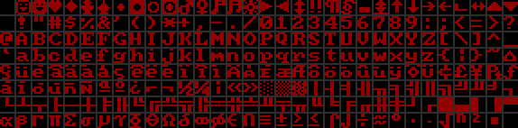  | 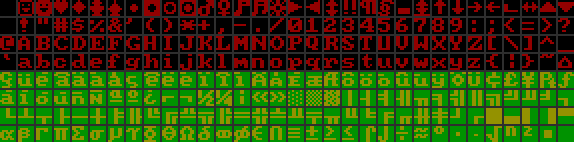  |

| ALTIND0 = 1; ALTIND1 = 0 | ALTIND0 = 1; ALTIND1 = 1 |
|:------------------------:|:------------------------:|
| 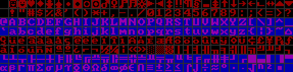  | 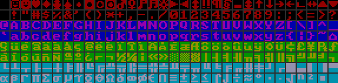  |

