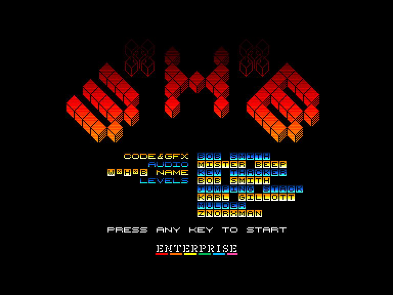
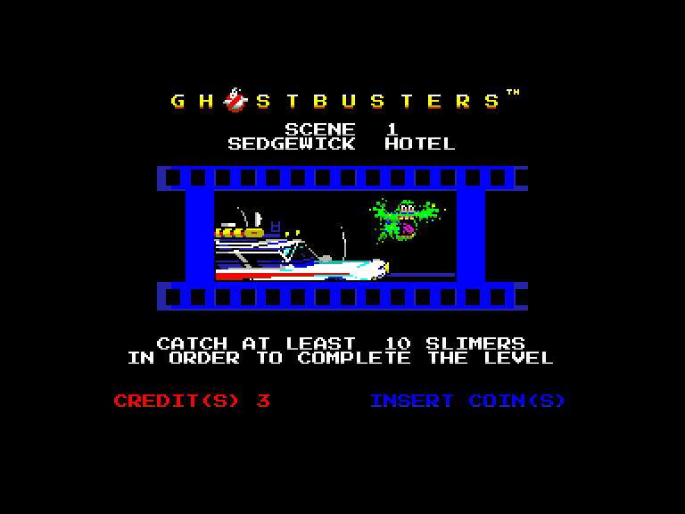

# Заготовки для програм

## Приклад програми з 4-колірним відеорежимом

- Визначення макросу системного виклику EXOS.
- Визначення стандартного заголовка файлу EXOS.
- Резервування сегментів відеопам'яті через EXOS.
- Резервування сегментів пам'яті через EXOS.
- Підпрограма коректного виходу з програми.
- Деякі налаштування для старту.
- Визначення таблиці [LPT](../system-info/nick/lpt.md) для 4-колірного екрана 320×200.

[sample4c.asm](sample4c.asm)

 - lines 12-16: [EP program header](../tips-hints/fileformats/fmt_exe5-app.md) - 2nd byte should be 5, this means machine code application program, 3rd-4th byte is the length of the file (without header).  
 - lines 22-23: Store soft reset routine - this should be done on **FF** segment at address **3ff8h**  
 - lines 128-160: Soft reset routine (exit routine) - this should be on page **0**, at the bottom there is a shorter soft reset routine by IstvánV  
 - lines 33-34: Speed up EP -  disable memory wait states, EP programs will run at 4MHz in normal RAM  
 - lines 164-185: Allocate video segment  
 - lines 50-55: Calculate Nick address of video segment (screen)  
 - lines 58-60: Calculate nick address of LPT  
 - lines 61-63: get a free segment  
 - lines 78-81: copy LPT  
 - lines 83-94: set LPT addr to Nick 82-83h registers - after this the new screen is activated
 - lines 103-110: visible example for keyboard handling 
 - lines 112-124: EP keyboard matrice  
 - lines 196-226: Sample LPT table (320×200 4 colour) generate video syncron signal - line 209-226  
  
  
```
exit    di  
        ld      sp,0100h  
        ld      a,0ffh  
        out     (0b2h),a  
        ld      c,40h  
        exos    0  
        ld      a,01h  
        out     (0b3h), a  
        ld      a,06h  
        jp      0c00dh
```

## Приклад лоадера для порта зі Спектрума (Geco)

Завантажувач створює екран з атрибутним режимом та "градієнтною" палітрою для різних ліній екрану.

<div style="text-align:center;">
</div>

[zxloader_geco.rar](zxloader_geco.rar)

## Приклад лоадера для порта зі Спектрума (ZozoSoft)

Ще один варіант завантажувача з опціональним стисненням екрану та кодового блоку.

[zxloader-zozo.rar](zxloader-zozo.rar)

## Приклад лоадера для MLT-файлів (формат відеорежима 2 (Mode 2) SAM Coupé)

<div style="text-align:center;">
</div>

В прикладі лоадера налаштовується екран схожий потрібний та таблично конвертуються кольори атрибутів. Кольори з bright -> 0-7, а без брайту -> 8-15 (BIAS). 

[mltload2.rar](mltload2.rar)


