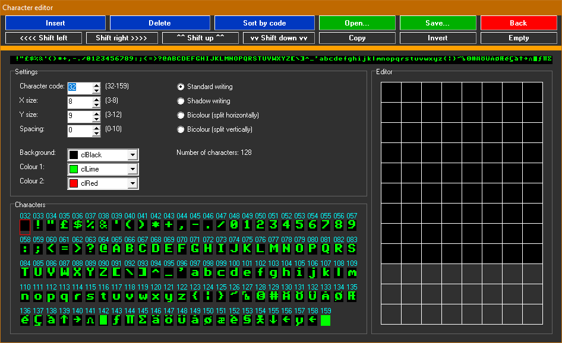

# Текстові шрифти 8×9 та робота з ними

## Шрифти що використовуються EXOS

[info_characters](../exos-info/info_characters.md)

Змінені шрифти використовуються усіма відеосторінками одночасно.

## Формати файлів для зберігання шрифтів

[fmt_fnt-epfnt](fileformats/fmt_fnt-epfnt.md)


## Зміна символу

### IS-Basic
Команда [SET CHARACTER](../is-basic_man-en/man_vo-character.md) змінює символ шрифта.

Команда [CLEAR FONT](../is-basic_man-en/man_cs-clear.md) повертає усі символи до початкових.

### HiSoft Pascal
Процедура [Character](../hisoft-pascal-hpu/grafcs.hpu.md) з бібліотеки GRAFCS.HPU / TEXTVID.HPU змінює символ шрифта.

Процедура [ClearFont](../hisoft-pascal-hpu/textvid.hpu.md) з бібліотеки TEXTVID.HPU повертає усі символи до початкового стану.

## Завантаження символів із зовнішнього файлу
### Завантаження FNT-файлів (1152 байтів)
#### IS-Basic
```
130 ALLOCATE 11
140 CODE TOLT=HEX$("3E,6A,01,80,04")
150 CODE =HEX$("11,80,B4,F7,06,C9")
160 OPEN #106:"HFONT.FNT"
170 CALL USR(TOLT,0)
180 CLOSE #106
```
### Завантаження файлів з символами у esc-послідовностях (від 12 до 1536 байтів)

Створити esc-файл можливо за допомогою простої програми на Бейсіку:
```
5 OPEN #1:"ESCFNT.BIN" ACCESS OUTPUT

10 SET #1:CHARACTER 32,2,63,63,1,6,0,0,1,102

100 CLOSE #1
```

#### IS-Basic
```
100 OPEN #1:"ESCFONT.BIN" ACCESS INPUT
110 COPY FROM #1 TO #102
120 CLOSE #1
```
#### HiSoft Pascal
```
tin('ESCFONT.BIN', addr(compmap));   {завантаження файлу у пам'ять (тимчасово можна використати масив змінних необхідного розміру)}
ra:=chr(140);                         {заносимо номер відкритого текстового каналу у RA}
rde:=addr(compmap);                   {заносимо адресу початку даних у RDE}
rbc:=1536;                            {заносимо кількість даних (розмір файлу) у RBC}
Exos(8);                              {виконуємо функцію EXOS 8 (записати дані у канал)}
```
## Програми редагування шрифтів

### CHR2012 (EP)


([детальний опис](../../software/su-chr2012.md))

Вміє завантажувати [FNT](fileformats/fmt_fnt-epfnt.md)-файли, редагувати та зберігати шрифти як у форматі програми BASIC так і у ті ж самі FNT-файли.

### EP128Pal (Win32)


Конвертер графіки та редактор шрифтів. ([детальний опис](../../software-pc/ep128pal.md))

Вміє працювати тільки з власним форматом шрифтів [epf](fileformats/fmt_fnt-epf.md), але він досить простий і зконвертувати у потрібний формат немає особливих проблем.