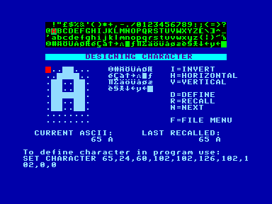
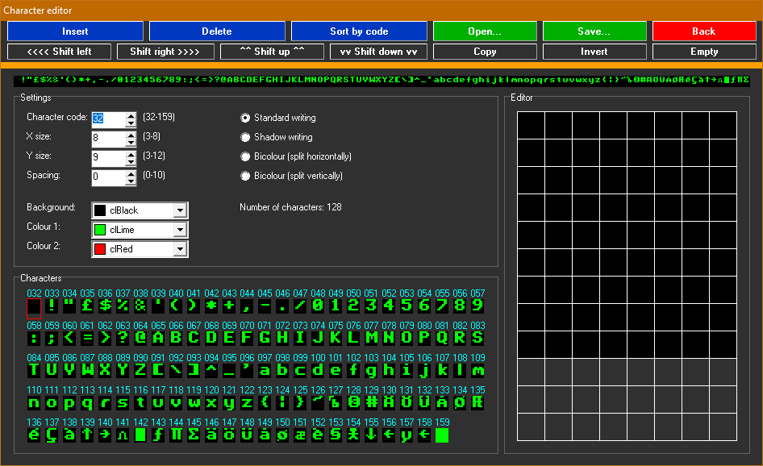
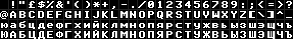

# Текстові шрифти та робота з ними

## Шрифти що використовує EXOS

[Таблиця символів](../system-info/info_characters.md)  
[Таблиця символів для різних локалізацій](http://epbas.lgb.hu/result-chset.html)  

Шрифт що використовує EXOS є підмножиною шрифтів які може використовувати Nick. 

- ширина: **8** пікселів..
- висота: **9** пікселів.
- кількість символів: **128**.
- єдиний шрифт використовуюється усіма відеосторінками.
- максимальна кількість символів у одній стрічці: **84**/**42**/**21**/**10**/**5** (в залежності від обраного відеорежиму)

При зміні шрифта автоматично оновляться лише символи, що були виведені на апаратних текстових сторінках (**TEXT 40**). 

## Шрифти що використовує Nick

Відеопроцесор [Nick](../../hardware/hm-nick.md) вміє використовувати різні шрифти:

- ширина: завжди **8** пікселів..
- висота: від **1** до **256** пікселів.
- кількість символів: **64**/**128**/**256**.
- використовуються лише на апаратних текстових відеорежимах (**CH64**/**CH128**/**CH256**)
- максимальна кількість символів у одній стрічці: **46** (з яких лише **42**-**44** будуть видимі на реальних моніторах/телевізорах)
- для кожного запису в таблиці [LPT](../system-info/nick/lpt.md) можна призначити власний шрифт.

При зміні шрифта символи оновлюються автоматично. 

Формат шрифта ідентичний тому що використовується в EXOS, з поправкою на висоту та кількість символів.

## Формати файлів для зберігання шрифтів

[FNT](fileformats/fmt_fnt-epfnt.md)

## Зміна символу шрифта що використовує EXOS

### IS-Basic
Команда [SET CHARACTER](../../manuals/is-basic-man-en/options/man_vo-character.md) змінює символ шрифта.

Команда [CLEAR FONT](../../manuals/is-basic-man-en/commands/man_cs-clear.md) повертає усі символи до початкових.

### HiSoft Pascal
Процедура [Character](../hisoft-pascal/hpu/grafcs-textvid.hpu.md) з бібліотеки GRAFCS.HPU / TEXTVID.HPU змінює символ шрифта.

Процедура [ClearFont](../hisoft-pascal/hpu/textvid.hpu.md) з бібліотеки TEXTVID.HPU повертає усі символи до початкового стану.

### Esc-послідовності
[Детальніше](../system-info/esc-seq/1b4b-video.md)  

## Завантаження символів із зовнішнього файлу
### Завантаження FNT-файлів (1152 байтів)
#### IS-Basic
```
130 ALLOCATE 11
140 CODE TOLT=HEX$("3E,6A,01,80,04")
150 CODE =HEX$("11,80,B4,F7,06,C9")
160 OPEN #106:"HFONT.FNT"
170 CALL USR(TOLT,0)
180 CLOSE #106
```
### Завантаження файлів з символами у esc-послідовностях (від 12 до 1536 байтів)

Створити esc-файл можливо за допомогою простої програми на Бейсіку:
```
5 OPEN #1:"ESCFNT.BIN" ACCESS OUTPUT

10 SET #1:CHARACTER 32,2,63,63,1,6,0,0,1,102

100 CLOSE #1
```

#### IS-Basic
```
100 OPEN #1:"ESCFONT.BIN" ACCESS INPUT
110 COPY FROM #1 TO #102
120 CLOSE #1
```
#### HiSoft Pascal
```
tin('ESCFONT.BIN', addr(compmap));   {завантаження файлу у пам'ять (тимчасово можна використати масив змінних необхідного розміру)}
ra:=chr(140);                         {заносимо номер відкритого текстового каналу у RA}
rde:=addr(compmap);                   {заносимо адресу початку даних у RDE}
rbc:=1536;                            {заносимо кількість даних (розмір файлу) у RBC}
Exos(8);                              {виконуємо функцію EXOS 8 (записати дані у канал)}
```
## Програми редагування шрифтів

### CHR2012 (EP)


([детальний опис](../../software/su-chr2012.md))

Вміє завантажувати [FNT](fileformats/fmt_fnt-epfnt.md)-файли, редагувати та зберігати шрифти як у форматі програми BASIC так і у ті ж самі FNT-файли.

### EP128Pal (Win32)


Конвертер графіки та редактор шрифтів. ([детальний опис](../../software-pc/ep128pal.md))

Вміє працювати тільки з власним форматом шрифтів [epf](fileformats/fmt_fnt-epf.md), але він досить простий і зконвертувати у потрібний формат немає особливих проблем.

## Використання символів кирилиці

Стандартного розміщення символів кирилиці для Ентерпрайзу немає. Зазвичай великі літери розміщають на місці альтернативних символів (128-159), а малі на місці малих латинських (96-127) у порядку схожому на KOI. Це дозволяє відносно комфортно вводити тексти використовуючи фонетичну розкладку **ЯВЕРТЫ** у *нормальному* (для малих літер), та *альтернативному* режимах введення (для великих).



## Символи які використовує EXOS

**8Eh** (142): символ курсору по-замовчуванню  
**9Eh** (158): символ курсору в режимі вставки  
**9Fh** (159): символ рівня сигналу касетного накопичувача (використовується у стрічці стану при завантаженні файлів через аудіовхід)  

**7Fh** (127): символ який неможливо ввести з клавіатури (лише за допомогою `chr$(127)`, або подібних команд)