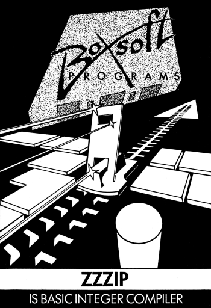
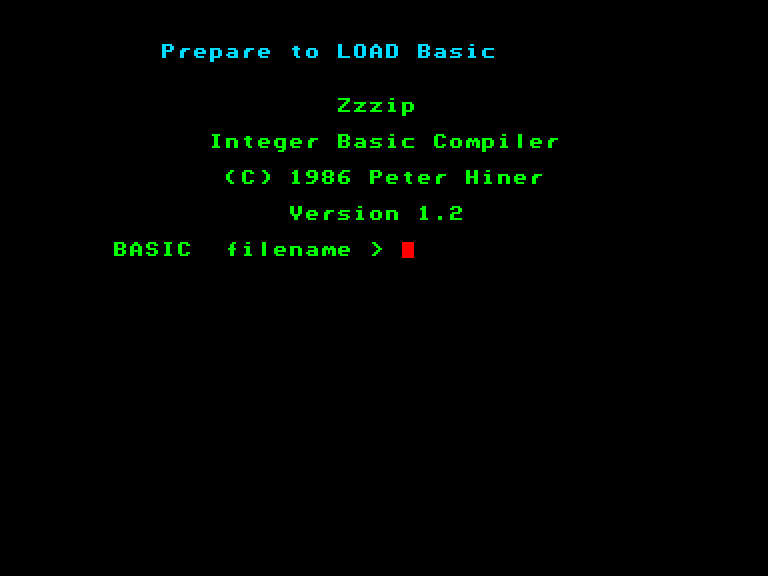

 
 

Автор: [Peter Hiner](../peoples/pers_peter-hiner.md)

ZZZIP — це цілочисельний компілятор BASIC. Він перетворює програму, написану на BASIC, у машинний код для швидшого виконання. ZZZIP досягає значного приросту швидкості завдяки тому (на що й указує назва «цілочисельний»), що він розглядає значення всіх констант і змінних у програмі BASIC як цілі числа (тобто не враховує цифри після десяткової коми). Через це є певні обмеження щодо використання ZZZIP, але якщо ретельно дотримуватися інструкцій у посібнику, ви легко опануєте ZZZIP і зможете досягти вражаючих результатів.

Перше очевидне питання: «У скільки разів швидше виконуватимуться відкомпільовані програми?» Відповідь залежить від того, який тип програми BASIC компілюється. Програма, яка сортує випадкові числа, працюватиме приблизно в 50 разів швидше, ніж на звичайному BASIC, тоді як програма для сортування рядків (string-ів) — можливо, лише у 12 разів. З іншого боку, програма, яка малює точки та лінії без особливих обчислень, ймовірно, буде лише вдвічі швидшою за BASIC (що все одно є певним прогресом). Якщо ми модифікуємо нашу програму BASIC так, щоб вона використовувала методи, які застосовуються в машинному коді, ми можемо отримати набагато швидшу роботу з екраном (програма `BENCH.BAS` що йде у комплекті з компілятором є прикладом такої швидкої роботи з екраном).

[Zzzip Manual](../../manuals/pr-zzzip-manual-en.md) (EN)  
[Zzzip Manual](http://ep128.hu/Ep_Util/Zzzip.htm) (HU)

<iframe src="https://www.youtube.com/embed/U4YbZcVPCBk"  
style="width:75%; aspect-ratio:16/9;" allowfullscreen></iframe>

*Відео зняте автором даного компілятора*