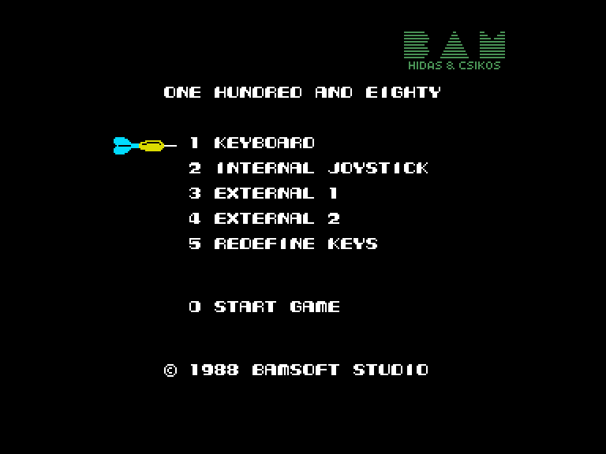
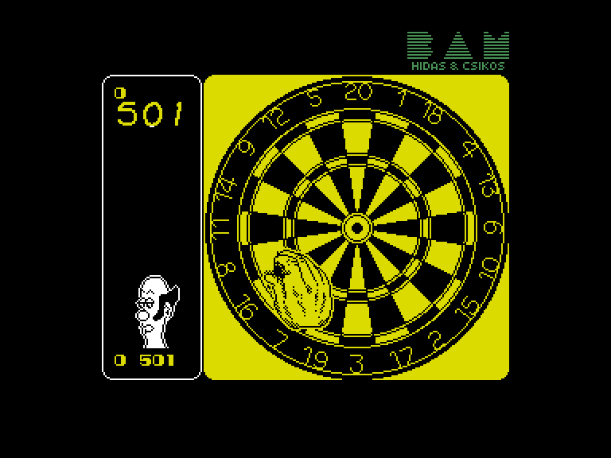
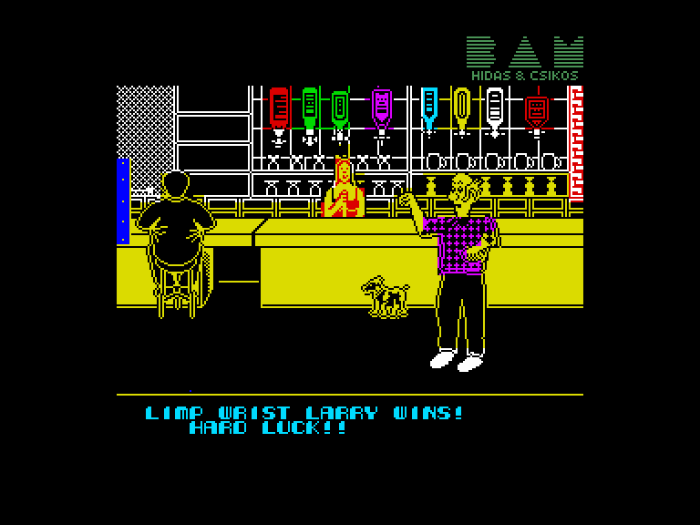
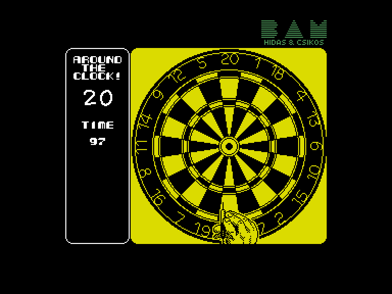

[0-9](../0/games-0.md) - [A](../a/games-a.md) - [B](../b/games-b.md) - [C](../c/games-c.md) - [D](../d/games-d.md) - [E](../e/games-e.md) - [F](../f/games-f.md) - [G](../g/games-g.md) - [H](../h/games-h.md) - [I](../i/games-i.md) - [J](../j/games-j.md) - [K](../k/games-k.md) - [L](../l/games-l.md) - [M](../m/games-m.md) - [N](../n/games-n.md) - [O](../o/games-o.md) - [P](../p/games-p.md) - [Q](../q/games-q.md) - [R](../r/games-r.md) - [S](../s/games-s.md) - [T](../t/games-t.md) - [U](../u/games-u.md) - [V](../v/games-v.md) - [W](../w/games-w.md) - [X](../x/games-x.md) - [Y](../y/games-y.md) - [Z](../z/games-z.md)

Ігри для [Enterprise 64k](../games-ep64.md) - [Enterprise 128k+RAMexp](../games-epramexp.md) - [2dfx](games-2dfx.md)

Ігри для систем [IS-DOS](../games-is-dos.md) - [SymbOS](../games-symbos.md) - [EDC Windows](../games-edcw.md)

Ігри для емуляторів [ZX Spectrum 48k/128k](../zxemu/games-zxemu.md) - [Amstrad CPC](../cpcemu/games-cpc.md) - [Sinclair ZX81](../zx81emu/games-zx81.md) - [Videoton TVC](../tvcemu/games-tvc.md) - [Commodore VIC-20](../vic20emu/games-vic20.md)

----------

# 180

**Альтернативні назви:**
 - 180!

**ID:** 180-zx

**Жанри:** Спортивна, Дартс

## Примітка

ℹ Стара неофіційна конверсія з платформи ZX Spectrum.

## Скріншоти

## Опис

Звичайний дартс: ви починаєте з 501 очка й списуєте їх до нуля. Звісно, якщо ваш суперник не зробить це першим...

## Основна інформація
- **Мови:** Англійська, Угорська
- **Оригінальна платформа:** ZX Spectrum
### Загальні системні вимоги
- **Апаратні:** EP128
### Геймплей
- **Керування:** Keyboard, Internal Joy, External Joy 1, External Joy 2
- **Кількість гравців:** 1 player, 2 players (alternate)
- **Додаткові теги:** Attribute mode
### Розробка
- **Рік випуску:** 1986
- **Автор:** Garry Hughes, Ste Pickford, Jeremy Nelson, David Whittaker
- **Компанія:** Binary Design Ltd

## Посилання
- [Опис на ep128.hu (угорською)](http://www.ep128.hu/Games/180!.htm)
- [Інформація про оригінальну версію](https://spectrumcomputing.co.uk/entry/15/ZX-Spectrum/180)
- [Завантажити](http://www.ep128.hu/Ep_Games/Prg/180.rar)

## Відео

<iframe src="https://www.youtube.com/embed/hOnlguqwj0k"  
style="width:75%; aspect-ratio:16/9;" allowfullscreen></iframe>

## Детальна інформація

### Геймплей  

Перед вами з'явиться мішень зблизька та велика рука на передньому плані, якою ви керуєте. Ця рука хаотично плаває в чотирьох діагональних напрямках, похитуючи дротиком на ходу. Очевидно, її власник добряче перебрав...