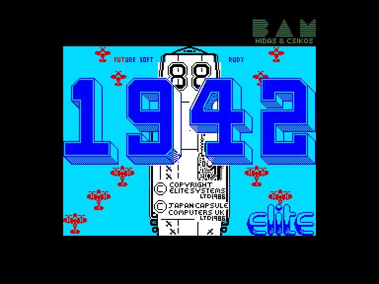
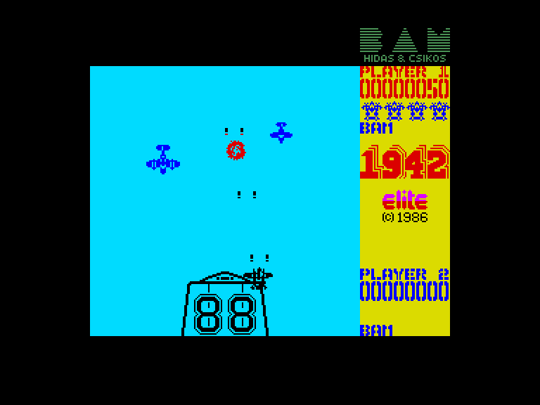
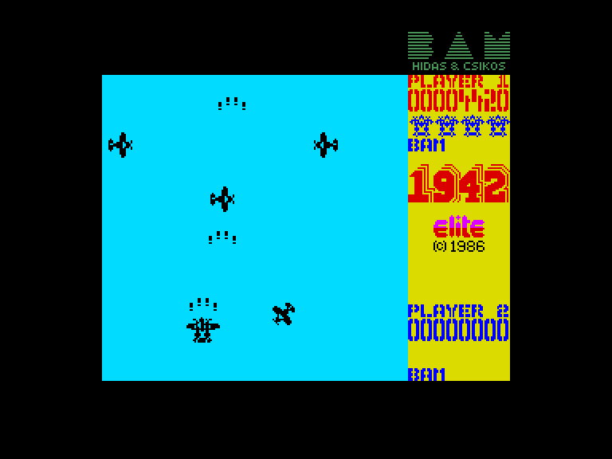
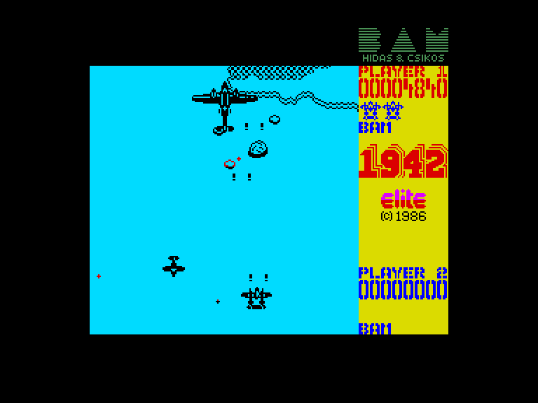

[0-9](../0/games-0.md) - [A](../a/games-a.md) - [B](../b/games-b.md) - [C](../c/games-c.md) - [D](../d/games-d.md) - [E](../e/games-e.md) - [F](../f/games-f.md) - [G](../g/games-g.md) - [H](../h/games-h.md) - [I](../i/games-i.md) - [J](../j/games-j.md) - [K](../k/games-k.md) - [L](../l/games-l.md) - [M](../m/games-m.md) - [N](../n/games-n.md) - [O](../o/games-o.md) - [P](../p/games-p.md) - [Q](../q/games-q.md) - [R](../r/games-r.md) - [S](../s/games-s.md) - [T](../t/games-t.md) - [U](../u/games-u.md) - [V](../v/games-v.md) - [W](../w/games-w.md) - [X](../x/games-x.md) - [Y](../y/games-y.md) - [Z](../z/games-z.md)

Ігри для [Enterprise 64k](../games-ep64.md) - [Enterprise 128k+RAMexp](../games-epramexp.md)

Ігри для систем [IS-DOS](../games-is-dos.md) - [SymbOS](../games-symbos.md) - [EDC Windows](../games-edcw.md)

Ігри для емуляторів [ZX Spectrum 48k/128k](../zxemu/games-zxemu.md) - [Amstrad CPC](../cpcemu/games-cpc.md) - [Sinclair ZX81](../zx81emu/games-zx81.md) - [Videoton TVC](../tvcemu/games-tvc.md) - [Commodore VIC-20](../vic20emu/games-vic20.md)

----------

# 1942

**ID:** 1942-zx

**Жанри:** Екшн, Шутем-ап

## Примітка

ℹ Стара неофіційна конверсія з платформи ZX Spectrum.

## Скріншоти

## Опис

1942 рік, у Тихому океані вирує війна. Ворожий флот та авіація невпинно набирають сили. На ваші плечі лягає завдання скоротити їхню чисельність у зухвалій поодинокій місії. Авіаносець доставить вас настільки близько, наскільки наважиться, але далі ви залишитеся сам на сам із ворогом!  

Пролітайте над територією та об'єктами противника, розсипаними островами та пересіченою місцевістю. Розумні маневри та майстерний вищий пілотаж знадобляться, щоб перехитрити ворожі літаки, а збір капсул сили (з написом POW) надасть вашому літаку додаткових можливостей.  

Будьте готові: ворожі зенітники вже взяли вас на приціл, а їхні пілоти готові піти на смерть, аби тільки зірвати вашу місію. Авіаносець чекає на ваше безпечне повернення — але чи вистачить вам майстерності, щоб вижити?

## Основна інформація
- **Мови:** Англійська
- **Оригінальна платформа:** ZX Spectrum
### Загальні системні вимоги
- **Апаратні:** EP128
### Геймплей
- **Керування:** Keyboard, Internal Joy, External Joy 1, External Joy 2
- **Кількість гравців:** 1 player, 2 players (alternate)
- **Додаткові теги:** Attribute mode
### Розробка
- **Рік випуску:** 1986
- **Автор:** Dominic Wood
- **Компанія:** Syrox

## Посилання
- [Опис гри на ep128.hu (угорською)](http://www.ep128.hu/Games/1942.htm)
- [Інформація про оригінальну версію](https://spectrumcomputing.co.uk/entry/9297/ZX-Spectrum/1942)

