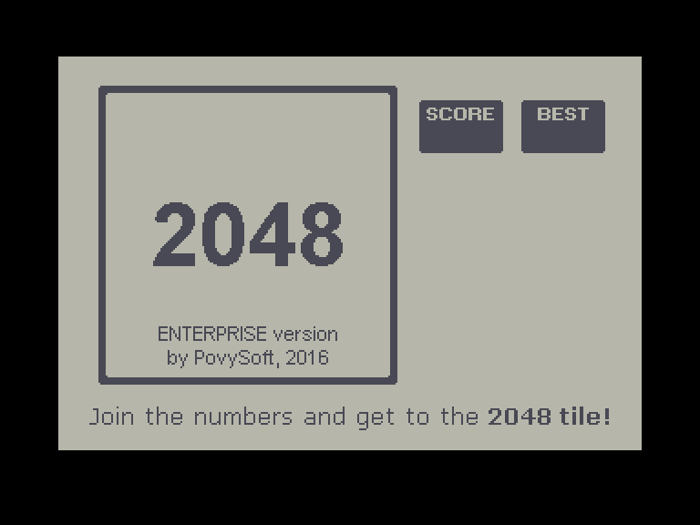
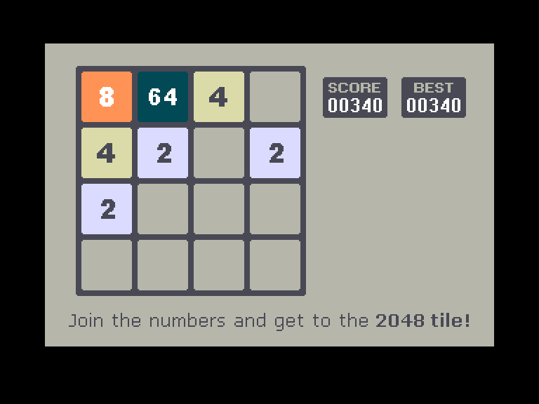
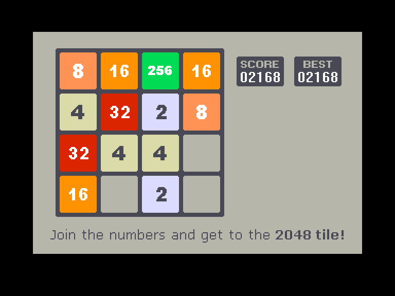
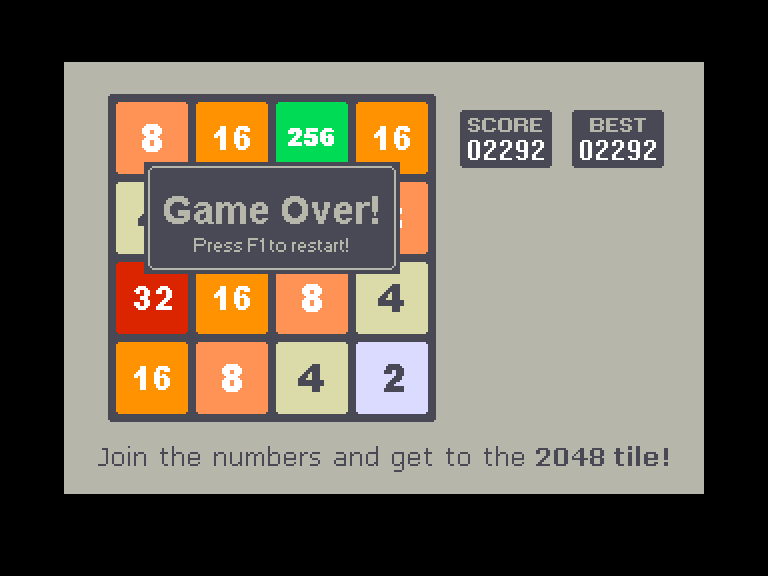

[0-9](../0/games-0.md) - [A](../a/games-a.md) - [B](../b/games-b.md) - [C](../c/games-c.md) - [D](../d/games-d.md) - [E](../e/games-e.md) - [F](../f/games-f.md) - [G](../g/games-g.md) - [H](../h/games-h.md) - [I](../i/games-i.md) - [J](../j/games-j.md) - [K](../k/games-k.md) - [L](../l/games-l.md) - [M](../m/games-m.md) - [N](../n/games-n.md) - [O](../o/games-o.md) - [P](../p/games-p.md) - [Q](../q/games-q.md) - [R](../r/games-r.md) - [S](../s/games-s.md) - [T](../t/games-t.md) - [U](../u/games-u.md) - [V](../v/games-v.md) - [W](../w/games-w.md) - [X](../x/games-x.md) - [Y](../y/games-y.md) - [Z](../z/games-z.md)

Ігри для [Enterprise 64k](../games-ep64.md) - [Enterprise 128k+RAMexp](../games-epramexp.md) - [2dfx](games-2dfx.md)

Ігри для систем [IS-DOS](../games-is-dos.md) - [SymbOS](../games-symbos.md) - [EDC Windows](../games-edcw.md)

Ігри для емуляторів [ZX Spectrum 48k/128k](../zxemu/games-zxemu.md) - [Amstrad CPC](../cpcemu/games-cpc.md) - [Sinclair ZX81](../zx81emu/games-zx81.md) - [Videoton TVC](../tvcemu/games-tvc.md) - [Commodore VIC-20](../vic20emu/games-vic20.md)

----------

# 2048

**ID:** 2048

**Жанри:** Логічна

## Примітка

ℹ Хоумбрю-гра.

## Скріншоти

## Опис

Версія браузерної гри 2048, написаної Ґабріеле Чіруллі.  
Ігрове поле має форму квадрата 4x4. Метою гри є отримання плитки номіналом «2048» шляхом поєднання плиток з однаковим номіналом.

## Основна інформація
- **Мови:** Англійська
- **Оригінальна платформа:** Enterprise
### Загальні системні вимоги
- **Апаратні:** EP64, EP128
### Геймплей
- **Керування:** Internal Joy, External Joy 1
- **Кількість гравців:** 1 player
- **Додаткові теги:** Attribute mode, HiScore saving
### Розробка
- **Рік випуску:** 2016
- **Автор:** Povi

## Посилання
- [Домашня сторінка](https://github.com/gabrielecirulli/2048)
- [Опис на ep128.hu (угорською)](http://www.ep128.hu/Ep_Games/Leiras/2048.htm)
- [Завантажити](http://www.ep128.hu/Ep_Games/Prg/2048.rar)
- [Easy Load&Play](https://t.me/EP128k_Load_n_Play/46) *(Telegram-канал Vibrant Waves)*

## Відео

<iframe src="https://www.youtube.com/embed/fQq8P-J8WdE"  
style="width:75%; aspect-ratio:16/9;" allowfullscreen></iframe>

## [Керування](../controllers.md)

`Internal Joystick`  
`External Joystick 1`  

`U`: Скасувати останній крок  
`F1`: Рестарт гри (⚠ без попереджень)  
`F2`: Зберегти гру  
`F3`: Завантажити збережену гру  
`F7`: вимкн./увімкн. музику  
`F8`: вихід в систему (із збереженням HISCORE.DAT)

## Детальна інформація

### Геймплей  

Гра починається на квадратному полі з 16-и клітинок, де дві клітинки зайняті плитками. Кожну плитку можна перемістити по горизонталі чи вертикалі. Щоразу як гравець переміщує плитку, на полі з'являється додаткова плитка номіналу «2» або «4» (співвідношення 10 до 1). Дві плитки одного номіналу, будучи поміщеними на одну клітинку, зливаються в одну, номінал якої дорівнює сумі злитих. За кожне злиття ігрові очки збільшуються на номінал новоутвореної плитки. Метою є отримати плитку «2048». Гра закінчується, якщо після чергового переміщення неможливо виконати жодне злиття плиток.