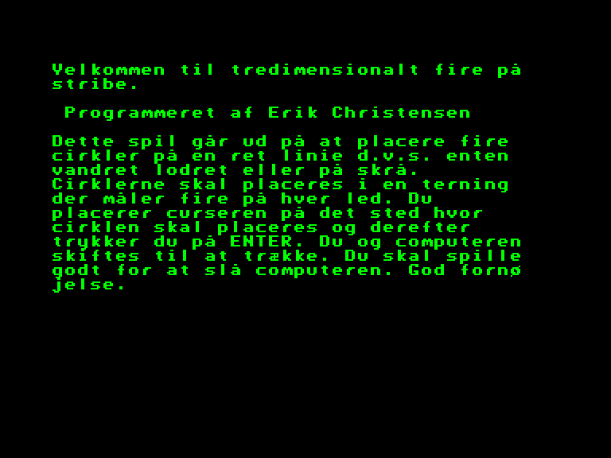
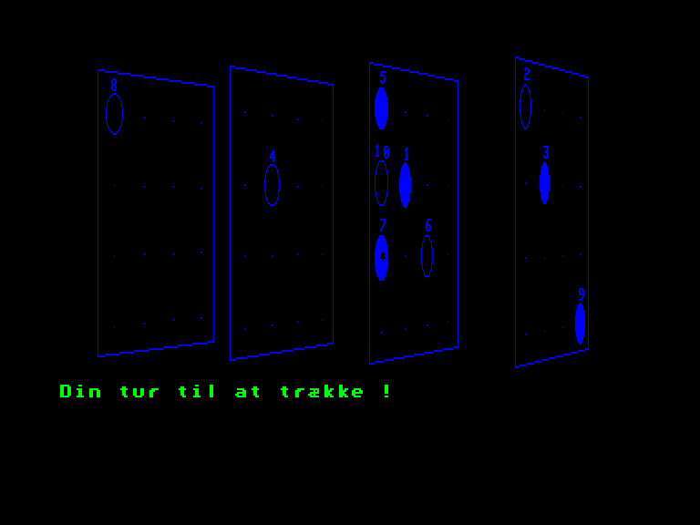
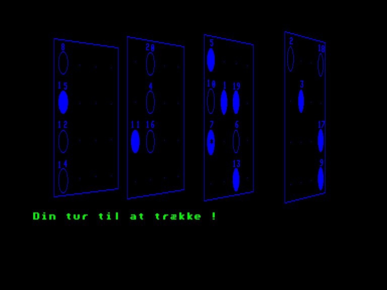
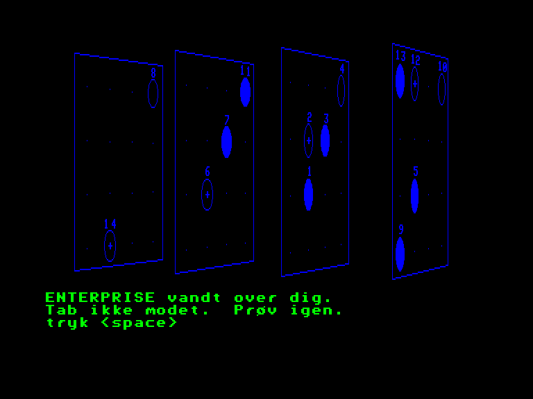

[0-9](../0/games-0.md) - [A](../a/games-a.md) - [B](../b/games-b.md) - [C](../c/games-c.md) - [D](../d/games-d.md) - [E](../e/games-e.md) - [F](../f/games-f.md) - [G](../g/games-g.md) - [H](../h/games-h.md) - [I](../i/games-i.md) - [J](../j/games-j.md) - [K](../k/games-k.md) - [L](../l/games-l.md) - [M](../m/games-m.md) - [N](../n/games-n.md) - [O](../o/games-o.md) - [P](../p/games-p.md) - [Q](../q/games-q.md) - [R](../r/games-r.md) - [S](../s/games-s.md) - [T](../t/games-t.md) - [U](../u/games-u.md) - [V](../v/games-v.md) - [W](../w/games-w.md) - [X](../x/games-x.md) - [Y](../y/games-y.md) - [Z](../z/games-z.md)

Ігри для [Enterprise 64k](../games-ep64.md) - [Enterprise 128k+RAMexp](../games-epramexp.md)

Ігри для систем [IS-DOS](../games-is-dos.md) - [SymbOS](../games-symbos.md) - [EDC Windows](../games-edcw.md)

Ігри для емуляторів [ZX Spectrum 48k/128k](../zxemu/games-zxemu.md) - [Amstrad CPC](../cpcemu/games-cpc.md) - [Sinclair ZX81](../zx81emu/games-zx81.md) - [Videoton TVC](../tvcemu/games-tvc.md) - [Commodore VIC-20](../vic20emu/games-vic20.md)

----------

# 3D Fire På Stribe

**Альтернативні назви:**
 - Tredimensionalt Fire På Stribe
 - 3D 4 Raw

**ID:** 3d-4-row-bas

**Жанри:** Логічна, Стратегія

## Примітка

ℹ Хоумбрю-гра яка продавалась на території Нідерландів.

## Скріншоти

## Опис

Це 3D-версія логічної настільної гри «Чотири в ряд».

Мета гри — розташувати поспіль по горизонталі, вертикалі або діагоналі чотири фішки свого кольору раніше ніж це зробить ваш супротивник.  
Ви завжди починаєте гру фішками синього кольору і граєте проти комп'ютера що використовує чорні.

## Основна інформація
- **Мови:** Данська
- **Оригінальна платформа:** Enterprise
### Загальні системні вимоги
- **Апаратні:** EP64, EP128
- **Програмні:** IS-Basic
### Геймплей
- **Керування:** Internal Joy
- **Кількість гравців:** 1 player
- **Додаткові теги:** 2-color mode
### Розробка
- **Рік випуску:** 198x
- **Автор:** Erik Christensen

## Посилання
- [Опис гри на ep128.hu (угорською)](http://www.ep128.hu/Ep_Games/Leiras/Basic_Program_Pack.htm)
- [Завантажити гру](http://www.ep128.hu/Ep_Games/Prg/Basic_Program_Pack.rar)

## Керування

`Internal Joystick`

`Enter`: розмістити фішку

## Детальна інформація

### Особливості гри

Нетрадиційна бічна перспектива значно ускладнює ігровий процес.
Крім того, гра спілкується з користувачем данською мовою, і для коректного відображення символів потрібне відповідне мовне розширення.

Гра працює з «*терпимою швидкістю*».