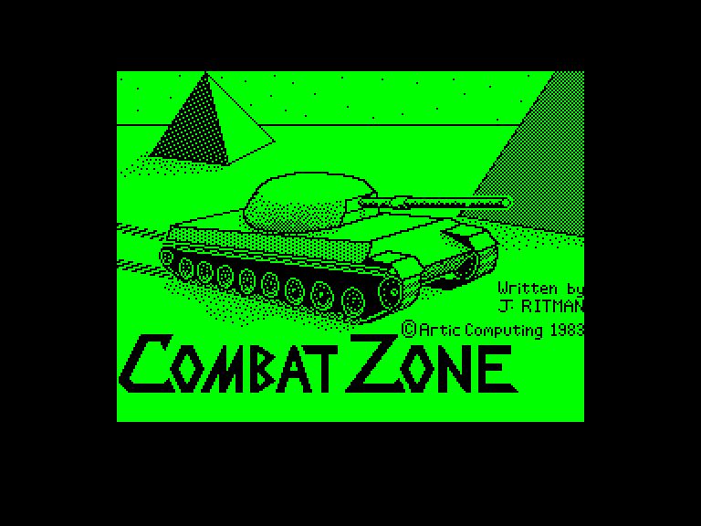
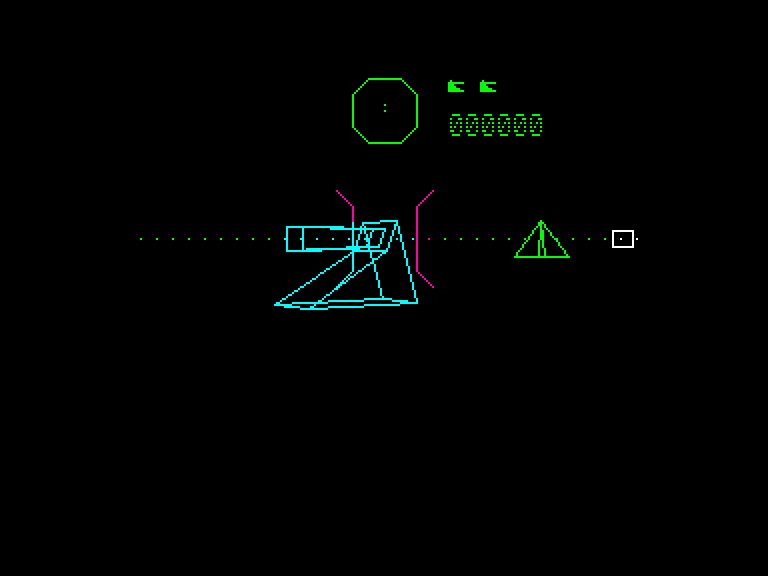
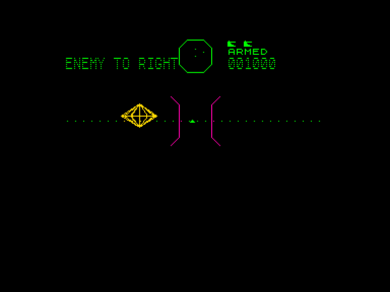
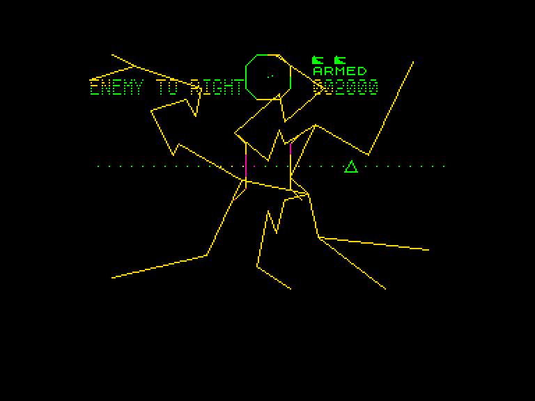

[0-9](../0/games-0.md) - [A](../a/games-a.md) - [B](../b/games-b.md) - [C](../c/games-c.md) - [D](../d/games-d.md) - [E](../e/games-e.md) - [F](../f/games-f.md) - [G](../g/games-g.md) - [H](../h/games-h.md) - [I](../i/games-i.md) - [J](../j/games-j.md) - [K](../k/games-k.md) - [L](../l/games-l.md) - [M](../m/games-m.md) - [N](../n/games-n.md) - [O](../o/games-o.md) - [P](../p/games-p.md) - [Q](../q/games-q.md) - [R](../r/games-r.md) - [S](../s/games-s.md) - [T](../t/games-t.md) - [U](../u/games-u.md) - [V](../v/games-v.md) - [W](../w/games-w.md) - [X](../x/games-x.md) - [Y](../y/games-y.md) - [Z](../z/games-z.md)

Ігри для [Enterprise 64k](../games-ep64.md) - [Enterprise 128k+RAMexp](../games-epramexp.md)

Ігри для систем [IS-DOS](../games-is-dos.md) - [SymbOS](../games-symbos.md) - [EDC Windows](../games-edcw.md)

Ігри для емуляторів [ZX Spectrum 48k/128k](../zxemu/games-zxemu.md) - [Amstrad CPC](../cpcemu/games-cpc.md) - [Sinclair ZX81](../zx81emu/games-zx81.md) - [Videoton TVC](../tvcemu/games-tvc.md) - [Commodore VIC-20](../vic20emu/games-vic20.md)

----------

# 3D Combat Zone

**Альтернативні назви:**
 - Combat Zone

**ID:** 3d-combat-zone-zx

**Жанри:** Симулятор, Екшн, від першої особи

## Скріншоти

## Опис

**3D Combat Zone** — це гра в жанрі симулятора боїв на танках від першої особи. Вона переносить гравця у долини Лацентри — величезну рівнину, усіяну пірамідами. Це поле бою, на якому залишилися лише рештки столітньої війни між двома протиборчими фракціями. Гравцеві доведеться командувати єдиним вцілілим танком розбитого флоту.

Ваш танк обладнаний радарною системою та могутньою гарматою, яка заряджена важкими бронебійними снарядами. Після кожного пострілу, що вражає ціль або пролітає максимальну відстань, гармата автоматично перезаряджається.

### Противники та геймплей

Вам належить протистояти залишкам ворожого флоту, що складається з трьох типів машин: звичайних танків, літаючих тарілок та супертанків.

**3D Combat Zone** належить до піонерської групи ігор для ZX Spectrum, які почали ефективно використовувати технологію 3D-каркасної графіки (wireframe). Це дозволило максимально використати обмежені ресурси 8-бітної машини, черпаючи натхнення з культової гри Battlezone.

## Основна інформація
- **Мови:** Англійська
- **Оригінальна платформа:** ZX Spectrum
### Системні вимоги
- **Апаратні:** EP128
### Геймплей
- **Керування:** Keyboard, Internal Joy, External Joy 1
- **Кількість гравців:** 1 player
- **Додаткові теги:** Vector graphic
### Розробка
- **Рік випуску:** 1983
- **Автор:** Jon Ritman

## Посилання
- [Опис гри на ep128.hu (угорською)](http://www.ep128.hu/Games/Combat_Zone.htm)
- [Інформація про оригінальну версію](https://spectrumcomputing.co.uk/entry/1033/ZX-Spectrum/3D_Combat_Zone)
- [Завантажити гру](http://www.ep128.hu/Ep_Games/Prg/Combat_Zone.rar)

**Дата генерації:** 28.07.2026

