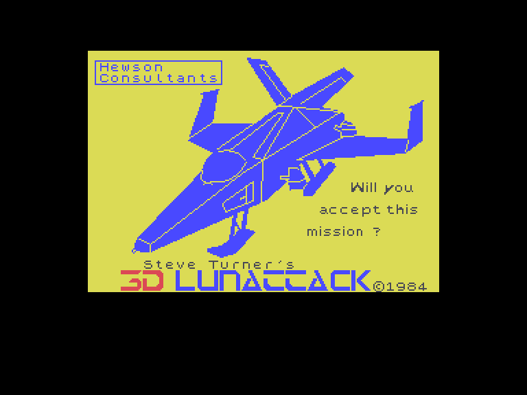
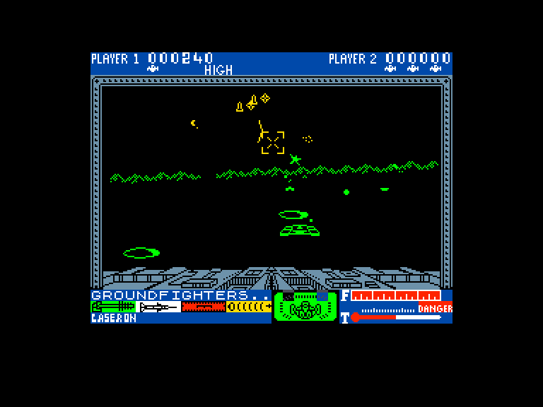
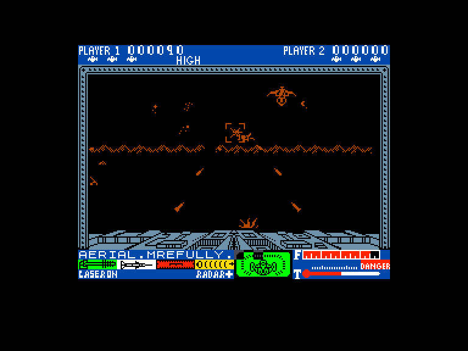
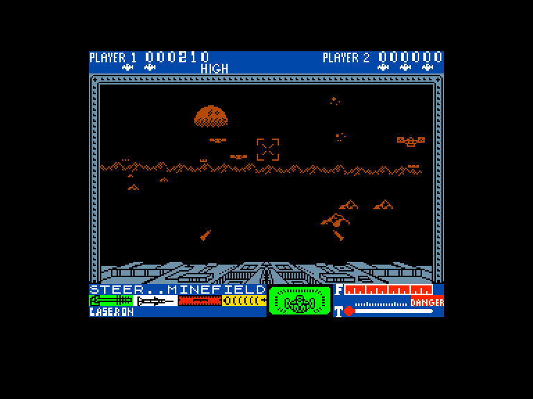

[0-9](../0/games-0.md) - [A](../a/games-a.md) - [B](../b/games-b.md) - [C](../c/games-c.md) - [D](../d/games-d.md) - [E](../e/games-e.md) - [F](../f/games-f.md) - [G](../g/games-g.md) - [H](../h/games-h.md) - [I](../i/games-i.md) - [J](../j/games-j.md) - [K](../k/games-k.md) - [L](../l/games-l.md) - [M](../m/games-m.md) - [N](../n/games-n.md) - [O](../o/games-o.md) - [P](../p/games-p.md) - [Q](../q/games-q.md) - [R](../r/games-r.md) - [S](../s/games-s.md) - [T](../t/games-t.md) - [U](../u/games-u.md) - [V](../v/games-v.md) - [W](../w/games-w.md) - [X](../x/games-x.md) - [Y](../y/games-y.md) - [Z](../z/games-z.md)

Ігри для [Enterprise 64k](../games-ep64.md) - [Enterprise 128k+RAMexp](../games-epramexp.md)

Ігри для систем [IS-DOS](../games-is-dos.md) - [SymbOS](../games-symbos.md) - [EDC Windows](../games-edcw.md)

Ігри для емуляторів [ZX Spectrum 48k/128k](../zxemu/games-zxemu.md) - [Amstrad CPC](../cpcemu/games-cpc.md) - [Sinclair ZX81](../zx81emu/games-zx81.md) - [Videoton TVC](../tvcemu/games-tvc.md) - [Commodore VIC-20](../vic20emu/games-vic20.md)

----------

# 3D Lunattack

**ID:** 3d-lunattack-zx

**Жанри:** Шутем-ап, Екшн

## Примітка

ℹ Стара неофіційна конверсія з платформи ZX Spectrum.

## Скріншоти

## Опис

Це продовження війни проти Сейддаб, і цього разу ви берете участь в атаці на їхню місячну базу.  

Ви пілотуєте ховеркрафт і ваша перша ціль — відбитись від ворожих танків. Після того, як ви подолаєте це кільце оборони, вам доведеться пролетіти крізь мінне поле, що висить над гірським хребтом. Далі на вас чекає зона запуску ракет, яку також потрібно подолати, щоб дістатися до командної бази Сейддаб.  

На відміну від попередньої гри, **3D Seiddab Attack**, ви тепер літаєте, що дає змогу виконувати більш ризиковані та складні маневри.

## Основна інформація
- **Мови:** Англійська
- **Оригінальна платформа:** ZX Spectrum
### Загальні системні вимоги
- **Апаратні:** EP128
### Геймплей
- **Керування:** Internal Joy, External Joy 1, External Joy 2
- **Кількість гравців:** 1 player, 2 players (alternate)
- **Додаткові теги:** Attribute mode
### Розробка
- **Рік випуску:** 1984
- **Автор:** Steve Turner
- **Компанія:** Hewson Consultants Ltd

## Посилання
- [Опис гри на ep128.hu (угорською)](http://www.ep128.hu/Games/Lunattack.htm)
- [Інформація про оригінальну версію](https://spectrumcomputing.co.uk/entry/2955/ZX-Spectrum/3D_Lunattack)
- [Завантажити гру](http://www.ep128.hu/Ep_Games/Prg/Lunattack.rar)

## [Керування](../controllers.md)

`Internal Joystick`  
`External Joystick 1`  
`External Joystick 2`

## Детальна інформація

### Геймплей  

Ваш корабель оснащений лазерною гарматою та ракетами. Ви можете рухати корабель вліво та вправо, а приціл — вгору та вниз, але не можете змінювати висоту польоту, що спрощує навігацію. Бортовий навігаційний комп'ютер допоможе вам знайти правильний напрямок, показуючи лінії, що сходяться під прицілом.  

**Зброя та інтерфейс**  

***Лазерна гармата***: ефективна проти ворогів, видимих неозброєним оком.  

***Ракети***: призначені для цілей, які ще не видно, але позначені жовтою міткою на прицільному індикаторі. Ракети запускаються з автоматичним наведенням, тож вам достатньо лише випустити їх. Система управління зброєю автоматично обирає потрібний тип снарядів.  

На панелі приладів відображається важлива інформація:  

- LASER ON (зелений): Активна лазерна зброя.  
- ARMED (білий): Активна ракетна система (коли приціл у верхній частині екрана).  
- NAV ON (червоний): Активна навігаційна система (коли приціл у нижній частині екрана).  

У центрі екрана знаходиться дисплей, що показує пошкодження вашого корабля (синім, рожевим та червоним кольорами), а праворуч — індикатори рівня палива (**F**) та температури лазерної гармати (**T**). Цікаво, що перегрів гармати не перешкоджає її використанню, а паливо практично не закінчується.  

Над ігровим екраном відображається ваш рахунок, кількість життів та рекорд.