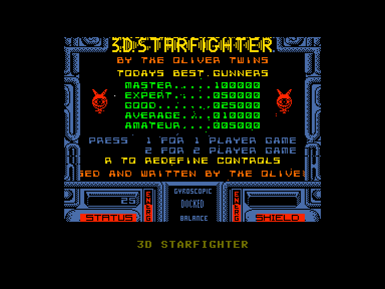
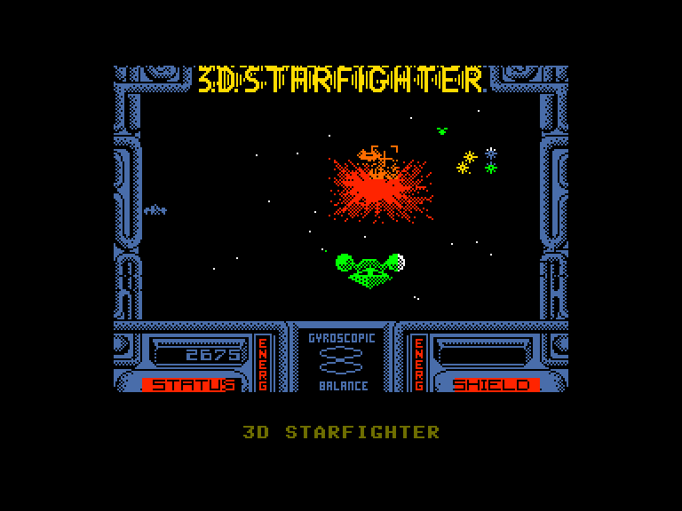
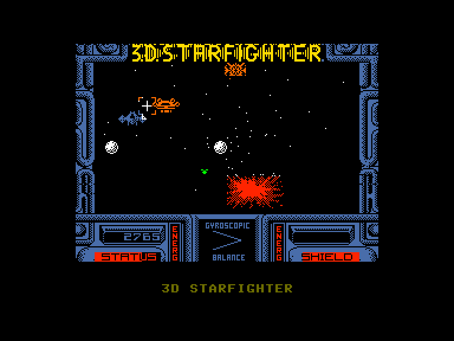
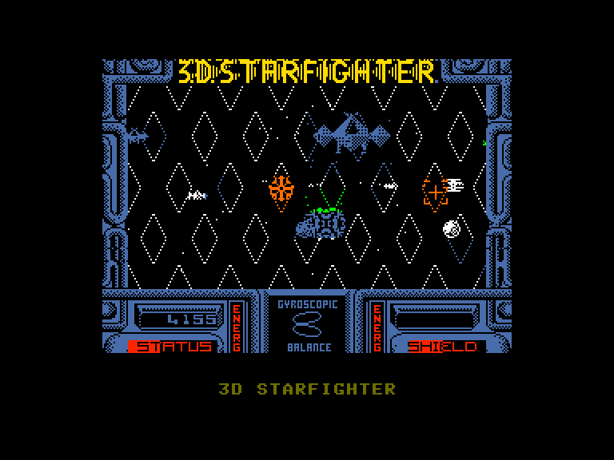

[0-9](../0/games-0.md) - [A](../a/games-a.md) - [B](../b/games-b.md) - [C](../c/games-c.md) - [D](../d/games-d.md) - [E](../e/games-e.md) - [F](../f/games-f.md) - [G](../g/games-g.md) - [H](../h/games-h.md) - [I](../i/games-i.md) - [J](../j/games-j.md) - [K](../k/games-k.md) - [L](../l/games-l.md) - [M](../m/games-m.md) - [N](../n/games-n.md) - [O](../o/games-o.md) - [P](../p/games-p.md) - [Q](../q/games-q.md) - [R](../r/games-r.md) - [S](../s/games-s.md) - [T](../t/games-t.md) - [U](../u/games-u.md) - [V](../v/games-v.md) - [W](../w/games-w.md) - [X](../x/games-x.md) - [Y](../y/games-y.md) - [Z](../z/games-z.md)

Ігри для [Enterprise 64k](../games-ep64.md) - [Enterprise 128k+RAMexp](../games-epramexp.md)

Ігри для систем [IS-DOS](../games-is-dos.md) - [SymbOS](../games-symbos.md) - [EDC Windows](../games-edcw.md)

Ігри для емуляторів [ZX Spectrum 48k/128k](../zxemu/games-zxemu.md) - [Amstrad CPC](../cpcemu/games-cpc.md) - [Sinclair ZX81](../zx81emu/games-zx81.md) - [Videoton TVC](../tvcemu/games-tvc.md) - [Commodore VIC-20](../vic20emu/games-vic20.md)

----------

# 3D Starfighter

**ID:** 3d-starfighter-zx

**Жанри:** Шутем-ап, Екшн

## Скріншоти

## Опис

> ℹ Стара неофіційна конверсія з платформи ZX Spectrum.  

3D Starfighter — це космічний шутер від першої особи, де ви керуєте високошвидкісним зорельотом.

Ви — спеціальний агент, місія якого — доставити зброю CHAOS (Complete Hostile Alien Obliteration System — Система Повного Знищення Ворожих Прибульців) населенню далекої планети, захопленої ворожими прибульцями. 
Ваше завдання — зачистити кожну космічну зону від ворогів. Фінальна мета — знищити ворожий Бойовий Зоряний Крейсер (Battlestar).

### Ігровий процес
Ви маєте використовувати приціл, щоб збивати ворожі кораблі, що стрімко наближаються, перш ніж вони зіткнуться з вами і виснажать ваші щити. 
Використовуйте свої лазери ощадливо, адже кожен постріл також витрачає вашу енергію!

Оберіть пункт призначення зі Схеми Битв (підказка: Belmar).

Знищте всі ворожі кораблі, щоб відкрити безпечне вікно для евакуації. Після цього розпочнеться автоматичне прискорення до світлової швидкості.

Після прибуття до пункту призначення почнеться автоматичне уповільнення. Ваше завдання — пристикуватися до крихітного далекого материнського корабля червоного кольору. Для цього просто утримуйте свій приціл на ньому (не стріляючи та не зважаючи на інших). Це активує його тягові промені, які притягнуть вас ближче.

Після стикування Блінкі надасть вам інформацію про вашу наступну ціль, що є черговим кроком до виконання місії.

## Основна інформація
- **Мови:** Англійська
- **Оригінальна платформа:** ZX Spectrum
### Системні вимоги
- **Апаратні:** EP128
### Геймплей
- **Керування:** Keyboard, Internal Joy, External Joy 1, External Joy 2
- **Кількість гравців:** 1 player, 2 players (cooperative)
- **Додаткові теги:** Attribute mode
### Розробка
- **Рік випуску:** 1988
- **Автор:** Philip Oliver, Andrew Oliver, Mervin James, James Wilson, Jon Paul Eldridge
- **Компанія:** Code Masters Ltd

## Посилання
- [Опис гри на ep128.hu (угорською)](http://www.ep128.hu/Games/3D-Starfighter.htm)
- [Інформація про оригінальну версію](https://spectrumcomputing.co.uk/entry/9423/ZX-Spectrum/3D_Starfighter)
- [Завантажити гру](http://www.ep128.hu/Ep_Games/Prg/3D-Starfighter.rar)

