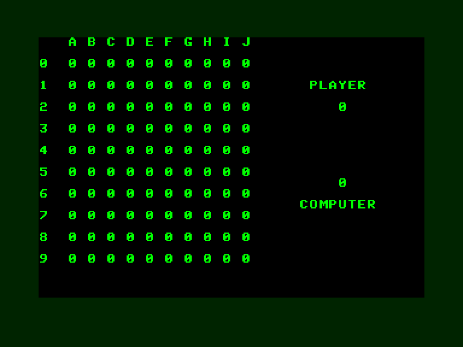
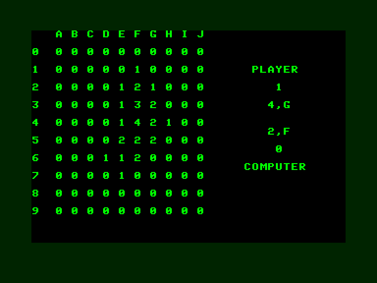

[0-9](../0/games-0.md) - [A](../a/games-a.md) - [B](../b/games-b.md) - [C](../c/games-c.md) - [D](../d/games-d.md) - [E](../e/games-e.md) - [F](../f/games-f.md) - [G](../g/games-g.md) - [H](../h/games-h.md) - [I](../i/games-i.md) - [J](../j/games-j.md) - [K](../k/games-k.md) - [L](../l/games-l.md) - [M](../m/games-m.md) - [N](../n/games-n.md) - [O](../o/games-o.md) - [P](../p/games-p.md) - [Q](../q/games-q.md) - [R](../r/games-r.md) - [S](../s/games-s.md) - [T](../t/games-t.md) - [U](../u/games-u.md) - [V](../v/games-v.md) - [W](../w/games-w.md) - [X](../x/games-x.md) - [Y](../y/games-y.md) - [Z](../z/games-z.md)

Ігри для [Enterprise 64k](../games-ep64.md) - [Enterprise 128k+RAMexp](../games-epramexp.md)

Ігри для систем [IS-DOS](../games-is-dos.md) - [SymbOS](../games-symbos.md) - [EDC Windows](../games-edcw.md)

Ігри для емуляторів [ZX Spectrum 48k/128k](../zxemu/games-zxemu.md) - [Amstrad CPC](../cpcemu/games-cpc.md) - [Sinclair ZX81](../zx81emu/games-zx81.md) - [Videoton TVC](../tvcemu/games-tvc.md) - [Commodore VIC-20](../vic20emu/games-vic20.md)

----------

# 4-es Játék

**ID:** 4es-jatek-n2-bas

**Жанри:** Логічна, Стратегія

## Примітка

Homebrew

## Скріншоти

## Опис

### Ігровий процес
Ваше завдання — набрати більше очок, ніж комп'ютер. Гра відбувається на ігровому полі розміром 10×10 клітинок. Коли ви вибираєте будь-яку клітинку, її значення та значення чотирьох сусідніх клітинок збільшується на один.

При кожному наступному виборі значення клітинки та її сусідів знову збільшується на одиницю, поки не досягне значення 4. За кожен ваш хід, який перетворює одну або кілька клітинок на 4, ви отримуєте одне очко. Комп'ютер постійно підраховує бали, і перемагає той, хто на момент заповнення дошки набрав більше очок.

## Основна інформація
- **Мови:** Угорська
- **Оригінальна платформа:** Enterprise
### Загальні системні вимоги
- **Програмні:** IS-Basic
### Геймплей
- **Керування:** Keyboard
- **Кількість гравців:** 1 player
- **Додаткові теги:** Text40 mode

## [Керування](../controllers.md)

Keyboard  

Введення координат комірки з клавіатури у форматі `цифра,буква` (наприклад: `5,g`)

