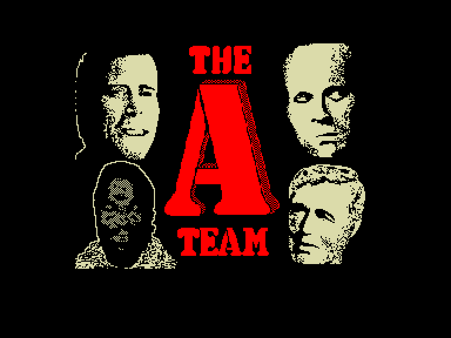
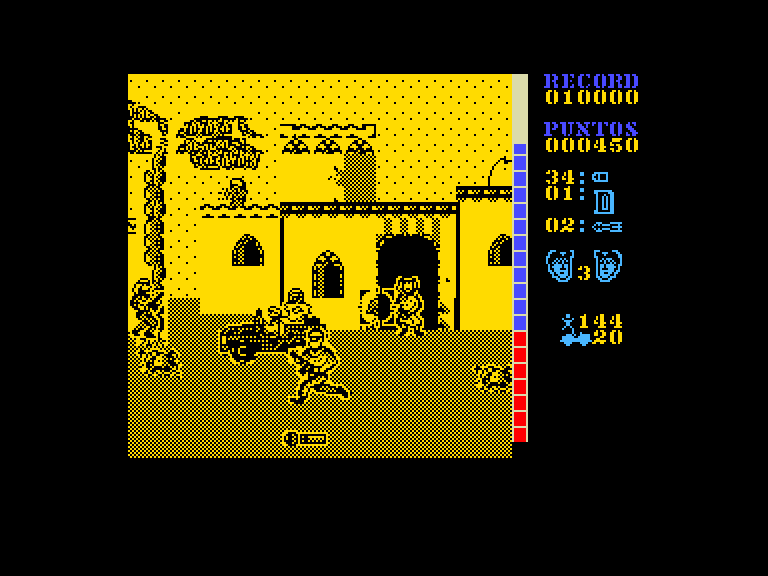
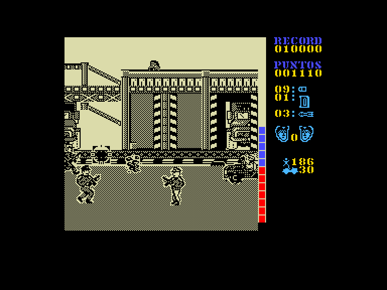
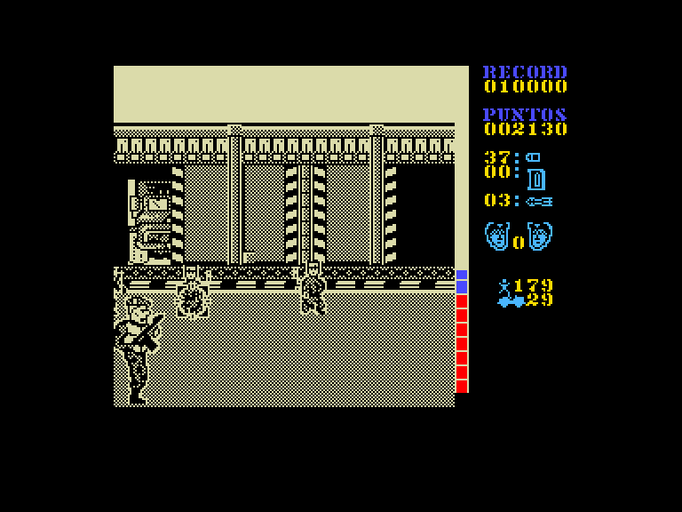

[0-9](../0/games-0.md) - [A](../a/games-a.md) - [B](../b/games-b.md) - [C](../c/games-c.md) - [D](../d/games-d.md) - [E](../e/games-e.md) - [F](../f/games-f.md) - [G](../g/games-g.md) - [H](../h/games-h.md) - [I](../i/games-i.md) - [J](../j/games-j.md) - [K](../k/games-k.md) - [L](../l/games-l.md) - [M](../m/games-m.md) - [N](../n/games-n.md) - [O](../o/games-o.md) - [P](../p/games-p.md) - [Q](../q/games-q.md) - [R](../r/games-r.md) - [S](../s/games-s.md) - [T](../t/games-t.md) - [U](../u/games-u.md) - [V](../v/games-v.md) - [W](../w/games-w.md) - [X](../x/games-x.md) - [Y](../y/games-y.md) - [Z](../z/games-z.md)

Ігри для [Enterprise 64k](../games-ep64.md) - [Enterprise 128k+RAMexp](../games-epramexp.md)

Ігри для систем [IS-DOS](../games-is-dos.md) - [SymbOS](../games-symbos.md) - [EDC Windows](../games-edcw.md)

Ігри для емуляторів [ZX Spectrum 48k/128k](../zxemu/games-zxemu.md) - [Amstrad CPC](../cpcemu/games-cpc.md) - [Sinclair ZX81](../zx81emu/games-zx81.md) - [Videoton TVC](../tvcemu/games-tvc.md) - [Commodore VIC-20](../vic20emu/games-vic20.md)

----------

# The A-Team

**Альтернативні назви:**
 - El Equipo A

**ID:** a-team-zx

**Жанри:** Екшн, Шутер

## Скріншоти

## Опис

Опис гри
A Team — це шутер 1989 року від іспанської компанії Zafiro Software, що має багато спільного з популярною грою Operation Wolf. У грі використовується іспанська мова, але для початку достатньо знати слово «JUGAR» (Грати).

Деталі ігрового процесу
Мета гри: Знищити ворогів та звільнити заручників.

Рівні: У грі є два окремі рівні складності.

Завдання: На обох рівнях вам потрібно знешкодити певну кількість ворожих солдатів та джипів. На першому рівні також необхідно не застрелити заручників, які пробігають екраном.

Здоров'я: Якщо ви вб'єте заручника або у вас закінчиться енергія, ви втратите одне життя.

Зброя та боєприпаси:

Кулі: Кількість боєприпасів обмежена. Їх можна поповнити, стріляючи по пакунках з боєприпасами.

Ракети: Можна запускати, натиснувши клавішу SPACE. Вибух ракети знищує все на екрані, включаючи заручників.

Управління:

Клавіатура: Q, A, O, P, M.

Джойстики: Sinclair, Kempston.

Пауза: Клавіша H призупиняє гру.

Чіти: Текст також містить коди POKE для отримання нескінченної енергії, боєприпасів та ракет, а також для налаштування кількості ворогів.

## Основна інформація
- **Мови:** Іспанська
- **Оригінальна платформа:** ZX Spectrum
### Системні вимоги
- **Апаратні:** EP128
### Геймплей
- **Додаткові теги:** Attribute mode

## Посилання
- [Опис гри на ep128.hu (угорською)](http://www.ep128.hu/Games/ATeam.htm)
- [Інформація про оригінальну версію](https://spectrumcomputing.co.uk/entry/303/ZX-Spectrum/El_Equipo_A)
- [Завантажити гру](http://www.ep128.hu/Ep_Games/Prg/ATeam.rar)

**Дата генерації:** 28.07.2026

