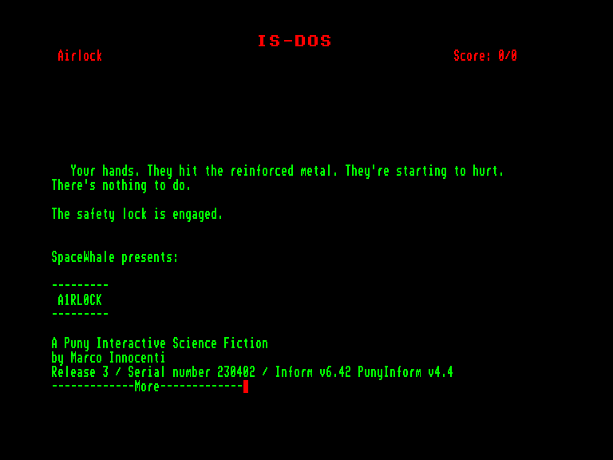
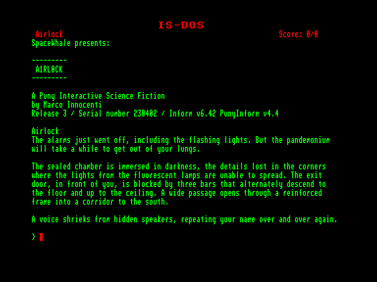
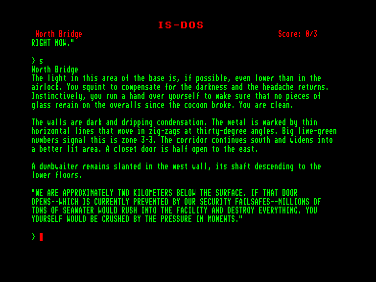
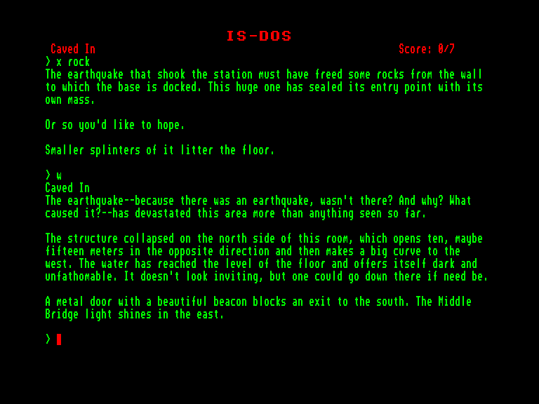

[0-9](../0/games-0.md) - [A](../a/games-a.md) - [B](../b/games-b.md) - [C](../c/games-c.md) - [D](../d/games-d.md) - [E](../e/games-e.md) - [F](../f/games-f.md) - [G](../g/games-g.md) - [H](../h/games-h.md) - [I](../i/games-i.md) - [J](../j/games-j.md) - [K](../k/games-k.md) - [L](../l/games-l.md) - [M](../m/games-m.md) - [N](../n/games-n.md) - [O](../o/games-o.md) - [P](../p/games-p.md) - [Q](../q/games-q.md) - [R](../r/games-r.md) - [S](../s/games-s.md) - [T](../t/games-t.md) - [U](../u/games-u.md) - [V](../v/games-v.md) - [W](../w/games-w.md) - [X](../x/games-x.md) - [Y](../y/games-y.md) - [Z](../z/games-z.md)

Ігри для [Enterprise 64k](../games-ep64.md) - [Enterprise 128k+RAMexp](../games-epramexp.md)

Ігри для систем [IS-DOS](../games-is-dos.md) - [SymbOS](../games-symbos.md) - [EDC Windows](../games-edcw.md)

Ігри для емуляторів [ZX Spectrum 48k/128k](../zxemu/games-zxemu.md) - [Amstrad CPC](../cpcemu/games-cpc.md) - [Sinclair ZX81](../zx81emu/games-zx81.md) - [Videoton TVC](../tvcemu/games-tvc.md) - [Commodore VIC-20](../vic20emu/games-vic20.md)

----------

# A1RL0CK

**ID:** a1rl0ck-zcode

**Жанри:** Текстова пригода, Фантастика

## Скріншоти

## Опис

A1RL0CK — це текстова пригодницька гра в жанрі survival, яка занурює гравця в таємничу історію без попереднього пояснення.

### Ігровий процес та сюжет

Гра починається з тривожної сцени: увімкнена сигналізація, миготливі вогні та голос, що закликає заспокоїтися.
Гравцю належить узяти на себе роль дівчинки на ім'я Хлоя, яка опинилася в підводному комплексі після землетрусу.
Більшість персоналу зникла, і гравцеві належить досліджувати оточення, щоб розібратися в загадці того, що сталося.

Особливість A1RL0CK в підході in media res, тобто сюжет починається безпосередньо в центрі подій. Гра не пояснює, що сталося і що потрібно робити. Замість цього, історія розгортається поступово, через дослідження та взаємодію з навколишнім світом. Це може здатися незвичним і навіть незрозумілим для деяких гравців, але саме так замислювали гру її творці: таємниця є частиною ігрового процесу.

## Основна інформація
- **Мови:** Англійська
### Загальні системні вимоги
- **Апаратні:** EXDOS
- **Програмні:** IS-DOS
### Геймплей
- **Керування:** Keyboard
- **Кількість гравців:** 1 player
- **Додаткові теги:** Z-code
### Розробка
- **Рік випуску:** 2023
- **Автор:** Marco Innocenti
- **Компанія:** SpaceWhale

## Посилання
- [Домашня сторінка гри](https://www.andromedalegacy.com/a1rl0ck/)
- [Домашня сторінка гри](https://jpking.itch.io/a1rl0ck)
- [Інформація про оригінальну версію](https://www.cpc-power.com/index.php?page=detail&num=18949)
- [Інформація про гру (SolutionArchive.com)](https://solutionarchive.com/game/id%2C10309/A1RL0CK.html)
- [Завантажити гру](http://www.ep128.hu/Ep_Games/Prg/Z-machine_Adventures.rar)

## [Керування](../controllers.md)

Гра ведеться за допомогою введення тексту.

Ви можете переміщатись, вводячи напрямки (`GO NORTH` або просто `N`).  
Дозволені й інші дії, такі як `EXAMINE` (щоб отримати опис речей, які вас оточують — ми настійно рекомендуємо робити це якомога частіше), `TAKE` або `GET <thing>` (щоб заволодіти предметами, знайденими в грі), `PUSH`, `PULL` і навіть `ATTACK`, що завгодно. І багато іншого.

Не кожна команда дає задовільний результат. Просто продовжуйте грати і намагайтеся зрозуміти, про що йдеться.

