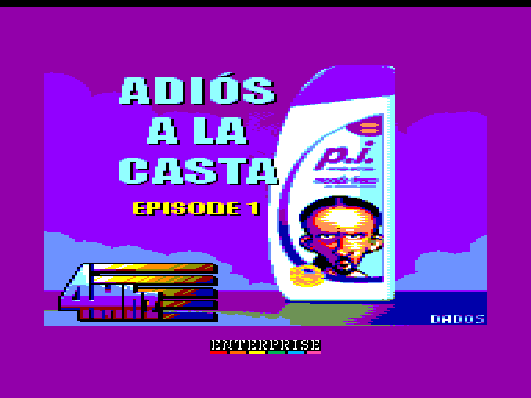
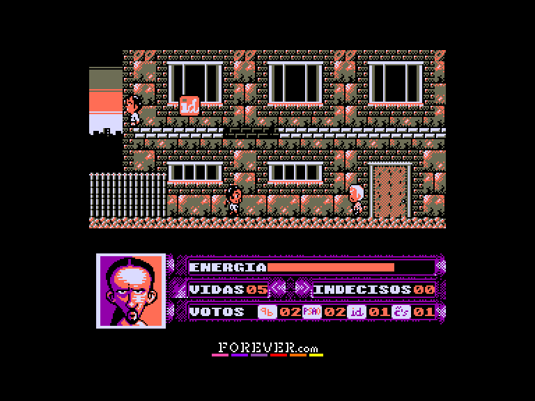
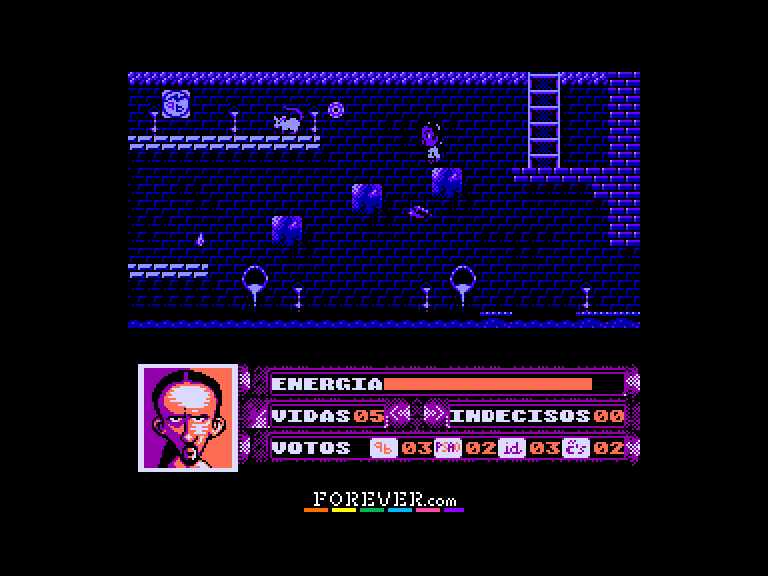
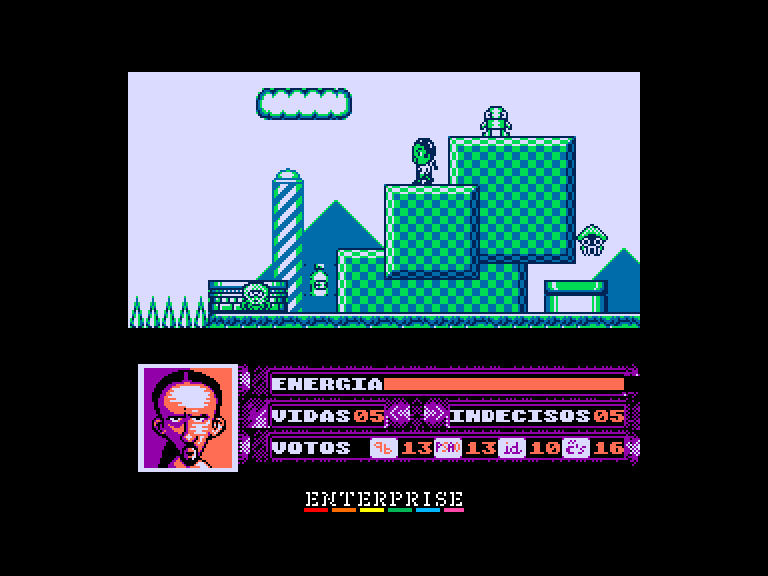

[0-9](../0/games-0.md) - [A](../a/games-a.md) - [B](../b/games-b.md) - [C](../c/games-c.md) - [D](../d/games-d.md) - [E](../e/games-e.md) - [F](../f/games-f.md) - [G](../g/games-g.md) - [H](../h/games-h.md) - [I](../i/games-i.md) - [J](../j/games-j.md) - [K](../k/games-k.md) - [L](../l/games-l.md) - [M](../m/games-m.md) - [N](../n/games-n.md) - [O](../o/games-o.md) - [P](../p/games-p.md) - [Q](../q/games-q.md) - [R](../r/games-r.md) - [S](../s/games-s.md) - [T](../t/games-t.md) - [U](../u/games-u.md) - [V](../v/games-v.md) - [W](../w/games-w.md) - [X](../x/games-x.md) - [Y](../y/games-y.md) - [Z](../z/games-z.md)

Ігри для [Enterprise 64k](../games-ep64.md) - [Enterprise 128k+RAMexp](../games-epramexp.md)

Ігри для систем [IS-DOS](../games-is-dos.md) - [SymbOS](../games-symbos.md) - [EDC Windows](../games-edcw.md)

Ігри для емуляторів [ZX Spectrum 48k/128k](../zxemu/games-zxemu.md) - [Amstrad CPC](../cpcemu/games-cpc.md) - [Sinclair ZX81](../zx81emu/games-zx81.md) - [Videoton TVC](../tvcemu/games-tvc.md) - [Commodore VIC-20](../vic20emu/games-vic20.md)

----------

# Adiós a la Casta: Episode 1

**ID:** adios-a-la-casta-ep1-cpc

**Жанри:** Аркада, Платформер

## Примітка

ℹ Сучасна схвалена конверсія з платформи Amstrad CPC.

## Скріншоти

## Опис

Проведи Фіолетового Хвостика (Coleta Morada) крізь його місію — здобути голоси виборців і очистити країну від корупції та кумівства!  

20 листопада вже близько, і вибори в Іспаністані — просто за рогом. Країна терміново потребує зміни керівництва. Соціальні скорочення, корупція, підпорядковані дрібці олігархів ЗМІ, куплена та політизована «тими самими людьми» поліція…  

Існує лише одна людина, здатна повернути народові надію. Народові пригнобленому, зневіреному, здебілілому від футболу, кориди та пліток про зірок. І хто ж ця людина? Як її звати? Її звати… Паблендер!  

Але легко йому не буде. Решта політичних сил намагаються заплутати населення, розкидаючи по всьому місту (та його околицях) бюлетені, щоб вкрасти останній «корисний голос». Ці голоси охороняють десятки клонів лідерів опозиційних партій, редакторів жовтої преси та корумпованих копів.

## Основна інформація
- **Мови:** Іспанська
- **Оригінальна платформа:** Amstrad CPC
### Загальні системні вимоги
- **Апаратні:** EP128
### Геймплей
- **Керування:** Keyboard, Internal Joy, External Joy 1, External Joy 2
- **Кількість гравців:** 1 player
- **Додаткові теги:** 4-color mode
### Розробка
- **Рік випуску:** 2015
- **Компанія:** 4MHz

## Посилання
- [Домашня сторінка гри](https://www.4mhz.es/adios-a-la-casta-episode-1/)
- [Тема на форумі enterpriseforever](https://enterpriseforever.com/cpc-rl/adios-a-la-casta/)
- [Інформація про оригінальну версію](https://www.cpc-power.com/index.php?page=detail&num=12680)
- [Завантажити гру](http://www.ep128.hu/Ep_Games/Prg/Adios_a_la_Casta.rar)
- [Easy Load&Play](https://t.me/EP128k_Load_n_Play/50?single) *(Telegram-канал Vibrant Waves)*

## Відео

<iframe src="https://www.youtube.com/embed/Ozpdf_p5zgg"  
style="width:75%; aspect-ratio:16/9;" allowfullscreen></iframe>

## [Керування](../controllers.md)

`Internal Joystick`  
`External Joystick 1`  
`External Joystick 2`  
`Keyboard`: `Q`, `A`, `O`, `P`, `Space`  

`Esc`: Вихід з поточної гри  
`8`: оригінальна палітра (світліша)  
`9`: модифікована палітна (контрастніша)  
`0`: монохромна палітра

## Детальна інформація

### Геймплей  

Дія гри розгортається у двох основних локаціях: на вулиці, де, залежно від кількості здобутих голосів, ми можемо заходити до будинків для збору голосів тих, хто ще не визначився (що дуже знадобиться у фіналі); та в каналізації, де кажани й щури зроблять усе можливе, аби завадити нам зібрати необхідну для досягнення мети кількість голосів.  

У нашому розпорядженні є 5 життів, які втрачаються, коли вичерпується смужка енергії. На щастя, у грі є предмети для її відновлення, а також атака по навісній траєкторії, що дозволяє позбутися більшості ворогів (інші ж будуть лише тимчасово паралізовані). Втім, при переході на новий екран усі вороги з'являтимуться знову.  

Пройшовши всі екрани та зібравши всі звичайні голоси (навіть приховані), ми зможемо потрапити до будинку фінального боса. Тут на нас чекає сюрприз: тепер будь-який дотик одразу відбирає ціле життя, що робить цей момент найскладнішим у грі. Щоб здолати боса, потрібно влучити в нього 40 разів, ухиляючись від його снарядів та посіпак. Зібрані голоси тих, хто не визначився, зараховуються як готові влучання, тож чим більше їх удасться зібрати, тим легшою буде фінальна битва.  

Саме для цього в грі є таємна зона з безліччю таких голосів, яка водночас слугує омажем культовій класичній відеогрі. Щоб потрапити туди, спочатку потрібно знайти портативну консоль (що з'являється у випадковому місці), а потім розшукати екран, з якого здійснюється стрибок до секретної локації.  

### Чіти  

`T`+`R`: нескінченні життя  
`W`: нескінченна енергія  
`E`: вимкнути режим нескінченної енергії  

**Оригінальні чіти** (для активації натисніть комбінацію клавіш `1`+`5`+`⬆️`  

Зміна кімнати:  
`F4`: до кімнати ліворуч  
`F6`: до кімнати праворуч  
`F8`: до кімнати зверху  
`F2`: до кімнати знизу  

Збирання голосів:  
`1`: Збільшити голоси 1  
`2`: Збільшити голоси 2  
`3`: Збільшити голоси 3  
`4`: Збільшити голоси 4  
`5`: Збільшити кількість невизначившихся