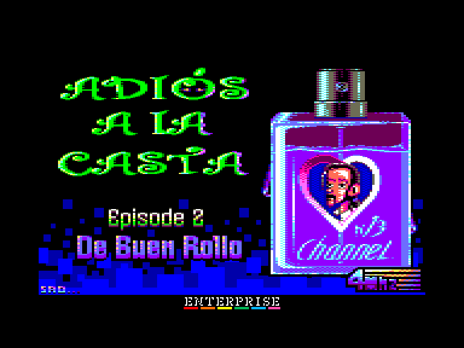
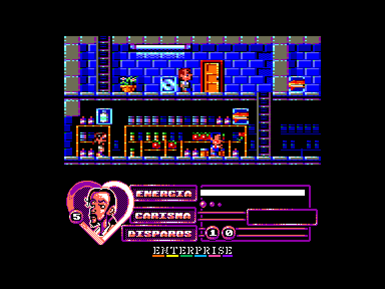
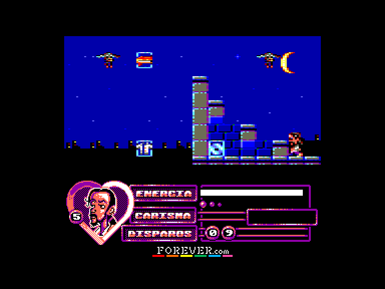
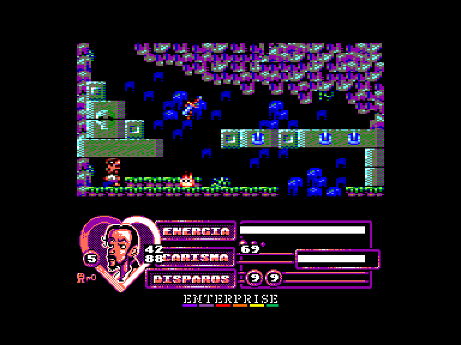

[0-9](../0/games-0.md) - [A](../a/games-a.md) - [B](../b/games-b.md) - [C](../c/games-c.md) - [D](../d/games-d.md) - [E](../e/games-e.md) - [F](../f/games-f.md) - [G](../g/games-g.md) - [H](../h/games-h.md) - [I](../i/games-i.md) - [J](../j/games-j.md) - [K](../k/games-k.md) - [L](../l/games-l.md) - [M](../m/games-m.md) - [N](../n/games-n.md) - [O](../o/games-o.md) - [P](../p/games-p.md) - [Q](../q/games-q.md) - [R](../r/games-r.md) - [S](../s/games-s.md) - [T](../t/games-t.md) - [U](../u/games-u.md) - [V](../v/games-v.md) - [W](../w/games-w.md) - [X](../x/games-x.md) - [Y](../y/games-y.md) - [Z](../z/games-z.md)

Ігри для [Enterprise 64k](../games-ep64.md) - [Enterprise 128k+RAMexp](../games-epramexp.md)

Ігри для систем [IS-DOS](../games-is-dos.md) - [SymbOS](../games-symbos.md) - [EDC Windows](../games-edcw.md)

Ігри для емуляторів [ZX Spectrum 48k/128k](../zxemu/games-zxemu.md) - [Amstrad CPC](../cpcemu/games-cpc.md) - [Sinclair ZX81](../zx81emu/games-zx81.md) - [Videoton TVC](../tvcemu/games-tvc.md) - [Commodore VIC-20](../vic20emu/games-vic20.md)

----------

# Adiós a la Casta: Episode 2 - De Buen Rollo

**ID:** adios-a-la-casta-ep2-cpc

**Жанри:** Аркада, Платформер

## Примітка

ℹ Сучасна схвалена конверсія з платформи Amstrad CPC.

## Скріншоти

## Опис

Нові вибори в Іспанії: Фіолетовий Хвостик знову йде у бій!  

Під час виборів 20 числа ми допомагали Фіолетовому Хвостику та його помічникам розв'язати проблеми Іспаністану, зігравши в Перший епізод «Прощавай, Касто!», та зібрати голоси тих, хто ще не визначився, щоб виграти вибори. Наші заклики не дали результату, і Фіолетовий Хвостик зазнав поразки, давши Рахойо та Пікапедро шанс знову розграбовувати країну (якщо вони взагалі залишили що розграбовувати…).  

Проте ані Рахойо, ані Пікапедро не змогли домовитися, як і далі грабувати безкарно, тож довелося призначати нові вибори. Цього разу Фіолетовий Хвостик має спокусити свого політичного друга Каспона та завоювати серця виборців.  

Легко не буде. Знову Рахойо та Пікапедро, до яких приєдналися Альбертіто, Рістра та орди Охоронців, БіоГалок, БіоКажанів і БіоЩурів, намагатимуться зруйнувати магічну ідилію між Фіолетовим Хвостиком та Каспоном.  

І якщо попри все кохання переможе і йому вдасться дістатися фіналу цієї пригоди, на нього чекає остання перешкода. Втілення самого зла — аморальний і жахливий A.N.S.A.R.

## Основна інформація
- **Мови:** Іспанська
- **Оригінальна платформа:** Amstrad CPC
### Загальні системні вимоги
- **Апаратні:** EP128
### Геймплей
- **Керування:** Keyboard, Internal Joy, External Joy 1, External Joy 2
- **Кількість гравців:** 1 player
- **Додаткові теги:** 16-color mode
### Розробка
- **Рік випуску:** 2016
- **Компанія:** 4Mhz

## Посилання
- [Домашня сторінка гри](https://www.4mhz.es/adios-a-la-casta-episode-2-de-buen-rollo/)
- [Тема на форумі enterpriseforever](https://enterpriseforever.com/cpc-rl/adios-a-la-casta-ii/)
- [Інформація про оригінальну версію](https://www.cpc-power.com/index.php?page=detail&num=13113)
- [Завантажити гру](http://www.ep128.hu/Ep_Games/Prg/Adios_a_la_Casta_2.rar)
- [Easy Load&Play](https://t.me/EP128k_Load_n_Play/56) *(Telegram-канал Vibrant Waves)*

## Відео

<iframe src="https://www.youtube.com/embed/atNI0AMza8k"  
style="width:75%; aspect-ratio:16/9;" allowfullscreen></iframe>

- [Відео](https://youtu.be/oX1HMN3M3NA)

## [Керування](../controllers.md)

`Internal Joystick`  
`External Joystick 1`  
`External Joystick 2`  
`Keyboard`: `Q`, `A`, `O`, `P`, `Space`  

`Esc`: Вийти з поточної гри  
`8`: оригінальна палітра (світліша)  
`9`: модифікована палітра (контрастніша)

## Детальна інформація

### Геймплей  

Фіолетовий Хвостик має зібрати всі предмети, які знайде у своєму улюбленому гіпермаркеті — Alzampo. Такі речі, як дешеві сорочки, диски гурту Hue Kids, книжки про Марс та пляшечки антикастового шампуню, поповнюватимуть шкалу вашої Харизми. Зібравши їх усі, він зможе вирушити на побачення зі своїм коханим Каспоном, але перш за все йому доведеться здолати свого вічного ворога — ANSAR.  

Для цього потрібно збирати набої, розкидані по всій карті, хоча їх буде недостатньо, якщо ви не потрапите на прихований рівень (який так називається саме тому, що він прихований і важкодоступний). На цьому рівні ви знайдете набагато більше патронів, що значно полегшить розправу над ANSAR. Заходити на секретний рівень не обов'язково, але вам неодмінно сподобається туди потрапити, ось побачите…  

По всьому маршруту також розставлені пляшки з колою, які допоможуть вам відновити рівень енергії.  

### Чіти  

`T`+`R`: нескінченні життя  
`W`: нескінченна енергія  
`E`: вимкнути режим нескінченної енергії  

**Original cheats** (для активації натисніть комбінацію клавіш `1`+`5`+`⬆️`)  
Зміна кімнати:  
`F4`: до кімнати ліворуч  
`F6`: до кімнати праворуч  
`F8`: до кімнати зверху  
`F2`: до кімнати знизу  

Інше:  
`2`: Отримати ключ від фінальної локації  
`Q`: Відобразити відладочну інформацію