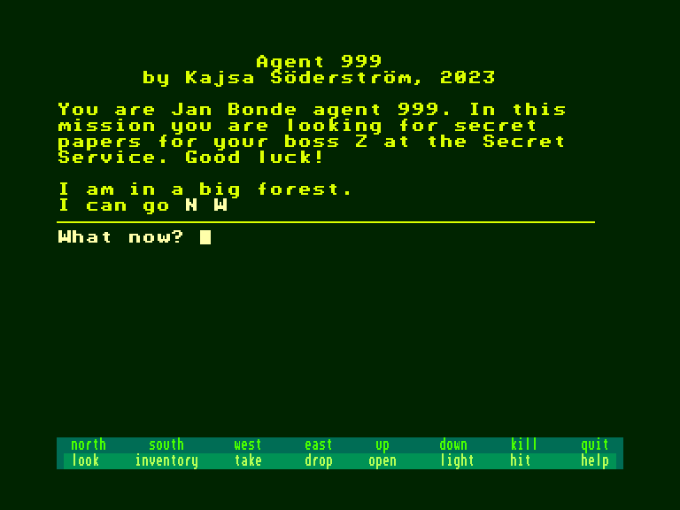
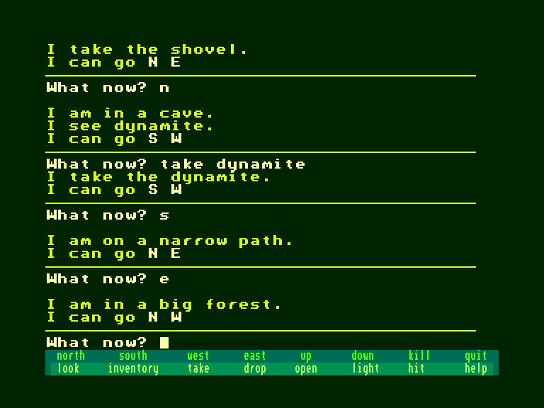
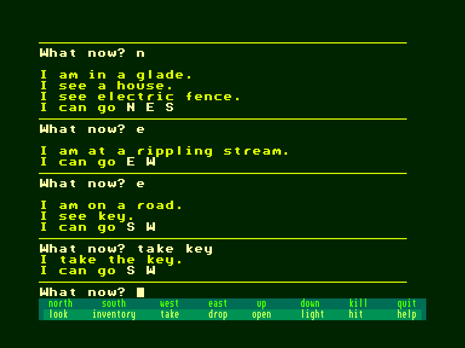

[0-9](../0/games-0.md) - [A](../a/games-a.md) - [B](../b/games-b.md) - [C](../c/games-c.md) - [D](../d/games-d.md) - [E](../e/games-e.md) - [F](../f/games-f.md) - [G](../g/games-g.md) - [H](../h/games-h.md) - [I](../i/games-i.md) - [J](../j/games-j.md) - [K](../k/games-k.md) - [L](../l/games-l.md) - [M](../m/games-m.md) - [N](../n/games-n.md) - [O](../o/games-o.md) - [P](../p/games-p.md) - [Q](../q/games-q.md) - [R](../r/games-r.md) - [S](../s/games-s.md) - [T](../t/games-t.md) - [U](../u/games-u.md) - [V](../v/games-v.md) - [W](../w/games-w.md) - [X](../x/games-x.md) - [Y](../y/games-y.md) - [Z](../z/games-z.md)

Ігри для [Enterprise 64k](../games-ep64.md) - [Enterprise 128k+RAMexp](../games-epramexp.md) - [2dfx](games-2dfx.md)

Ігри для систем [IS-DOS](../games-is-dos.md) - [SymbOS](../games-symbos.md) - [EDC Windows](../games-edcw.md)

Ігри для емуляторів [ZX Spectrum 48k/128k](../zxemu/games-zxemu.md) - [Amstrad CPC](../cpcemu/games-cpc.md) - [Sinclair ZX81](../zx81emu/games-zx81.md) - [Videoton TVC](../tvcemu/games-tvc.md) - [Commodore VIC-20](../vic20emu/games-vic20.md)

----------

# Agent 999

**ID:** agent999-bas

**Жанри:** Текстова пригода

## Примітка

ℹ Сучасна конверсія.

## Скріншоти

## Опис

Головний герой гри — агент Ян Бонде. Він отримує завдання викрасти «таємні документи», які зберігаються в будинку ґанґстерів, та доставити їх до кабінету свого боса. Тож перед нами розгортається така собі крошечна й простенька шпигунська історія. В оригінальній грі ми майже не отримували жодного відгуку про те, успішна наша спроба чи ні. Версія для Enterprise у цьому плані розширена.

## Основна інформація
- **Мови:** Англійська
- **Оригінальна платформа:** Commodore 64
### Загальні системні вимоги
- **Програмні:** IS-Basic
### Геймплей
- **Керування:** Keyboard
- **Кількість гравців:** 1 player
- **Додаткові теги:** Text40 mode
### Розробка
- **Рік випуску:** 2023
- **Автор:** Kajsa Söderström

## Посилання
- [Опис на ep128.hu (угорською)](http://www.ep128.hu/Ep_Games/Leiras/Basic_Program_Pack.htm)
- [Інформація про гру (SolutionArchive.com)](https://solutionarchive.com/game/id%2C10325/Agent+999.html)
- [Завантажити](http://www.ep128.hu/Ep_Games/Prg/Basic_Program_Pack.rar)

## [Керування](../controllers.md)

`Keyboard`  

`F1`-`F8`, `Shift`+`F1`-`Shift`+`F8`: швидке введення команд (підказка на стрічці знизу екрану).

## Детальна інформація

### Геймплей  

Програма розуміє такі команди: `n`, `s`, `w`, `e`, `u`, `d`, `take`, `get`, `drop`, `hit`, `kill`, `light`, `inventory` (`i`), `look`, `quit`, `help`. Скорочення (крім зазначених) не приймаються.  

Гра легко проходиться. Якщо трохи помалювати карту — успіх гарантовано.  

### Історія розробки  

Гра, яка початково вийшла шведською мовою, з'явилася 1984 року в журналі «Alt om Hemdatorer» («Все про домашні комп'ютери») у вигляді лістингу для передруку. І ні, не для C64, а для досить популярної у Швеції машини Spectravideo. Авторка — Кайса Седерстрьом (Kajsa Söderström), яка народилася 1976 року й написала оригінальну гру у 8-річному віці(!), — у 2023 році створила англомовну версію для C64.