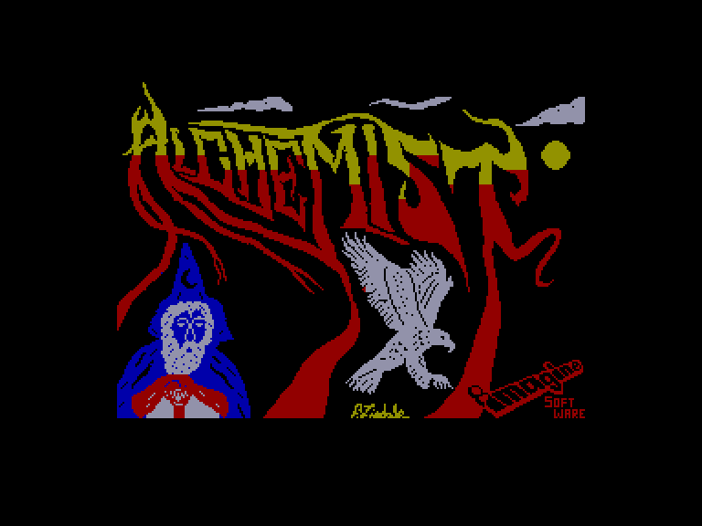
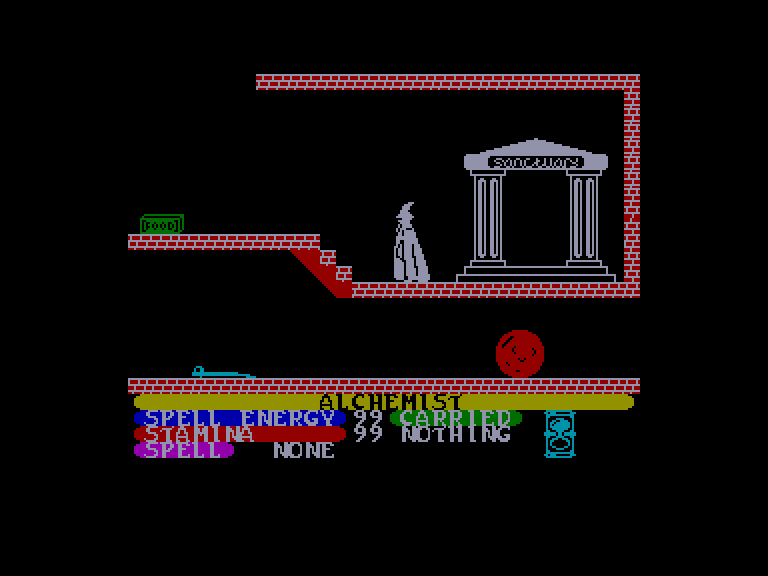
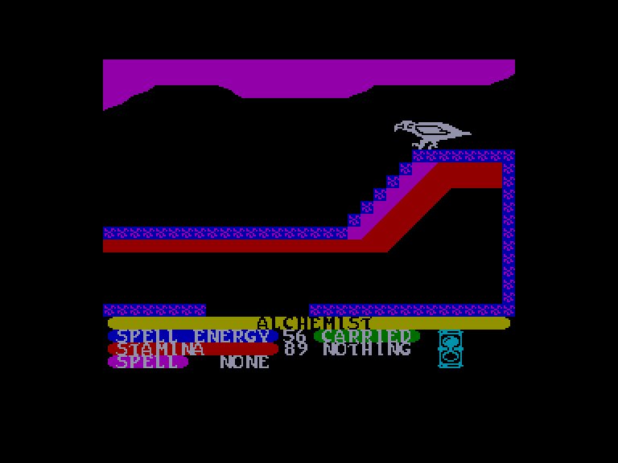
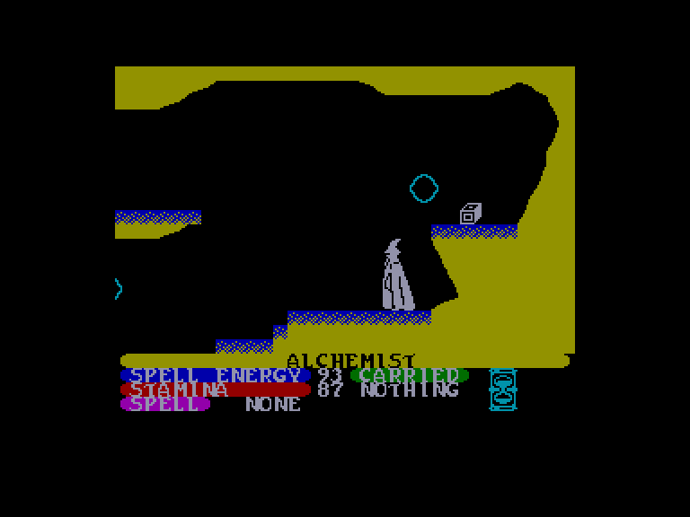

[0-9](../0/games-0.md) - [A](../a/games-a.md) - [B](../b/games-b.md) - [C](../c/games-c.md) - [D](../d/games-d.md) - [E](../e/games-e.md) - [F](../f/games-f.md) - [G](../g/games-g.md) - [H](../h/games-h.md) - [I](../i/games-i.md) - [J](../j/games-j.md) - [K](../k/games-k.md) - [L](../l/games-l.md) - [M](../m/games-m.md) - [N](../n/games-n.md) - [O](../o/games-o.md) - [P](../p/games-p.md) - [Q](../q/games-q.md) - [R](../r/games-r.md) - [S](../s/games-s.md) - [T](../t/games-t.md) - [U](../u/games-u.md) - [V](../v/games-v.md) - [W](../w/games-w.md) - [X](../x/games-x.md) - [Y](../y/games-y.md) - [Z](../z/games-z.md)

Ігри для [Enterprise 64k](../games-ep64.md) - [Enterprise 128k+RAMexp](../games-epramexp.md) - [2dfx](games-2dfx.md)

Ігри для систем [IS-DOS](../games-is-dos.md) - [SymbOS](../games-symbos.md) - [EDC Windows](../games-edcw.md)

Ігри для емуляторів [ZX Spectrum 48k/128k](../zxemu/games-zxemu.md) - [Amstrad CPC](../cpcemu/games-cpc.md) - [Sinclair ZX81](../zx81emu/games-zx81.md) - [Videoton TVC](../tvcemu/games-tvc.md) - [Commodore VIC-20](../vic20emu/games-vic20.md)

----------

# Alchemist

**ID:** alchemist-zx

## Примітка

ℹ Стара неофіційна конверсія з платформи ZX Spectrum.

## Скріншоти

## Опис

Вас, найвправнішого Алхіміка на землі, закликали на бій із Лютим Чаклуном, який тероризує ці землі. Ви мусите проникнути в його замок і знайти чотири частини магічного сувою — саме вони дозволять вам здолати Чаклуна, повернувши його ж власне Закляття Знищення проти нього самого.

## Основна інформація
- **Мови:** Англійська
- **Оригінальна платформа:** ZX Spectrum
### Геймплей
- **Додаткові теги:** Attribute mode

## Посилання
- [Інформація про оригінальну версію](https://spectrumcomputing.co.uk/entry/139/ZX-Spectrum/Alchemist)
- [Завантажити](http://www.ep128.hu/Ep_Games/Prg/Alchemist.rar)

## Детальна інформація

### Геймплей  

Алхімік може подорожувати у вигляді людини, поки не натрапить на крутий пагорб або обрив, але він здатен перетворитися на велетенського орла, аби здолати ці перешкоди. Сам замок кишить кімнатами, печерами та коридорами, повними найрізноманітніших монстрів, (можливо) корисних предметів, одноразових малих заклять і, звісно ж, чотирьох частин магічного сувою.  

Справу ускладнюють два фактори. По-перше, Алхімік може нести лише один предмет за раз, тож вибір того, що саме взяти з собою, вимагає певної стратегії. По-друге, будь-який рух, зіткнення з об'єктами чи перетворення виснажують вашу витривалість. Підтримувати її можна, збираючи припаси їжі.  

Втім, у вашому розпорядженні є два види зброї — блискавки та заклинання (якщо вони у вас є). Вони витрачають магічну енергію, яка відновлюється лише з часом. Сутички з монстрами також знесилюють, хоча це залежить від того, чи маєте ви при собі зброю нашталт сокири чи меча.