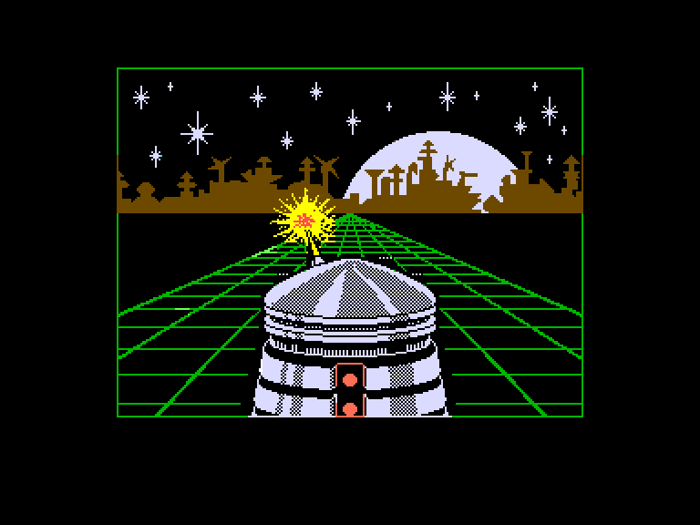
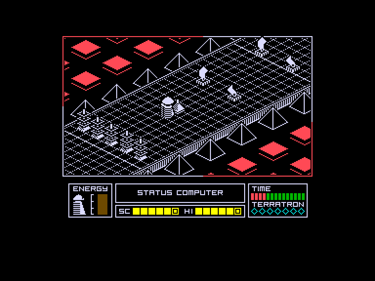
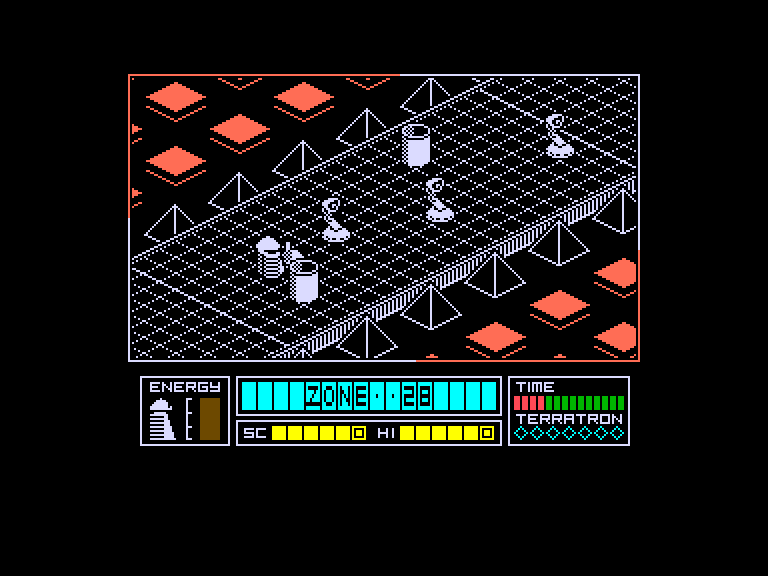
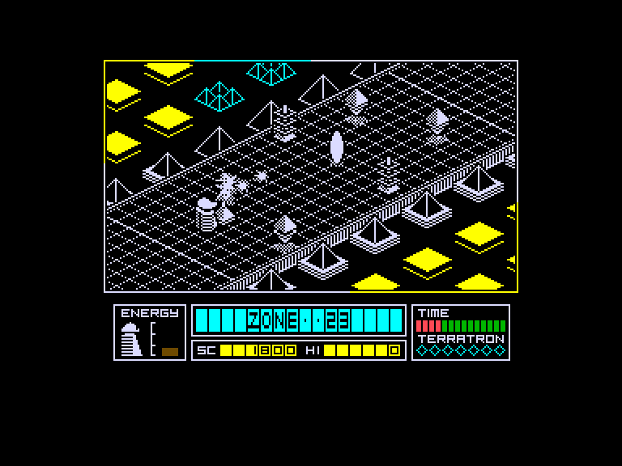

[0-9](../0/games-0.md) - [A](../a/games-a.md) - [B](../b/games-b.md) - [C](../c/games-c.md) - [D](../d/games-d.md) - [E](../e/games-e.md) - [F](../f/games-f.md) - [G](../g/games-g.md) - [H](../h/games-h.md) - [I](../i/games-i.md) - [J](../j/games-j.md) - [K](../k/games-k.md) - [L](../l/games-l.md) - [M](../m/games-m.md) - [N](../n/games-n.md) - [O](../o/games-o.md) - [P](../p/games-p.md) - [Q](../q/games-q.md) - [R](../r/games-r.md) - [S](../s/games-s.md) - [T](../t/games-t.md) - [U](../u/games-u.md) - [V](../v/games-v.md) - [W](../w/games-w.md) - [X](../x/games-x.md) - [Y](../y/games-y.md) - [Z](../z/games-z.md)

Ігри для [Enterprise 64k](../games-ep64.md) - [Enterprise 128k+RAMexp](../games-epramexp.md) - [2dfx](games-2dfx.md)

Ігри для систем [IS-DOS](../games-is-dos.md) - [SymbOS](../games-symbos.md) - [EDC Windows](../games-edcw.md)

Ігри для емуляторів [ZX Spectrum 48k/128k](../zxemu/games-zxemu.md) - [Amstrad CPC](../cpcemu/games-cpc.md) - [Sinclair ZX81](../zx81emu/games-zx81.md) - [Videoton TVC](../tvcemu/games-tvc.md) - [Commodore VIC-20](../vic20emu/games-vic20.md)

----------

# Alien Highway

**Альтернативні назви:**
 - Encounter 2

**ID:** alien-highway-zx

**Жанри:** Екшн

## Примітка

ℹ Сучасна неофіційна конверсія з платформи ZX Spectrum.

## Скріншоти

## Опис

Ваша мішень — Імперія Іншопланетян та величезний комплекс, який є критично важливим для їхнього виживання. Ваше завдання полягає в тому, щоб проштовхати пристрій під назвою «Терратрон» через усю довгу автостраду аж до воріт Штаб-квартири Іншопланетян, де він вибухне й знищить ворога.

## Основна інформація
- **Мови:** Англійська
- **Оригінальна платформа:** ZX Spectrum
### Загальні системні вимоги
- **Апаратні:** EP64, EP128
### Геймплей
- **Керування:** Keyboard, Internal Joy, External Joy 1, External Joy 2
- **Кількість гравців:** 1 player
- **Додаткові теги:** Attribute mode, Isometric

## Посилання
- [Опис на ep128.hu (угорською)](http://www.ep128.hu/Games/Alien_Highway.htm)
- [Інформація про оригінальну версію](https://spectrumcomputing.co.uk/entry/151/ZX-Spectrum/Alien_Highway)
- [Завантажити](http://www.ep128.hu/Ep_Games/Prg/Alien_Highway.rar)
- [Easy Load&Play](https://t.me/EP128k_Load_n_Play/1130) *(Telegram-канал Vibrant Waves)*

## Детальна інформація

### Геймплей  

Ви керуєте роботом на ім’я Вортон, схожим на Далека. Його потрібно постійно підзаряджати від джерел живлення уздовж автостради, адже будь-який контакт із ворогом чи його зброєю виснажує енергію. Вортон дуже швидко розганяється, але досить повільно гальмує, що дещо ускладнює керування! Вам доведеться спочатку спрямувати його в потрібний бік, а вже потім рухатися.  

Шлях до Імперії захаращений перешкодами та різноманітними охоронцями. До того ж краї обочини перебувають під смертельно небезпечною напругою. Деякі об'єкти можна пересувати, розстрілюючи їх із лазерів, і використовувати для перегороджування шляху ворогам, забезпечуючи собі безпечний прохід.  

Дорогою «Тератрон» потрібно підзарядити сім разів, аби втримати його в робочому стані — уважно стежте за станціями Регенерації. Вікно стану показує кількість отриманих зарядів, а також рівень вашої енергії та час.