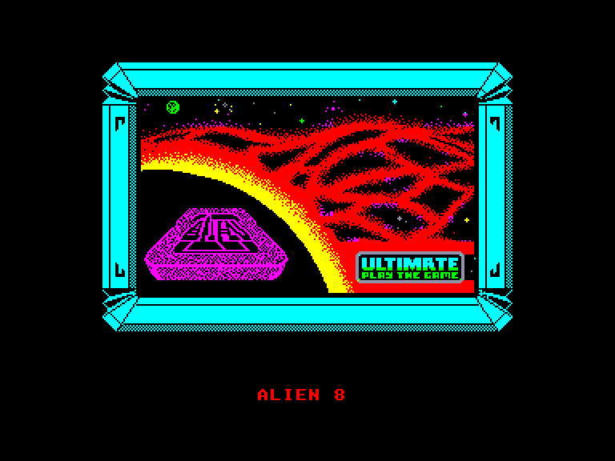
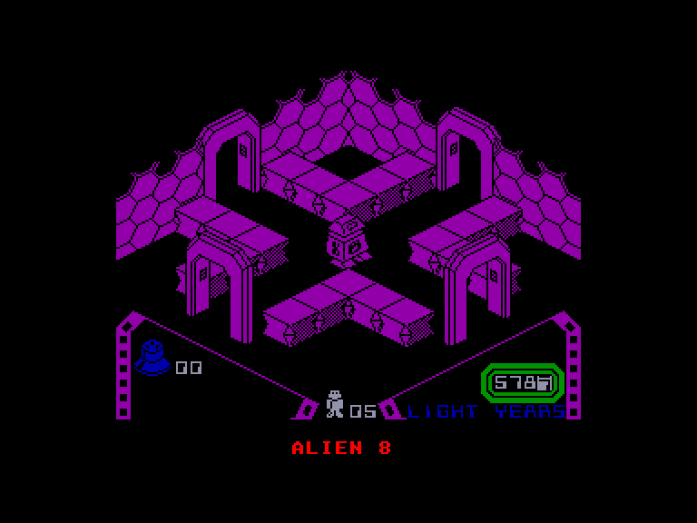
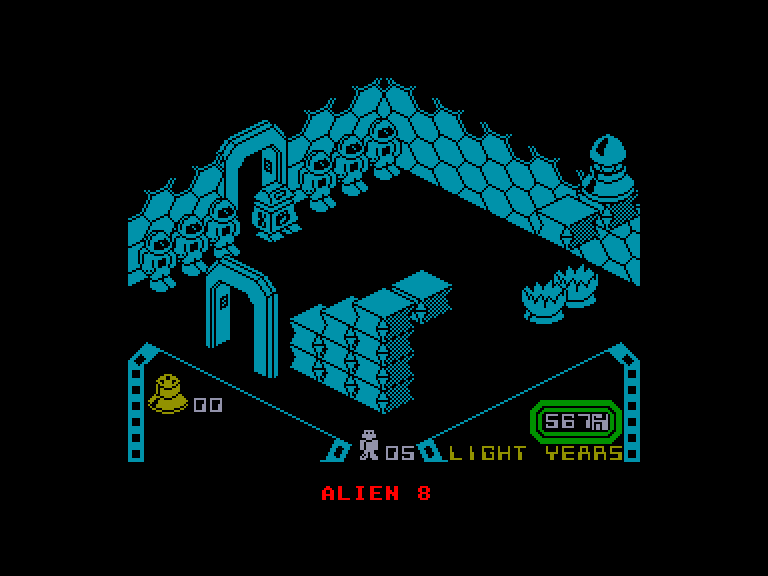
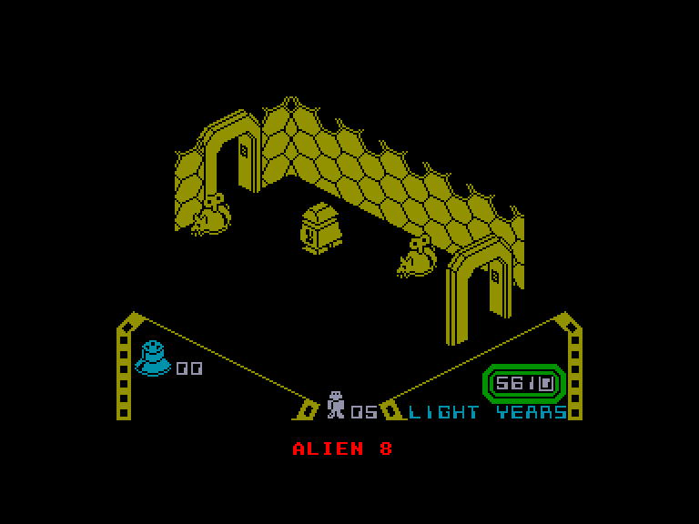

[0-9](../0/games-0.md) - [A](../a/games-a.md) - [B](../b/games-b.md) - [C](../c/games-c.md) - [D](../d/games-d.md) - [E](../e/games-e.md) - [F](../f/games-f.md) - [G](../g/games-g.md) - [H](../h/games-h.md) - [I](../i/games-i.md) - [J](../j/games-j.md) - [K](../k/games-k.md) - [L](../l/games-l.md) - [M](../m/games-m.md) - [N](../n/games-n.md) - [O](../o/games-o.md) - [P](../p/games-p.md) - [Q](../q/games-q.md) - [R](../r/games-r.md) - [S](../s/games-s.md) - [T](../t/games-t.md) - [U](../u/games-u.md) - [V](../v/games-v.md) - [W](../w/games-w.md) - [X](../x/games-x.md) - [Y](../y/games-y.md) - [Z](../z/games-z.md)

Ігри для [Enterprise 64k](../games-ep64.md) - [Enterprise 128k+RAMexp](../games-epramexp.md)

Ігри для систем [IS-DOS](../games-is-dos.md) - [SymbOS](../games-symbos.md) - [EDC Windows](../games-edcw.md)

Ігри для емуляторів [ZX Spectrum 48k/128k](../zxemu/games-zxemu.md) - [Amstrad CPC](../cpcemu/games-cpc.md) - [Sinclair ZX81](../zx81emu/games-zx81.md) - [Videoton TVC](../tvcemu/games-tvc.md) - [Commodore VIC-20](../vic20emu/games-vic20.md)

----------

# Alien 8

**ID:** alien8-zx

**Жанри:** Аркада, Пригодницька, Платформер

## Примітка

ℹ Стара неофіційна конверсія з платформи ZX Spectrum.  
(краще використовувати сучасний порт з Amstrad)

## Скріншоти

## Опис

У ролі Ремонтного Дроїда №8 ви перебуваєте на борту зорельота, який саме скидає швидкість для довгоочікуваного прибуття. На жаль, на корабель проникла група вельми неприємних прибульців і деактивувала таймери в кріогенних камерах, через що екіпаж досі залишається замороженим. Ваше завдання — знову підключити таймери до того, як зореліт дістанеться точки призначення.

## Основна інформація
- **Мови:** Англійська
- **Оригінальна платформа:** ZX Spectrum
### Геймплей
- **Кількість гравців:** 1 player
- **Додаткові теги:** Attribute mode, Isometric

## Посилання
- [Опис гри на ep128.hu (угорською)](http://www.ep128.hu/Games/Alien8.htm)
- [Інформація про оригінальну версію](https://spectrumcomputing.co.uk/entry/9302/ZX-Spectrum/Alien_8)
- [Завантажити гру](http://www.ep128.hu/Ep_Games/Prg/Alien_8.rar)

## [Керування](../controllers.md)

`Keyboard`: `Q`, `A`, `O`, `P`, `J` (пряме (directional) керування не працює)  
`Internal Joystick`  
`External Joystick 1`  
`External Joystick 2`  

`⬇`: підняти/викласти предмет (Якщо вимкнено пряме (directional) керування)  
`9`/`0`/`-`: підняти/викласти предмет (Якщо активне пряме (directional) керування)

## Детальна інформація

### Геймплей  

Електричні плати таймерів виглядають як геометричні фігури зі штекерами, розкидані по 129 кімнатах зорельота. Кожна кріогенна камера має лише одне гніздо, і кожному гнізду потрібен свій конкретний тип штекера — тож вам доведеться з'ясувати, який саме штекер підходить до якого гнізда. Крім цього, ви мусите здолати й інші небезпеки: прибульців, рухомі та розчинні блоки, а також автоматичний захист корабля — міни, гострі шипи й піраміди під смертельною напругою... Міни можна знешкодити за допомогою керованого робота: вставши на площадку з намальованими напрямками ви зможете направити його на міни.