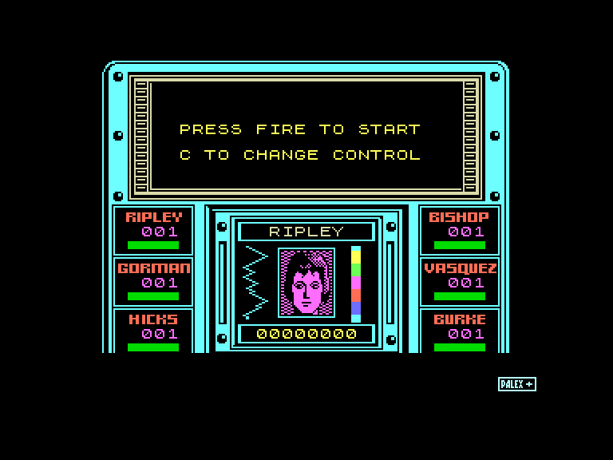
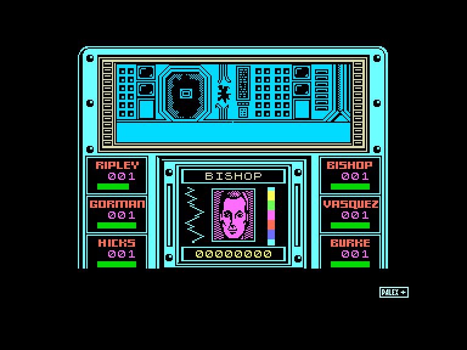
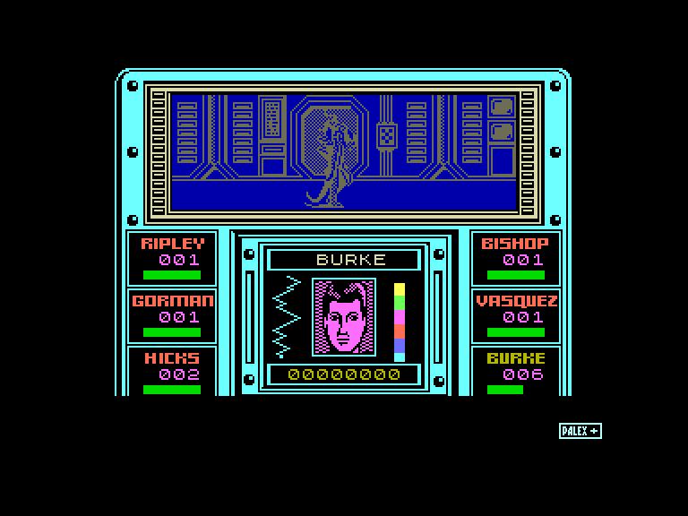
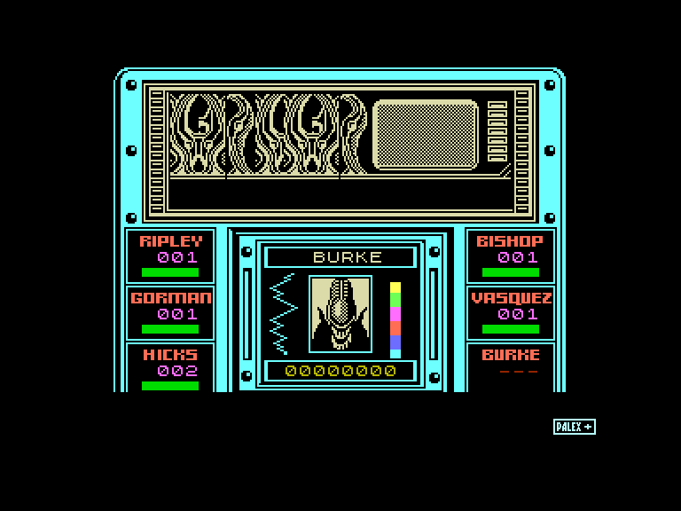

[0-9](../0/games-0.md) - [A](../a/games-a.md) - [B](../b/games-b.md) - [C](../c/games-c.md) - [D](../d/games-d.md) - [E](../e/games-e.md) - [F](../f/games-f.md) - [G](../g/games-g.md) - [H](../h/games-h.md) - [I](../i/games-i.md) - [J](../j/games-j.md) - [K](../k/games-k.md) - [L](../l/games-l.md) - [M](../m/games-m.md) - [N](../n/games-n.md) - [O](../o/games-o.md) - [P](../p/games-p.md) - [Q](../q/games-q.md) - [R](../r/games-r.md) - [S](../s/games-s.md) - [T](../t/games-t.md) - [U](../u/games-u.md) - [V](../v/games-v.md) - [W](../w/games-w.md) - [X](../x/games-x.md) - [Y](../y/games-y.md) - [Z](../z/games-z.md)

Ігри для [Enterprise 64k](../games-ep64.md) - [Enterprise 128k+RAMexp](../games-epramexp.md)

Ігри для систем [IS-DOS](../games-is-dos.md) - [SymbOS](../games-symbos.md) - [EDC Windows](../games-edcw.md)

Ігри для емуляторів [ZX Spectrum 48k/128k](../zxemu/games-zxemu.md) - [Amstrad CPC](../cpcemu/games-cpc.md) - [Sinclair ZX81](../zx81emu/games-zx81.md) - [Videoton TVC](../tvcemu/games-tvc.md) - [Commodore VIC-20](../vic20emu/games-vic20.md)

----------

# Aliens

**ID:** aliens-zx

**Жанри:** Екшн, Лабіринт

## Примітка

ℹ Стара неофіційна конверсія з платформи ZX Spectrum.

## Скріншоти

## Опис

Ріплі повертається на планету Чужих разом із загоном елітних колоніальних морпіхів, аби з'ясувати, що сталося з відправленими туди колоністами. Ваше завдання — керувати нею та іншими членами команди, щоб проникнути на базу «Ахерон» і врятувати тих, хто вижив... якщо такі взагалі лишились.

## Основна інформація
- **Мови:** Англійська
- **Оригінальна платформа:** ZX Spectrum
### Геймплей
- **Додаткові теги:** Attribute mode
### Розробка
- **Рік випуску:** 1987

## Посилання
- [Інформація про оригінальну версію](https://spectrumcomputing.co.uk/entry/161/ZX-Spectrum/Aliens)

## Детальна інформація

### Геймплей  

Дія розгортається від першої особи: ви бачите світ через камеру на шоломі Ріплі та п'ятьох морпіхів. Приціл імпульсної гвинтівки можна переміщати, щоб вистежувати Чужих або повертатися в кімнаті — камера слідує за прицілом.  

Окрім основного екрана, на консолі знизу відображається стан усіх шести членів команди. Вона відстежує їхнє здоров'я: коли бійці близькі до виснаження, смужка стану починає блимати, а якщо в кімнаті з ними опиняється Чужий — змінює колір. Також вказується номер кімнати, де перебуває персонаж. У центрі консолі показано поточного бійця, ліворуч — його життєві показники, а праворуч — залишок боєприпасів.  

Пересуватися можна через двері: наведіть приціл на дверний отвір і натисніть кнопку вогню, щоб пройти. Для швидкого переміщення можна наказати персонажу пройти до дев'яти кімнат на північ, південь, схід чи захід. Малювання карти тут, очевидно, буде чудовою ідеєю!  

Якщо Чужий вибирається зі схованки або входить до кімнати, лунає сигнал датчика руху. У вас є лише кілька секунд, щоб застрелити потвору, поки вона не поласувала вашим чолом... Якщо це станеться, екран вкриється перешкодами, а ваш персонаж загине. Якщо ж член команди, який не перебуває під вашим прямим контролем, стикається з Чужим, істота захоплює його та інфікує — смужка стану стає жовтою. Якщо бійця швидко не врятувати, він незабаром помре, коли з його грудей вилупиться грудолом.  

Зрештою, у глибинах бази ви можете зустріти Королеву Чужих у її кублі. І вона буде дуже добре захищена...