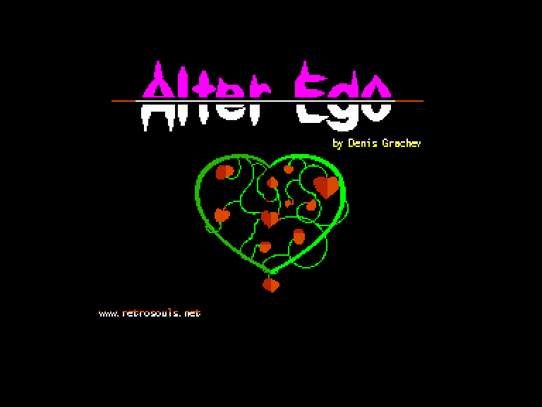
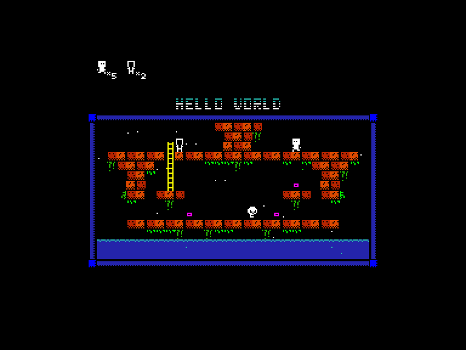
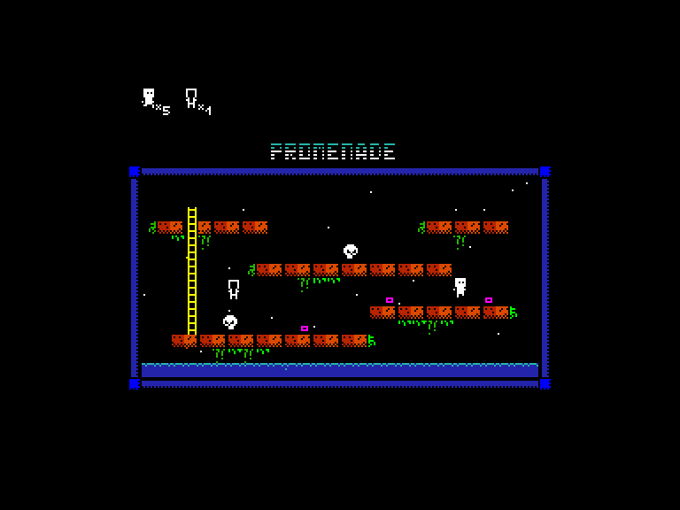
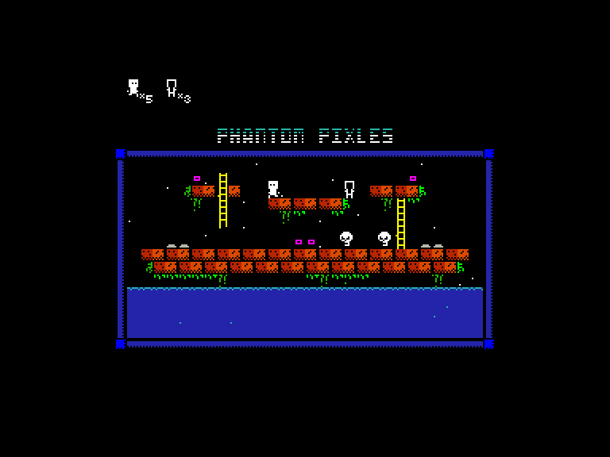

[0-9](../0/games-0.md) - [A](../a/games-a.md) - [B](../b/games-b.md) - [C](../c/games-c.md) - [D](../d/games-d.md) - [E](../e/games-e.md) - [F](../f/games-f.md) - [G](../g/games-g.md) - [H](../h/games-h.md) - [I](../i/games-i.md) - [J](../j/games-j.md) - [K](../k/games-k.md) - [L](../l/games-l.md) - [M](../m/games-m.md) - [N](../n/games-n.md) - [O](../o/games-o.md) - [P](../p/games-p.md) - [Q](../q/games-q.md) - [R](../r/games-r.md) - [S](../s/games-s.md) - [T](../t/games-t.md) - [U](../u/games-u.md) - [V](../v/games-v.md) - [W](../w/games-w.md) - [X](../x/games-x.md) - [Y](../y/games-y.md) - [Z](../z/games-z.md)

Ігри для [Enterprise 64k](../games-ep64.md) - [Enterprise 128k+RAMexp](../games-epramexp.md) - [2dfx](games-2dfx.md)

Ігри для систем [IS-DOS](../games-is-dos.md) - [SymbOS](../games-symbos.md) - [EDC Windows](../games-edcw.md)

Ігри для емуляторів [ZX Spectrum 48k/128k](../zxemu/games-zxemu.md) - [Amstrad CPC](../cpcemu/games-cpc.md) - [Sinclair ZX81](../zx81emu/games-zx81.md) - [Videoton TVC](../tvcemu/games-tvc.md) - [Commodore VIC-20](../vic20emu/games-vic20.md)

----------

# Alter Ego

**ID:** alter-ego-zx

**Жанри:** Аркада, Платформер, Логічна

## Примітка

ℹ Сучасна неофіційна конверсія з платформи ZX Spectrum.

## Скріншоти

## Опис

На перший погляд «Alter Ego» може здатися схожою на класичну «Lode Runner», але все змінює одна додаткова ігрова механіка. Ви керуєте персонажем, у якого є примарний двійник — альтер-его, з яким можна обмінюватися місцем розташування. До того ж, у якому б напрямку він не рухався, його двійник рухатиметься в протилежному. Використовуючи цю здібність, необхідно зібрати всі предмети на рівні, уникаючи ворогів. Але зважте, що скористатися можливістю переміщення можна лише обмежену кількість разів.

## Основна інформація
- **Мови:** Англійська
- **Оригінальна платформа:** ZX Spectrum
### Загальні системні вимоги
- **Апаратні:** EP128
### Геймплей
- **Керування:** Keyboard, Internal Joy, External Joy 1
- **Кількість гравців:** 1 player
- **Додаткові теги:** Attribute mode
### Розробка
- **Рік випуску:** 2011
- **Автор:** Denis Grachev
- **Компанія:** Retrosouls

## Посилання
- [Домашня сторінка](https://www.retrosouls.net/?page_id=848)
- [Опис на ep128.hu (угорською)](http://www.ep128.hu/Games/Alter_Ego.htm)
- [Тема на форумі enterpriseforever](https://enterpriseforever.com/spectrum-rol/alter-ego/)
- [Інформація про оригінальну версію](https://spectrumcomputing.co.uk/entry/26211/ZX-Spectrum/Alter_Ego)
- [Завантажити](http://www.ep128.hu/Ep_Games/Prg/Alter_Ego.rar)
- [Easy Load&Play](https://t.me/EP128k_Load_n_Play/66) *(Telegram-канал Vibrant Waves)*

## Відео

<iframe src="https://www.youtube.com/embed/Ni2zLcmwFAI"  
style="width:75%; aspect-ratio:16/9;" allowfullscreen></iframe>

## [Керування](../controllers.md)

`Keyboard`: `Q`, `A`, `O`, `P`, `Space`  
`Internal Joystick`  
`External Joystick 1`  

`Fire`: телепортація

## Детальна інформація

### Чіти  

(активація після завантаження):  
Незкінченні життя [Y/N]  
Нескінченна кількість телепортацій [Y/N]  
Вибір початкового рівня [Y/N] (якщо ТАК, виберіть назву потрібного рівня (`⬅️`/`➡️`) і натисніть `Enter`)