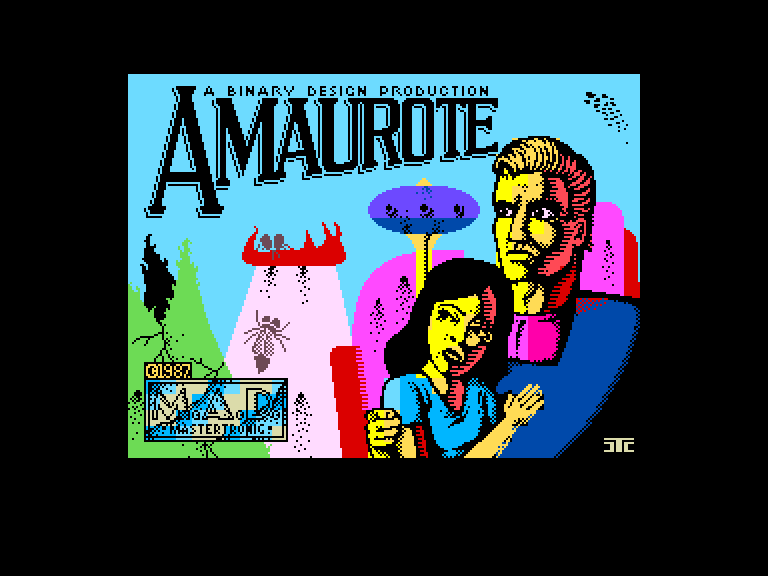
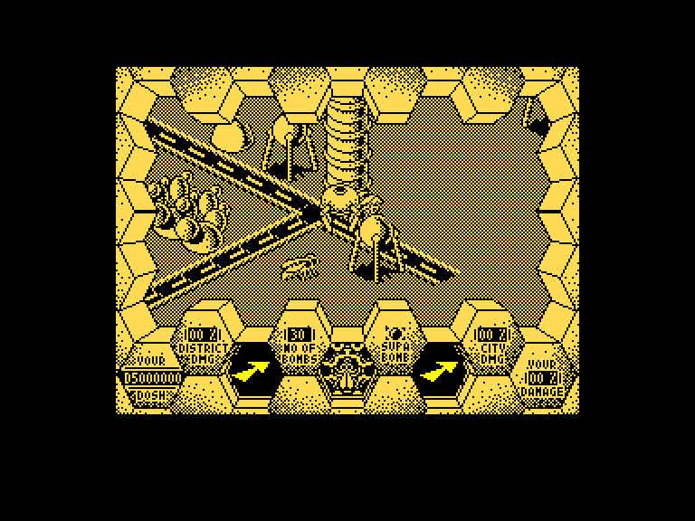
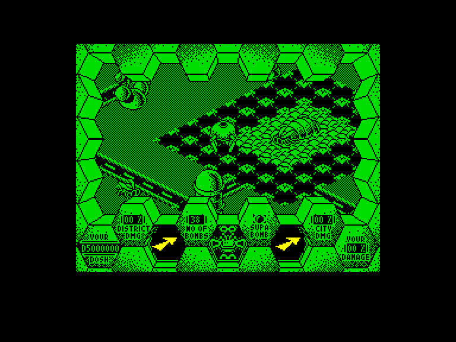
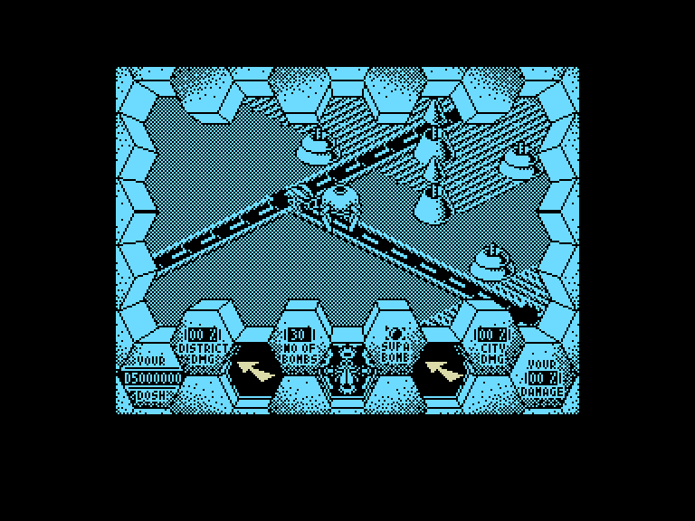

[0-9](../0/games-0.md) - [A](../a/games-a.md) - [B](../b/games-b.md) - [C](../c/games-c.md) - [D](../d/games-d.md) - [E](../e/games-e.md) - [F](../f/games-f.md) - [G](../g/games-g.md) - [H](../h/games-h.md) - [I](../i/games-i.md) - [J](../j/games-j.md) - [K](../k/games-k.md) - [L](../l/games-l.md) - [M](../m/games-m.md) - [N](../n/games-n.md) - [O](../o/games-o.md) - [P](../p/games-p.md) - [Q](../q/games-q.md) - [R](../r/games-r.md) - [S](../s/games-s.md) - [T](../t/games-t.md) - [U](../u/games-u.md) - [V](../v/games-v.md) - [W](../w/games-w.md) - [X](../x/games-x.md) - [Y](../y/games-y.md) - [Z](../z/games-z.md)

Ігри для [Enterprise 64k](../games-ep64.md) - [Enterprise 128k+RAMexp](../games-epramexp.md)

Ігри для систем [IS-DOS](../games-is-dos.md) - [SymbOS](../games-symbos.md) - [EDC Windows](../games-edcw.md)

Ігри для емуляторів [ZX Spectrum 48k/128k](../zxemu/games-zxemu.md) - [Amstrad CPC](../cpcemu/games-cpc.md) - [Sinclair ZX81](../zx81emu/games-zx81.md) - [Videoton TVC](../tvcemu/games-tvc.md) - [Commodore VIC-20](../vic20emu/games-vic20.md)

----------

# Amaurote

**ID:** amaurote-zx

**Жанри:** Екшн

## Примітка

ℹ Стара неофіційна конверсія з платформи ZX Spectrum.

## Скріншоти

## Опис

До міста Амаурот увірвалися велетенські агресивні комахи, які заснували колонії у кожному з його 25 секторів. Як єдиний армійський офіцер, що вижив після вторгнення (це буде тобі уроком за те, що ховався!), ти мусиш узяти на себе завдання знищити всі ці колонії комах.

## Основна інформація
- **Мови:** Англійська
- **Оригінальна платформа:** ZX Spectrum
### Геймплей
- **Додаткові теги:** Attribute mode
### Розробка
- **Рік випуску:** 1987

## Посилання
- [Опис гри на ep128.hu (угорською)](http://www.ep128.hu/Games/Amaurote.htm)
- [Інформація про оригінальну версію](https://spectrumcomputing.co.uk/entry/176/ZX-Spectrum/Amaurote)
- [Завантажити гру](http://www.ep128.hu/Ep_Games/Prg/Amaurote.rar)

## Детальна інформація

### Геймплей  

Для допомоги у цьому завданні, вам видали таке спорядження: броньований крокохід «Arachnus 4», радар-сканер, двосторонній радіоприймач, 30 стрибаючих бомб і $5 000 000 на купівлю нових припасів. Також у вас є карта для орієнтування.  

**МІСТО**: Зачищати колонії можна в будь-якому порядку. Кожен район Амаурота позначений маленьким диском; коли ви пересуваєте свій «Arachnus» картою, назва району з'являється у верхній частині екрана. Оберіть сектор, з якого хочете почати, підвівши «Arachnus» до відповідного диска та натиснувши кнопку вогню. Якщо вам вдасться знищити всіх комах у цьому районі, ви повернетеся до карти.  

**КОМАХИ**: Є три види комах, і всі вони однаково люті!  

***Королева*** — найважливіша з них, це ваша головна ціль. Втім, вам доведеться добряче попітніти, пробиваючись крізь її охорону. Вона віддає накази трутням і породжує нових комах: щоразу, коли ви вбиваєте одного ворога, вона за короткий час створює іншого.  

***Розвідники*** — літають навколо в пошуках їжі та нападників (тобто вас!). Якщо вони вас помітять, то одразу повідомлять Королеву — а це обіцяє великі неприємності!  

***Трутні*** — найчисленніші та найдурніші. Вони тупі, але ніколи не здаються. На їхніх плечах — збір їжі для Королеви та захист колонії від сторонніх.  

**БОМБИ**: Ваш запас стрибаючих бомб обмежений, тож використовувати їх слід дуже обачно. Натискання кнопки вогню запускає бомбу в напрямку вашого останнього руху. Вона стрибатиме в той бік, поки не влучить у комаху або будівлю — хоча взагалі-то руйнувати місто вам не дозволяли!  

Лише дві речі не можна знищити бомбами: периметральну огорожу та Королеву. Щоб позбутися її, вам знадобиться «супербомба». Отримати її можна за запитом через радіо (не більше однієї за раз). Вони дуже дорогі й надзвичайно небезпечні!  

Запустивши одну бомбу, ви не зможете вистрілити наступною, поки перша не вибухне. Число, що показує залишок бомб, блиматиме червоним, поки бомба перебуває в русі — навіть якщо вона вилетіла за межі екрана.  

**РАДІО**: Ваше командування забезпечило вас радіостанцією. Її активація відкриває меню з такими опціями:  

- ЗАПИТ БОМБ  
- СУПЕРБОМБА  
- РЕМОНТ  
- ЕВАКУАЦІЯ (вихід)  

Бомби скидають у місто з повітря, а за допомогою сканера ви можете їх розшукати. Якщо ваш «Arachnus 4» зазнає серйозних ушкоджень, вам доведеться купувати новий. Хоча у вас і є при собі $5 000 000, витрати можуть виявитися високими, тож намагайтеся не розкидатися грошима.  

**СКАНЕР**: Ви можете запрограмувати сканер на пошук найближчої комахи, Королеви або скинутих з повітря бомб. Для роботи просто оберіть потрібний режим і слідуйте за стрілками.