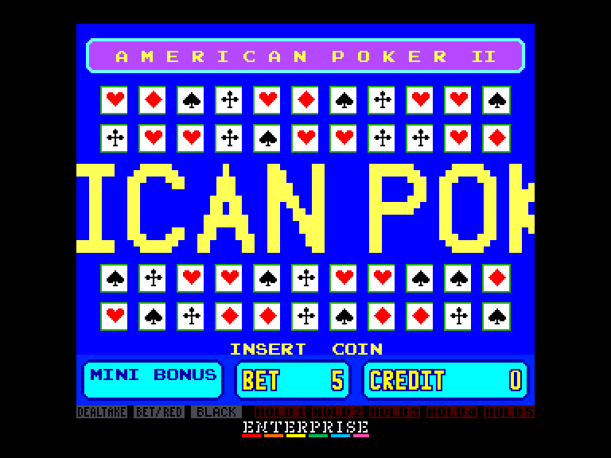
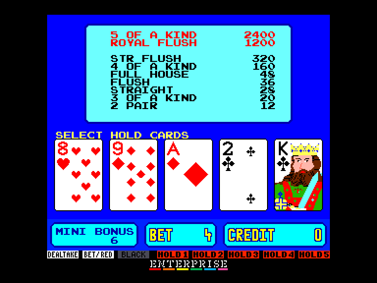
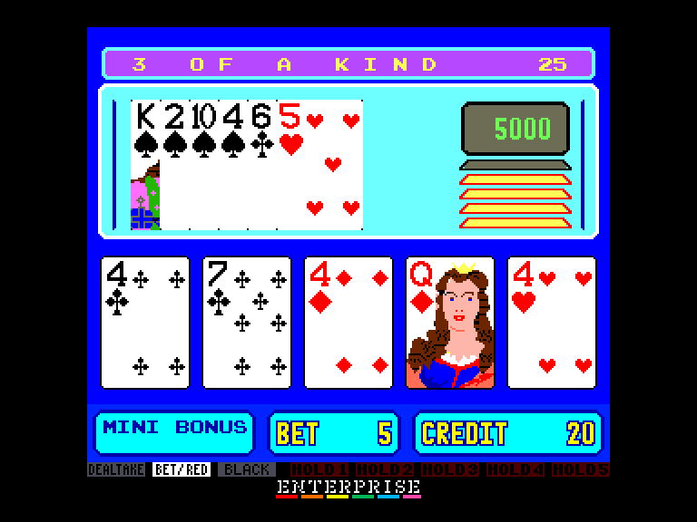
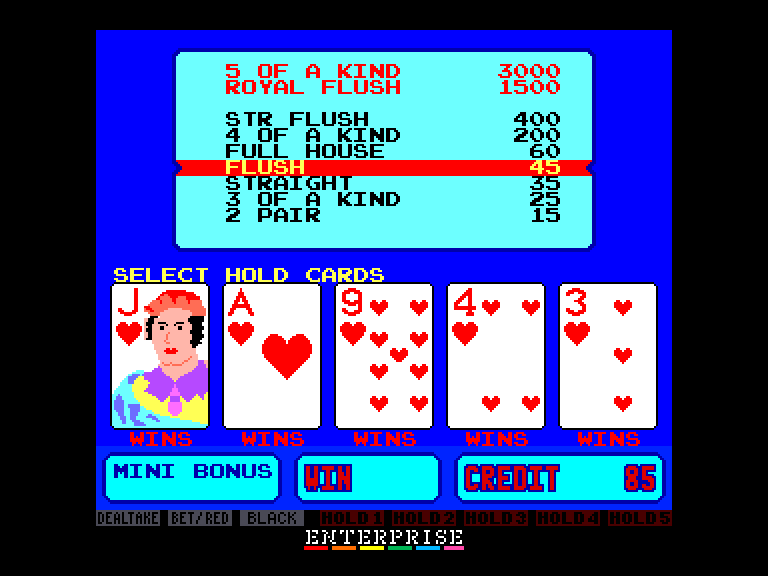

[0-9](../0/games-0.md) - [A](../a/games-a.md) - [B](../b/games-b.md) - [C](../c/games-c.md) - [D](../d/games-d.md) - [E](../e/games-e.md) - [F](../f/games-f.md) - [G](../g/games-g.md) - [H](../h/games-h.md) - [I](../i/games-i.md) - [J](../j/games-j.md) - [K](../k/games-k.md) - [L](../l/games-l.md) - [M](../m/games-m.md) - [N](../n/games-n.md) - [O](../o/games-o.md) - [P](../p/games-p.md) - [Q](../q/games-q.md) - [R](../r/games-r.md) - [S](../s/games-s.md) - [T](../t/games-t.md) - [U](../u/games-u.md) - [V](../v/games-v.md) - [W](../w/games-w.md) - [X](../x/games-x.md) - [Y](../y/games-y.md) - [Z](../z/games-z.md)

Ігри для [Enterprise 64k](../games-ep64.md) - [Enterprise 128k+RAMexp](../games-epramexp.md)

Ігри для систем [IS-DOS](../games-is-dos.md) - [SymbOS](../games-symbos.md) - [EDC Windows](../games-edcw.md)

Ігри для емуляторів [ZX Spectrum 48k/128k](../zxemu/games-zxemu.md) - [Amstrad CPC](../cpcemu/games-cpc.md) - [Sinclair ZX81](../zx81emu/games-zx81.md) - [Videoton TVC](../tvcemu/games-tvc.md) - [Commodore VIC-20](../vic20emu/games-vic20.md)

----------

# American Poker II

**ID:** american-poker2-arcade

**Жанри:** Гемблінг

## Примітка

ℹ Сучасна неофіційна конверсія з аркадного автомата.

## Скріншоти

## Опис

American Poker II — це культовий відеопокер, розроблений у 1990-х роках. Гра стала справжньою класикою як у наземних казино та гральних залах, так і в онлайн-версіях.

## Основна інформація
- **Мови:** Англійська
- **Оригінальна платформа:** Arcade
### Геймплей
- **Керування:** Keyboard
- **Кількість гравців:** 1 player
- **Додаткові теги:** Attribute mode

## Посилання
- [Тема на форумі enterpriseforever](https://enterpriseforever.com/konvertalas/american-poker-ii/)
- [Завантажити гру](http://www.ep128.hu/Ep_Games/Prg/American_Poker_2.rar)
- [Easy Load&Play](https://t.me/EP128k_Load_n_Play/658?single) *(Telegram-канал Vibrant Waves)*

## Відео

<iframe src="https://www.youtube.com/embed/1vykYDnGmZA"  
style="width:75%; aspect-ratio:16/9;" allowfullscreen></iframe>

## Керування

`Keyboard`

## Детальна інформація

### Геймплей  

У грі «American Poker II» використовується стандартна колода з 52 карт плюс 1 Джокер. Карта «Джокер» замінює будь-яку іншу карту. Гравець робить ставку на першу роздачу карт і потім може за бажанням докупити другу роздачу (обмін). Виграшна комбінація «Пара валетів або вище» (Jacks or Better) виплачується лише в тому разі, якщо була куплена друга роздача.