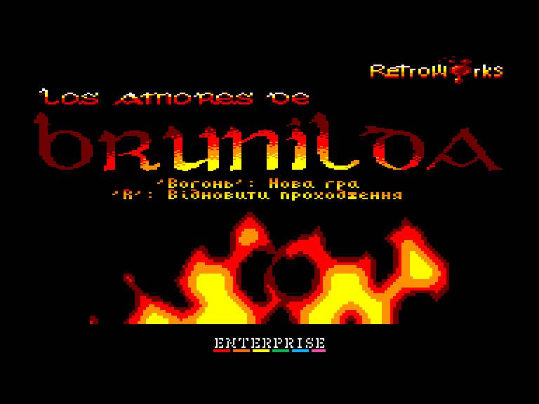
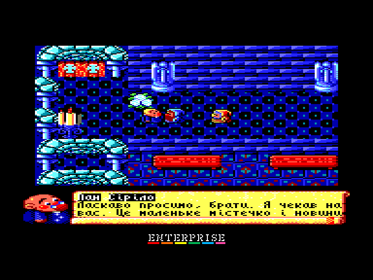
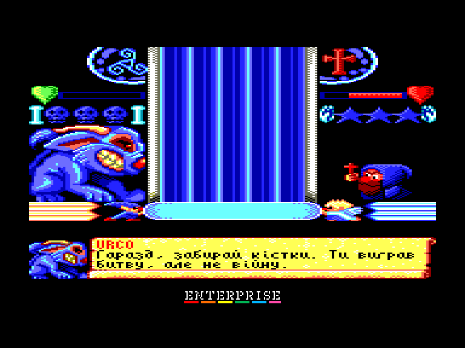
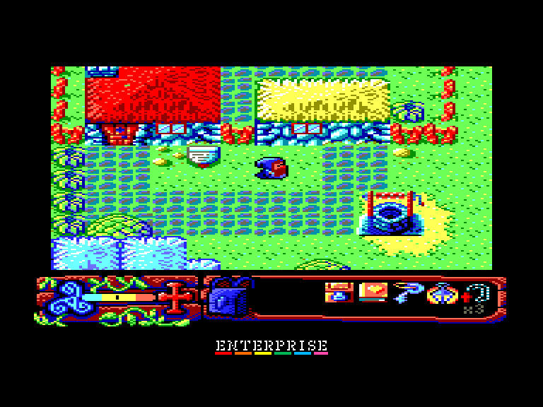

[0-9](../0/games-0.md) - [A](../a/games-a.md) - [B](../b/games-b.md) - [C](../c/games-c.md) - [D](../d/games-d.md) - [E](../e/games-e.md) - [F](../f/games-f.md) - [G](../g/games-g.md) - [H](../h/games-h.md) - [I](../i/games-i.md) - [J](../j/games-j.md) - [K](../k/games-k.md) - [L](../l/games-l.md) - [M](../m/games-m.md) - [N](../n/games-n.md) - [O](../o/games-o.md) - [P](../p/games-p.md) - [Q](../q/games-q.md) - [R](../r/games-r.md) - [S](../s/games-s.md) - [T](../t/games-t.md) - [U](../u/games-u.md) - [V](../v/games-v.md) - [W](../w/games-w.md) - [X](../x/games-x.md) - [Y](../y/games-y.md) - [Z](../z/games-z.md)

Ігри для [Enterprise 64k](../games-ep64.md) - [Enterprise 128k+RAMexp](../games-epramexp.md) - [2dfx](games-2dfx.md)

Ігри для систем [IS-DOS](../games-is-dos.md) - [SymbOS](../games-symbos.md) - [EDC Windows](../games-edcw.md)

Ігри для емуляторів [ZX Spectrum 48k/128k](../zxemu/games-zxemu.md) - [Amstrad CPC](../cpcemu/games-cpc.md) - [Sinclair ZX81](../zx81emu/games-zx81.md) - [Videoton TVC](../tvcemu/games-tvc.md) - [Commodore VIC-20](../vic20emu/games-vic20.md)

----------

# Los Amores de Brunilda

**Альтернативні назви:**
 - Brunilda

**ID:** amores-de-brunilda-cpc

**Жанри:** Аркада, Пригодницька

## Примітка

ℹ Сучасна схвалена конверсія з платформи Amstrad CPC.

## Скріншоти

## Опис

**САН-АРТЕЙХО-ДЕ-МОНТАЛЬВУ**  
Коли я вперше прибув до цього селища й познайомився з його жителями, то одразу зрозумів: щось дивне й моторошне заволоділо їхніми розумами. Того вечора було так холодно, що пронизливий мороз пробирав аж до самих кісток. Усі почали розходитися по домівках, наглухо замикаючи двері на ніч, сподіваючись, що їх не застануть зненацька найжахливіші страхи.  
Здавалося, ці люди не мали душі — вони зреклися Бога й повністю піддалися забобонам.  
Я щосили намагався викинути це відчуття з голови, але мій напарник не зміг. Він був молодшим і ще не навчився приборкувати свій страх. Втім, моєю головною турботою було знайти нічліг. Мене лякали не монстри чи демони, а холод: ще одна ніч під відкритим небом — і мої суглоби нили б аж до самого Сантьяго.  

**МІЖ ВІРОЮ ТА ЗАБОБОНАМИ**  
Тонку межу між цими двома поняттями дуже легко перейти. І те, й інше — сліпа переконаність, що не має підґрунтя. Кожен вільний обирати, у що вірити, а у що ні — саме це робить віру та забобони водночас такими далекими й такими близькими.  
Пам'ятаю, що розмови з місцевими залишали важкий, тривожний осад. Їхні страхи проникали в мене, і часом, якщо мені не вдавалося зберігати спокій, я починав бачити те саме, що й вони: проникати туди, куди раніше не міг протиснутися, або отямлюватися біля входу в печеру, поняття не маючи, як туди потрапив.  
Найкращим способом забути про все була молитва у святому місці — вона зміцнювала мою віру й відганяла ці думки. Тоді реальність знову поставала перед моїми очима, і я чітко усвідомлював, що немає жодних аномальних місць чи потойбічних істот.  
Але я завжди боявся остаточно втратити віру та глузд, піддатися омані цього стосу язичницьких вірувань, міфів та потвор, назавжди обірвавши все, що пов'язувало мене з минулим життям.  
Я не розповідатиму про те, що відбувалося, поки я не навчився опановувати себе, адже й досі сумніваюся, що з цього було реальністю, а що — лише грою моєї уяви.

## Основна інформація
- **Мови:** Англійська, Іспанська, Галісійська, EU, Каталонська, Португальська, Італійська, Французька, Німецька, Угорська, Українська
- **Оригінальна платформа:** Amstrad CPC
### Загальні системні вимоги
- **Апаратні:** EP128+RAM
### Геймплей
- **Керування:** Keyboard, Internal Joy, External Joy 1, External Joy 2
- **Кількість гравців:** 1 player
- **Додаткові теги:** 16-color mode
### Розробка
- **Рік випуску:** 2021
- **Автор:** Rafael Pardo (Spirax), Fco. Javier Velasco (pagantipaco), Benway, Mikomedes, Wyz, Marco Antonio del Campo (MAC)
- **Компанія:** Retroworks

## Посилання
- [Домашня сторінка](http://www.retroworks.es/php/game_en.php?id=11)
- [Тема на форумі enterpriseforever](https://enterpriseforever.com/cpc-rl/los-amores-de-brunilda/)
- [Інформація про оригінальну версію](https://www.cpc-power.com//index.php?page=detail&num=18484)
- [Завантажити](http://www.ep128.hu/Ep_Games/Prg/Los_Amores_de_Brunilda.rar)

## Відео

<iframe src="https://www.youtube.com/embed/7U94bDMLVDQ"  
style="width:75%; aspect-ratio:16/9;" allowfullscreen></iframe>

