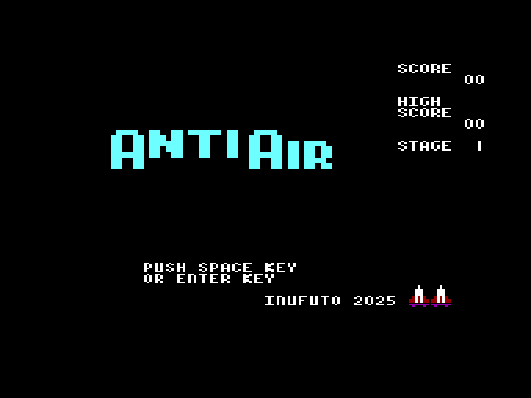
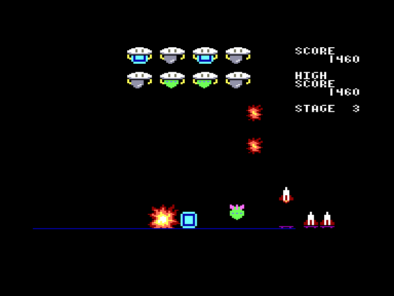
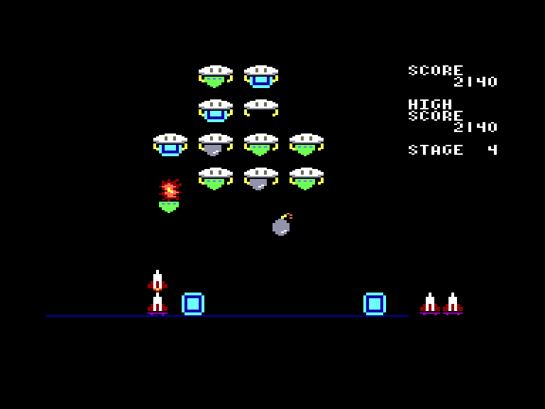
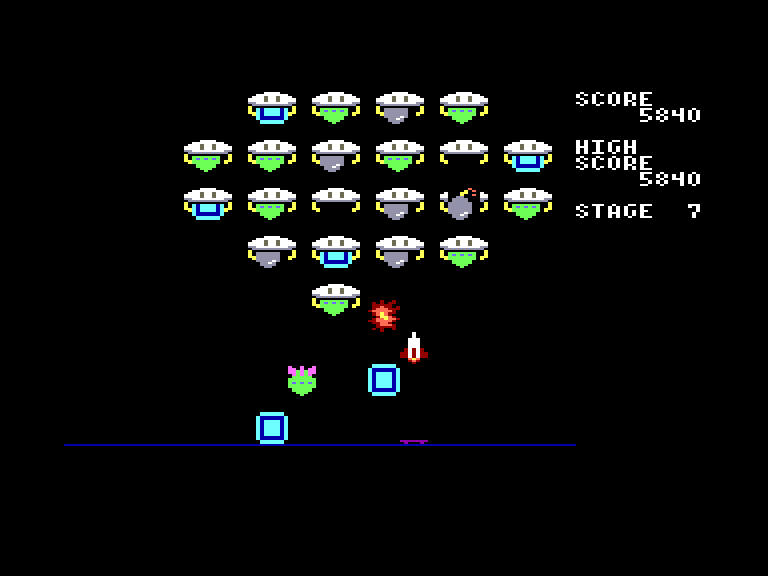

[0-9](../0/games-0.md) - [A](../a/games-a.md) - [B](../b/games-b.md) - [C](../c/games-c.md) - [D](../d/games-d.md) - [E](../e/games-e.md) - [F](../f/games-f.md) - [G](../g/games-g.md) - [H](../h/games-h.md) - [I](../i/games-i.md) - [J](../j/games-j.md) - [K](../k/games-k.md) - [L](../l/games-l.md) - [M](../m/games-m.md) - [N](../n/games-n.md) - [O](../o/games-o.md) - [P](../p/games-p.md) - [Q](../q/games-q.md) - [R](../r/games-r.md) - [S](../s/games-s.md) - [T](../t/games-t.md) - [U](../u/games-u.md) - [V](../v/games-v.md) - [W](../w/games-w.md) - [X](../x/games-x.md) - [Y](../y/games-y.md) - [Z](../z/games-z.md)

Ігри для [Enterprise 64k](../games-ep64.md) - [Enterprise 128k+RAMexp](../games-epramexp.md)

Ігри для систем [IS-DOS](../games-is-dos.md) - [SymbOS](../games-symbos.md) - [EDC Windows](../games-edcw.md)

Ігри для емуляторів [ZX Spectrum 48k/128k](../zxemu/games-zxemu.md) - [Amstrad CPC](../cpcemu/games-cpc.md) - [Sinclair ZX81](../zx81emu/games-zx81.md) - [Videoton TVC](../tvcemu/games-tvc.md) - [Commodore VIC-20](../vic20emu/games-vic20.md)

----------

# AntiAir

**ID:** antiair

**Жанри:** Аркада

## Скріншоти

## Опис

(temporary description generated by AI Assistant)

**Опис гри AntiAir:**

AntiAir — це аркадна гра, випущена у 2024 році компанією Inufuto для платформ Spectrum (128k) та Enterprise. У грі гравець керує платформою для запуску ракет, яка рухається вліво та вправо, знищуючи атакуючі НЛО. НЛО скидають три типи предметів:

- **Зелені ракети**, які вибухають одразу, коли досягають дна екрану.
- **Червоні бомби** (сірі у версії для Enterprise), які вибухають через кілька секунд після досягнення дна. Гравець може бути пошкоджений, якщо вибух відбувається поряд.
- **Світло-блакитні блоки**, які тимчасово блокують шлях; якщо вони впадуть на гравця, це може призвести до проблем.

НЛО швидко перезаряджають свою амуніцію, тому гравцям потрібно бути уважними, оскільки найбільш небезпечна ситуація виникає, коли блоки оточують їх, обмежуючи рух. Гравець повинен знищити 10 атакуючих НЛО, які стають все численнішими, після чого гра починається спочатку.

**Правила гри:**
1. Керуй платформою для запуску ракет, рухаючи її вліво та вправо.
2. Вибухай НЛО, стріляючи в них ракети.
3. Уникай предметів, які скидають НЛО, щоб не отримати шкоду.
4. Знищуй всі 10 НЛО, щоб перейти до наступного раунду.
5. Використовуй клавіші (O, P, SPACE) або джойстик для управління.
6. Натисни RESET, щоб повернутися до меню.

## Основна інформація
- **Мови:** Англійська
- **Оригінальна платформа:** Multiplatform
### Системні вимоги
- **Апаратні:** EP64, EP128
### Геймплей
- **Керування:** Keyboard, Internal Joy
- **Кількість гравців:** 1 Player
- **Додаткові теги:** 16-color mode
### Розробка
- **Рік випуску:** 2025
- **Автор:** Inufuto

## Посилання
- [Домашня сторінка гри](http://inufuto.web.fc2.com/8bit/antiair/#ep64)
- [Опис гри на ep128.hu (угорською)](http://www.ep128.hu/Games/AntiAir.htm)
- [Завантажити гру](http://www.ep128.hu/Ep_Games/Prg/Antiair.rar)
- [Завантажити гру](http://inufuto.web.fc2.com/8bit/ep64/antiair_rom.zip)
- [Easy Load&Play](https://t.me/EP128k_Load_n_Play/781) *(Telegram-канал Vibrant Waves)*

**Дата генерації:** 28.07.2026

## Відео

<iframe src="https://www.youtube.com/embed/lbiyVWxnMu4"  
style="width:75%; aspect-ratio:16/9;" allowfullscreen></iframe>
