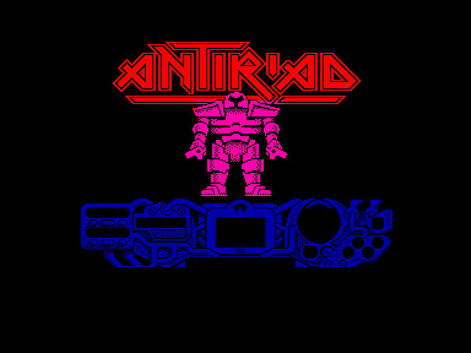
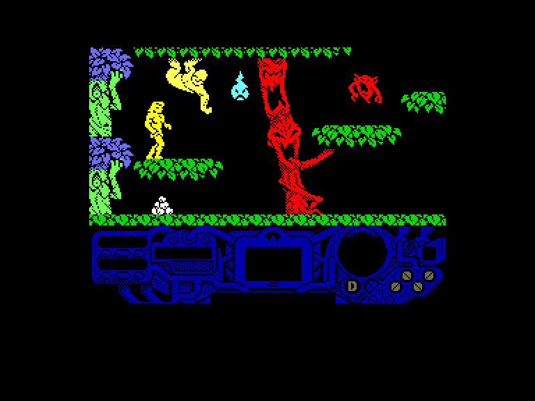
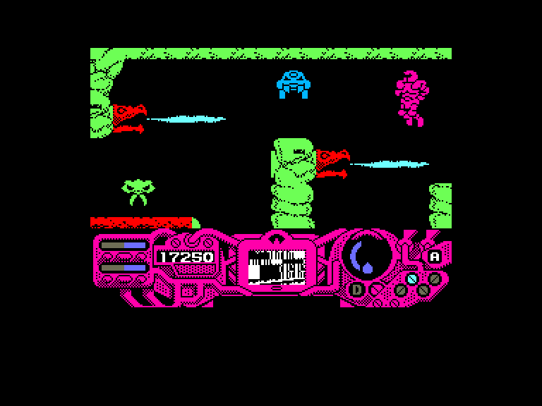
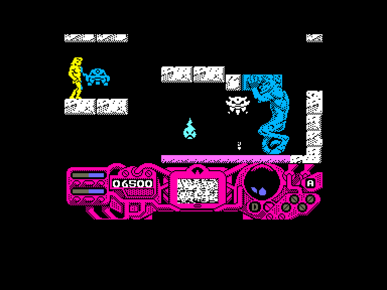

[0-9](../0/games-0.md) - [A](../a/games-a.md) - [B](../b/games-b.md) - [C](../c/games-c.md) - [D](../d/games-d.md) - [E](../e/games-e.md) - [F](../f/games-f.md) - [G](../g/games-g.md) - [H](../h/games-h.md) - [I](../i/games-i.md) - [J](../j/games-j.md) - [K](../k/games-k.md) - [L](../l/games-l.md) - [M](../m/games-m.md) - [N](../n/games-n.md) - [O](../o/games-o.md) - [P](../p/games-p.md) - [Q](../q/games-q.md) - [R](../r/games-r.md) - [S](../s/games-s.md) - [T](../t/games-t.md) - [U](../u/games-u.md) - [V](../v/games-v.md) - [W](../w/games-w.md) - [X](../x/games-x.md) - [Y](../y/games-y.md) - [Z](../z/games-z.md)

Ігри для [Enterprise 64k](../games-ep64.md) - [Enterprise 128k+RAMexp](../games-epramexp.md)

Ігри для систем [IS-DOS](../games-is-dos.md) - [SymbOS](../games-symbos.md) - [EDC Windows](../games-edcw.md)

Ігри для емуляторів [ZX Spectrum 48k/128k](../zxemu/games-zxemu.md) - [Amstrad CPC](../cpcemu/games-cpc.md) - [Sinclair ZX81](../zx81emu/games-zx81.md) - [Videoton TVC](../tvcemu/games-tvc.md) - [Commodore VIC-20](../vic20emu/games-vic20.md)

----------

# Antiriad

**Альтернативні назви:**
 - The Sacred Armour of Antiriad

**ID:** antiriad-zx

**Жанри:** Екшн, Пригодницька, Платформер

## Примітка

ℹ Стара неофіційна конверсія з платформи ZX Spectrum.

## Скріншоти

## Опис

Пасивне й мирне суспільство, створене на Землі до 2086 року, було позбавлене свого ідилічного існування через вторгнення інопланетних загарбників. Населення відправили працювати в шахти прибульців. Деякі повстали, але один вирізнявся особливою витривалістю та сміливістю. Старійшини доручили воїну на ім'я Тал дослідити ці землі в пошуках легендарного артефакту, над удосконаленням якого людство працювало так довго.  

Цей артефакт — звісно ж, та сама Священна Броня з назви гри: протирадіаційний костюм («Antiriad»), який робить свого носія абсолютно невразливим майже до будь-яких атак. Граючи за Тала, ваша перша мета — знайти цю броню, а потім будь-що повалити режим прибульців.  

Як тільки вам вдасться заволодіти бронею, наступним завданням стане пошук різноманітних предметів, які зроблять вас іще могутнішим: антигравітаційні чоботи, нейтралізатор частинок, пульсуючий промінь та імплозійна міна є життєво необхідними елементами. Імплозійна міна, мабуть, найважливіша за все решту — саме вона потрібна для знищення бази прибульців.

## Основна інформація
- **Мови:** Іспанська
- **Оригінальна платформа:** ZX Spectrum
### Геймплей
- **Додаткові теги:** Attribute mode

## Посилання
- [Опис гри на ep128.hu (угорською)](http://www.ep128.hu/Games/Antiriad.htm)
- [Інформація про оригінальну версію](https://spectrumcomputing.co.uk/entry/4300/ZX-Spectrum/The_Sacred_Armour_of_Antiriad)
- [Завантажити гру](http://www.ep128.hu/Ep_Games/Prg/Antiriad.rar)

