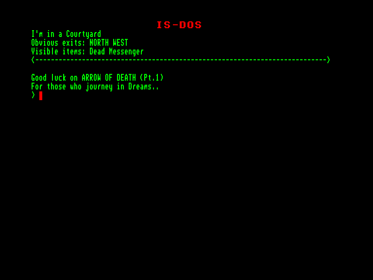
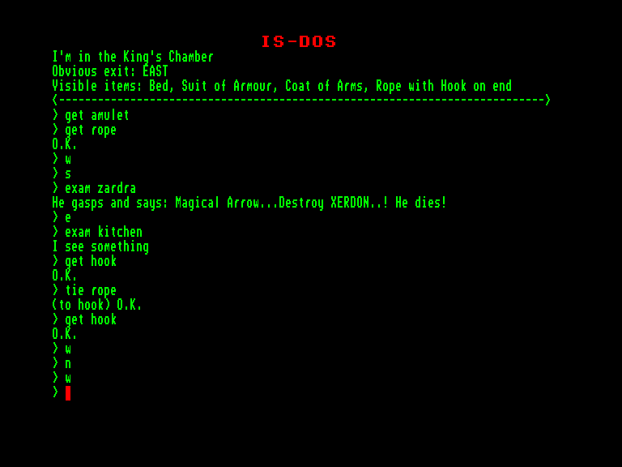
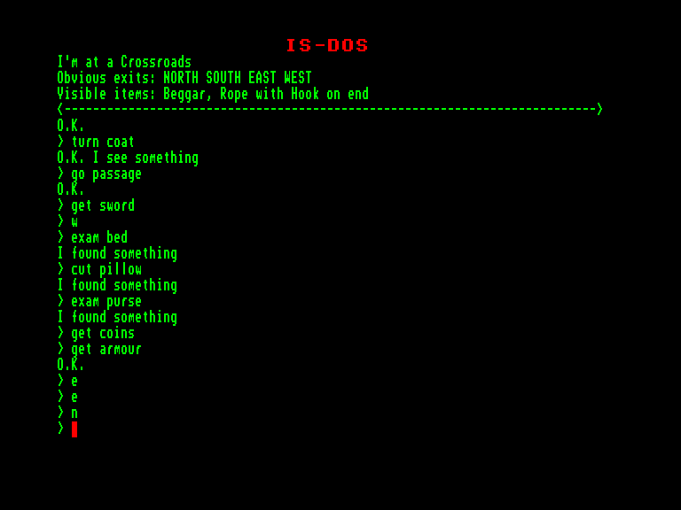

[0-9](../0/games-0.md) - [A](../a/games-a.md) - [B](../b/games-b.md) - [C](../c/games-c.md) - [D](../d/games-d.md) - [E](../e/games-e.md) - [F](../f/games-f.md) - [G](../g/games-g.md) - [H](../h/games-h.md) - [I](../i/games-i.md) - [J](../j/games-j.md) - [K](../k/games-k.md) - [L](../l/games-l.md) - [M](../m/games-m.md) - [N](../n/games-n.md) - [O](../o/games-o.md) - [P](../p/games-p.md) - [Q](../q/games-q.md) - [R](../r/games-r.md) - [S](../s/games-s.md) - [T](../t/games-t.md) - [U](../u/games-u.md) - [V](../v/games-v.md) - [W](../w/games-w.md) - [X](../x/games-x.md) - [Y](../y/games-y.md) - [Z](../z/games-z.md)

Ігри для [Enterprise 64k](../games-ep64.md) - [Enterprise 128k+RAMexp](../games-epramexp.md) - [2dfx](../games-2dfx.md)

Ігри для систем [IS-DOS](../games-is-dos.md) - [SymbOS](../games-symbos.md) - [EDC Windows](../games-edcw.md)

Ігри для емуляторів [ZX Spectrum 48k/128k](../zxemu/games-zxemu.md) - [Amstrad CPC](../cpcemu/games-cpc.md) - [Sinclair ZX81](../zx81emu/games-zx81.md) - [Videoton TVC](../tvcemu/games-tvc.md) - [Commodore VIC-20](../vic20emu/games-vic20.md)

----------

# Arrow of Death. Part 1

**Альтернативні назви:**
 - Mysterious Adventures 3 - Arrow of Death. Part 1

**ID:** arrow-of-death1-zcode

**Жанри:** Текстова пригода

## Примітка

ℹ Мультиплатформенна гра на рушії Z-machine від Infocom.

## Скріншоти

## Опис

Минуло вже п’ять років відтоді, як попри неабиякі труднощі ви повернули Золотий жезл давнього Ельфійського королівства й віддали його на законне місце до тронованої зали палацу Ферренуїла. З того дня вас повсюдно шанували як великого героя та безстрашного воїна, а ваша провінція процвітала завдяки силі, яку вкарбувала в Жезл давно зникла раса Ельфів. Ви жили в тихому достатку, насолоджуючись життям серед приємного й чесного люду місцевого села. Здавалося, краще й бути не може... або так здавалося ще кілька місяців тому.  

Усе почалося з періоду жахливо негоди. Коли пішов дощ, він затягнувся настільки, що стало важко пригадати, яким було життя до нього. Молодий урожай на полях гинув, і місцеві фермери почали боятись за свої посіви, адже поле за полем ставали розмокшими й непридатними для обробітку. Морок і розпач осіли, наче темні хмари, на серцях зневірених хліборобів. У людях почала проявлятися дивна гіркота; бійки між давніми друзями ставали лякаюче буденним явищем. Лихі почуття розросталися, мов ракова пухлина, крізь душі, які колись були гордими та чесними.  

Ситуація, здавалося, досягала критичної межі, коли вас відвідав особистий посланець від Короля. Від нього ви дізналися про лиху трансформацію, що спіткала Золотий жезл. Якщо раніше Жезл сяяв блиском, що далеко перевершував звичайне золото, то тепер він втратив блиск і потемнів. Що гірше, з самого Жезла випромінювалося відчуття зла. Усі, хто перебував поблизу, страждали від майже фізично відчутної ненависті до всього живого й зростаючого.  

Це відчуття було настільки небезпечним, що Король та всі мешканці були змушені залишити палац і шукати спокою у своїй гірській фортеці на півночі. Зардру, королівського чаклуна, вмовили оглянути Жезл у надії, що він зможе відшукати джерело злої сили та вигнати її у підземні світи. Протягом трьох днів він перебував у замку наодинці, нікому не дозволяючи увійти, поки бився з невидимою силою. Жахливі крики, що супроводжувалися сліпучими спалахами блискавок і гуркітливими вибухами, лунали з Тронованої зали — очевидно, джерело зла справді потужне.  

З страхом у серці ви вирушаєте з посланцем до палацу, таємно сподіваючись, що Зардра переможе невидимого ворога. Поки ви мовчки їдете крізь темну ніч, вашу душу тривожить безіменний жах. Якщо Зардра зазнає поразки, то звичайний смертний наразиться на безнадію протистояти злій силі, яка загрожує майбутньому вашої землі...

## Основна інформація
- **Мови:** Англійська
### Загальні системні вимоги
- **Апаратні:** EXDOS
- **Програмні:** IS-DOS
### Геймплей
- **Керування:** Keyboard
- **Кількість гравців:** 1 player
- **Додаткові теги:** Z-code
### Розробка
- **Рік випуску:** 1981
- **Автор:** Brian Howarth

## Посилання
- [Інформація про гру (SolutionArchive.com)](https://solutionarchive.com/game/id%2C23/Arrow+of+Death+Part+1.html)
- [Завантажити](https://www.ifarchive.org/if-archive/games/inform/mysterious_inform.zip)

## [Керування](../controllers.md)

`Keyboard`

## Детальна інформація

### Історія розробки  

Третя гра у серії «Mysterious Adventures»  

Браян Гаварт написав свої одинадцять текстових пригод «Mysterious Adventures» у 1981–1983 роках, початково як суто текстові ігри (саме так вони представлені тут). Пізніші версії (Spectrum, C64) мали контурну графіку. Усі файли даних є конверсіями з версій для Spectrum/C64 (але без графіки). Браян Гаварт дав свій дозвіл на завантаження ігор до IF Archive.