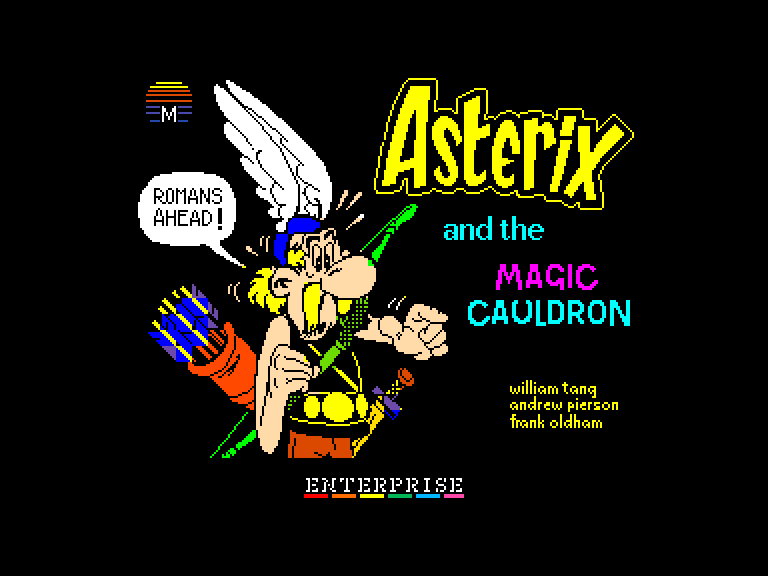
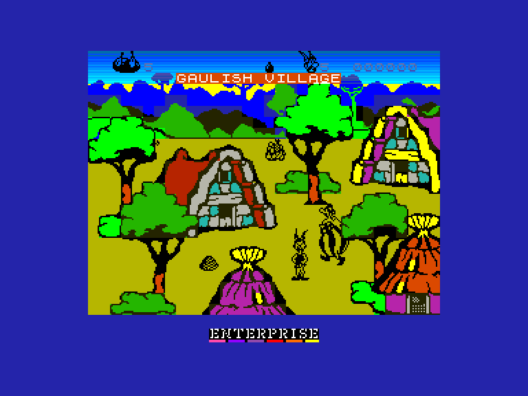
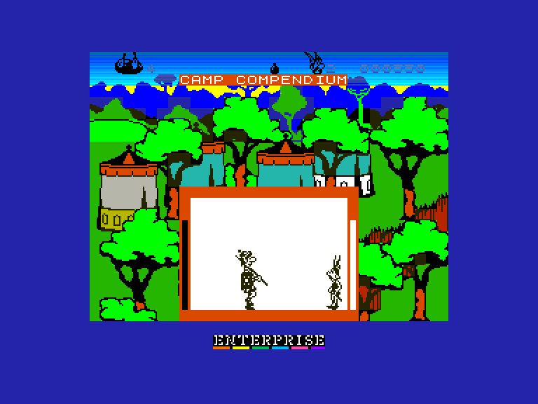
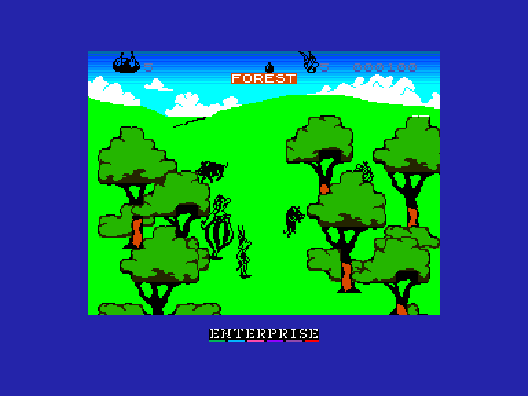

[0-9](../0/games-0.md) - [A](../a/games-a.md) - [B](../b/games-b.md) - [C](../c/games-c.md) - [D](../d/games-d.md) - [E](../e/games-e.md) - [F](../f/games-f.md) - [G](../g/games-g.md) - [H](../h/games-h.md) - [I](../i/games-i.md) - [J](../j/games-j.md) - [K](../k/games-k.md) - [L](../l/games-l.md) - [M](../m/games-m.md) - [N](../n/games-n.md) - [O](../o/games-o.md) - [P](../p/games-p.md) - [Q](../q/games-q.md) - [R](../r/games-r.md) - [S](../s/games-s.md) - [T](../t/games-t.md) - [U](../u/games-u.md) - [V](../v/games-v.md) - [W](../w/games-w.md) - [X](../x/games-x.md) - [Y](../y/games-y.md) - [Z](../z/games-z.md)

Ігри для [Enterprise 64k](../games-ep64.md) - [Enterprise 128k+RAMexp](../games-epramexp.md)

Ігри для систем [IS-DOS](../games-is-dos.md) - [SymbOS](../games-symbos.md) - [EDC Windows](../games-edcw.md)

Ігри для емуляторів [ZX Spectrum 48k/128k](../zxemu/games-zxemu.md) - [Amstrad CPC](../cpcemu/games-cpc.md) - [Sinclair ZX81](../zx81emu/games-zx81.md) - [Videoton TVC](../tvcemu/games-tvc.md) - [Commodore VIC-20](../vic20emu/games-vic20.md)

----------

# Asterix and the Magic Cauldron

**ID:** asterix-zx

**Жанри:** Пригодницька, Драка

## Примітка

ℹ Сучасна неофіційна конверсія з платформи ZX Spectrum.

## Скріншоти

## Опис

Галлія розділена на три частини... Ні, на чотири! Адже одне маленьке галльське селище в Армориці все ще тримає оборону проти загарбників. Завдяки магічному зіллю, що надає їм сили, вони й досі успішно протистоять римлянам. Однак чарівний казан, у якому варять це зілля, випадково розбився на сім уламків, і тепер наші герої Астерікс та Обелікс мусять розшукати їх усі...

## Основна інформація
- **Мови:** Англійська
- **Оригінальна платформа:** ZX Spectrum
### Загальні системні вимоги
- **Апаратні:** EP64, EP128
### Геймплей
- **Керування:** Keyboard, Internal Joy, External Joy 1, External Joy 2
- **Додаткові теги:** Attribute mode

## Посилання
- [Опис гри на ep128.hu (угорською)](http://www.ep128.hu/Games/Asterix.htm)
- [Інформація про оригінальну версію](https://spectrumcomputing.co.uk/entry/290/ZX-Spectrum/Asterix_and_the_Magic_Cauldron)
- [Завантажити гру](http://www.ep128.hu/Ep_Games/Prg/Asterix.rar)

## Детальна інформація

### Геймплей  

Суть гри зводиться до ретельного дослідження локацій, щоб знайти всі уламки казана. Обелікс ітиме за Астеріксом куди завгодно, але його потрібно підгодовувати його улюбленою стправою — диким кабаном. Астерікс має при собі п'ять смажених кабанів (як він їх тільки тягає?!), і один зникає щоразу, коли Астерікс та Обелікс зголодніють.  

Коли всі припаси вичерпаються, Астеріксу доведеться знайти та здолати дикого кабана — битви відбуваються в окремих вікнах, що виринають поверх основного екрана. Збоку вікна з'являються смужки витривалості кожного з бійців. Перемога над кабаном додає його до запасу їжі. Якщо ж Астерікс програє бій, його вибиває з вікна, і він втрачає одне життя. Ця ж система використовується для сутичок із римськими легіонерами та під час підбору корисних предметів.  

Астерікс починає з п'ятьма життями та єдиною флаконкою з магічним зіллям, яку можна використати лише один раз — у разі крайньої потреби. Знайдені уламки казана відображаються у верхній частині екрана. Також можна підбирати ключі, щоб відкривати доступ до раніше недоступних областей.