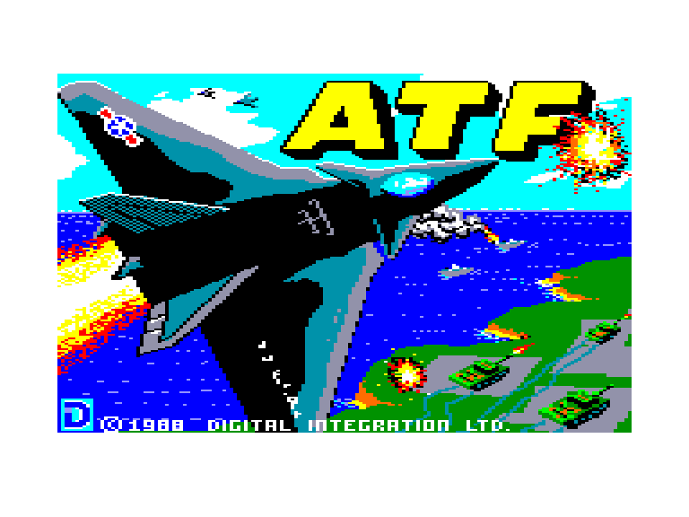
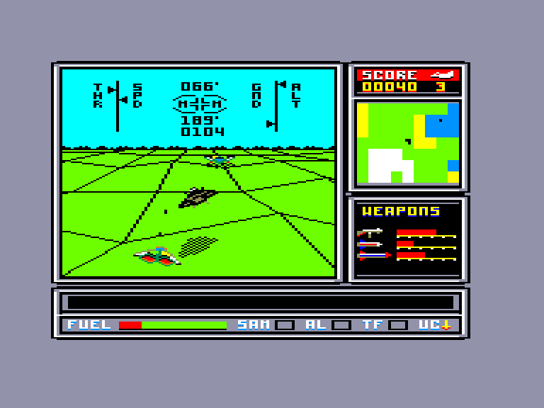
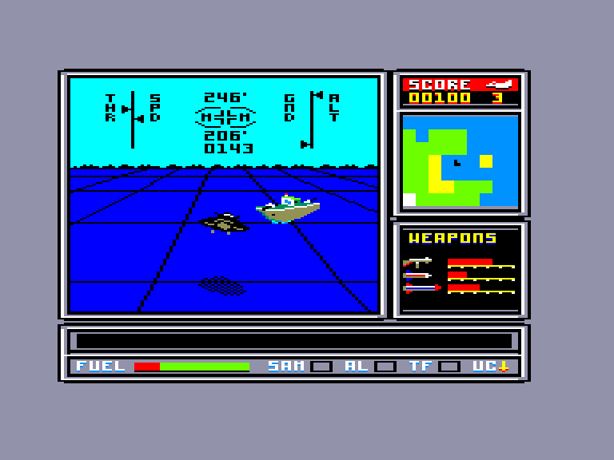
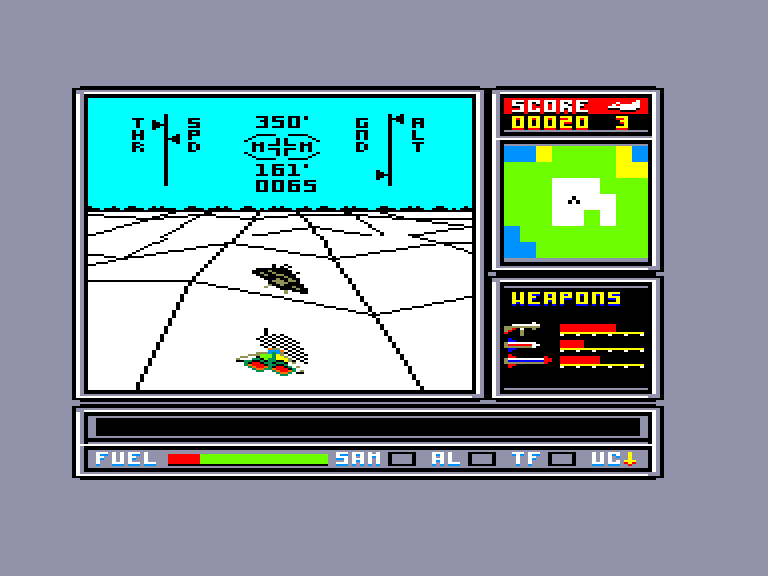

[0-9](../0/games-0.md) - [A](../a/games-a.md) - [B](../b/games-b.md) - [C](../c/games-c.md) - [D](../d/games-d.md) - [E](../e/games-e.md) - [F](../f/games-f.md) - [G](../g/games-g.md) - [H](../h/games-h.md) - [I](../i/games-i.md) - [J](../j/games-j.md) - [K](../k/games-k.md) - [L](../l/games-l.md) - [M](../m/games-m.md) - [N](../n/games-n.md) - [O](../o/games-o.md) - [P](../p/games-p.md) - [Q](../q/games-q.md) - [R](../r/games-r.md) - [S](../s/games-s.md) - [T](../t/games-t.md) - [U](../u/games-u.md) - [V](../v/games-v.md) - [W](../w/games-w.md) - [X](../x/games-x.md) - [Y](../y/games-y.md) - [Z](../z/games-z.md)

Ігри для [Enterprise 64k](../games-ep64.md) - [Enterprise 128k+RAMexp](../games-epramexp.md)

Ігри для систем [IS-DOS](../games-is-dos.md) - [SymbOS](../games-symbos.md) - [EDC Windows](../games-edcw.md)

Ігри для емуляторів [ZX Spectrum 48k/128k](../zxemu/games-zxemu.md) - [Amstrad CPC](../cpcemu/games-cpc.md) - [Sinclair ZX81](../zx81emu/games-zx81.md) - [Videoton TVC](../tvcemu/games-tvc.md) - [Commodore VIC-20](../vic20emu/games-vic20.md)

----------

# ATF

**Альтернативні назви:**
 - Advanced Tactical Fighter

**ID:** atf-cpc

**Жанри:** Екшн, Симулятор

## Примітка

ℹ Сучасна неофіційна конверсія з платформи Amstrad CPC.

## Скріншоти

## Опис

На острівному архіпелазі майбутнього спалахнула війна. На землі сили обох сторін рівні... проте один із противників має у своєму розпорядженні єдину ескадрилью надсучасних винищувачів-бомбардувальників Lockheed ATF. Чи під силу вам змінити розстановку сил завдяки цим літакам?

## Основна інформація
- **Мови:** Англійська
- **Оригінальна платформа:** Amstrad CPC
### Геймплей
- **Кількість гравців:** 1 player
- **Додаткові теги:** 16-color mode
### Розробка
- **Рік випуску:** 1988

## Посилання
- [Опис гри на ep128.hu (угорською)](http://www.ep128.hu/Ep_Games/Leiras/ATF.htm)
- [Інформація про оригінальну версію](https://www.cpc-power.com/index.php?page=detail&num=238)
- [Завантажити гру](http://www.ep128.hu/Ep_Games/Prg/ATF.rar)
- [Easy Load&Play](https://t.me/EP128k_Load_n_Play/1030) *(Telegram-канал Vibrant Waves)*

## [Керування](../controllers.md)

`Keyboard`: `W`, `S`, `8`, `9`  
`Internal Joystick`  
`External Joystick 1`  
`External Joystick 2`  

`Q`: Збільшити тягу  
`А`: Зменшити тягу  
`T`: Огинання рельєфу (автоматична висота)  
`L`: Автоматична посадка  
`U`: Шасі  

`J`: Постановник завад (РЕБ)  
`N`: Переключити тип ракет  
`M`: Пуск ракети  

`C`: Вибрати екран комп'ютера  
`D`: База даних союзників/ворогів  
`E`: Вибрати категорію бази даних  
`F`/`R`: Крок уперед / назад  
`G`: Найближча ціль у категорії  
`Enter`: Захоплення цілі з бази даних  

`LShift`: Лінії рельєфу (увімк / вимк)  
`H`: Пауза  
`Esc`: Вихід з поточної гри  

`F1`, `F2`, `F5`, `F7`, `F8`: Гучність звуку двигуна (`F1`: вимк; `F8`: макс; `F7`: за замовчуванням)

## Детальна інформація

### Геймплей  

Мета кожного раунду — знищити низку стратегічних цілей. Їхнє розташування відображається на бортовому комп'ютері винищувача, і гравець може атакувати їх у будь-якому порядку.  

На шляху до цілей можна або вступати в прямий повітряний бій із ворожими винищувачами, або летіти на малій висоті, щоб уникнути виявлення радарами.  

Ваше завдання починається з вибору боєкомплекту на місію. ATF можна оснастити гарматними набоями, ракетами ASRAAM із візуальним наведенням (від яких користі мало!) та потужнішими ракетами Maverick із дальністю ураження до 100 км, здатними нищити позатраєкторні цілі, вибрані з бази даних. Заправка й дозарядка мають вирішальне значення: озброєння слід чітко збалансувати з запасом пального, щоб винищувач не перевищував безпечні ліміти злітної маси. Рівень боєзапасу та пального відображається на стовпчастих діаграмах.  

Озброївшись та заправившись, ви можете починати виконання основної місії. Після злету на максимальній тязі важливо підтримувати швидкість ATF, щоб уникнути звалювання та авіакатастрофи. Під час польоту на малій висоті над ландшафтом із вертикальним скролінгом літак перебуватиме під постійними атаками ворожих сил. Ворожих радарів можна уникнути за допомогою системи огинання рельєфу місцевості, але це знижує швидкість і створює ризик зіткнення з землею.  

**ДИСПЛЕЇ**: Індикація на лобовому склі, накладена на основний екран, показує тягу двигуна, швидкість ATF, висоту рельєфу та польоту. Також відображаються доступна ракетна система, поточний курс польоту, дальність і пеленг до цілі.  

Під основним екраном розташовані додаткові індикатори рівня пального та стану шасі, а також попередження про наближення ракет «земля-повітря» (SAM). Вікно польотних повідомлень надає важливі дані про місію, а сканер ближнього радіуса дії збоку від основного екрана показує тип рельєфу під вами та наземні об'єкти ворога неподалік. Наближення зенітних ракет ЗРК вмикає тривожну сигналізацію — якщо пощастить, ви встигнете поставити їм заваду за допомогою бортового комплексу РЕБ.  

**БОРТОВИЙ КОМП'ЮТЕР**: ATF також оснащений бортовим обчислювачем, який на серії перемиканих екранів демонструє позиції ворога на карті світу, стан систем озброєння та самого літака. Комп'ютер містить базі даних для захоплення цілей, яка регулярно оновлюється в міру того, як ваша розвідка та бортові детектори виявляють нові об'єкти.  

Автоматичний посадкова фара/маяк (AL) активується, коли ATF входить у зону підходу союзних баз. Коли базу вибрано, можна ввімкнути режим автоматичної посадки.  

Звіт про воєнний стан — що надає повне зведення про всі останні здобутки й втрати союзних та ворожих баз, сухопутних, морських сил, а також вузлів зв'язку й промислових комплексів — викликається щоразу, коли ATF повертається на дружню базу. У цей момент розвідка також надасть додаткову інформацію про місцезнаходження сил противника.  

### Чіти  

(активація після завантаження):  
- `M`: Нескінченні життя  
- `,`: 9 життів