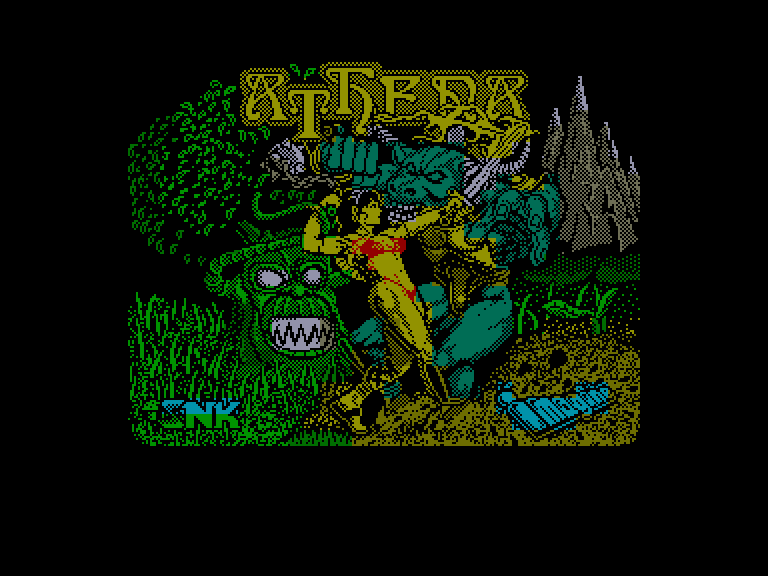
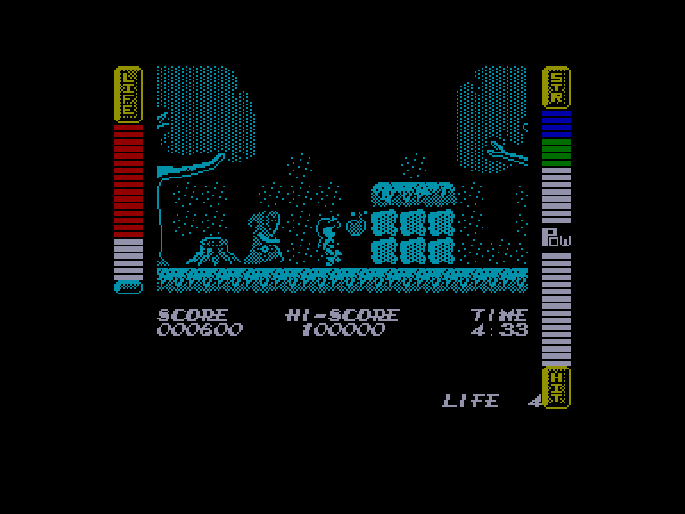
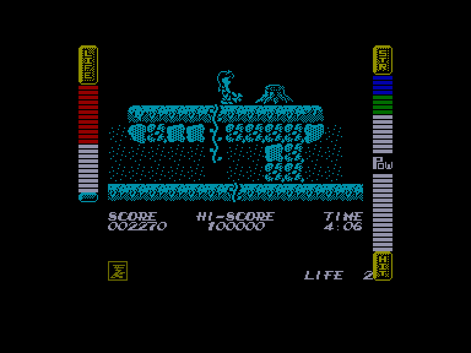
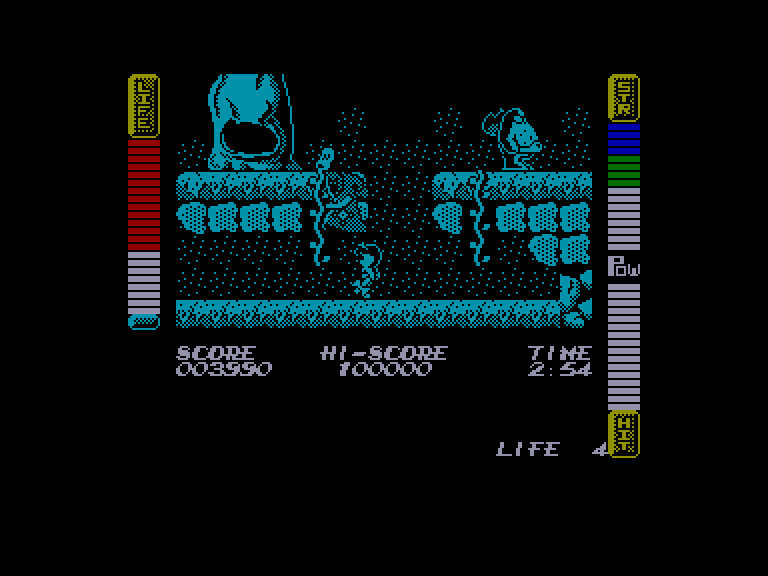

[0-9](../0/games-0.md) - [A](../a/games-a.md) - [B](../b/games-b.md) - [C](../c/games-c.md) - [D](../d/games-d.md) - [E](../e/games-e.md) - [F](../f/games-f.md) - [G](../g/games-g.md) - [H](../h/games-h.md) - [I](../i/games-i.md) - [J](../j/games-j.md) - [K](../k/games-k.md) - [L](../l/games-l.md) - [M](../m/games-m.md) - [N](../n/games-n.md) - [O](../o/games-o.md) - [P](../p/games-p.md) - [Q](../q/games-q.md) - [R](../r/games-r.md) - [S](../s/games-s.md) - [T](../t/games-t.md) - [U](../u/games-u.md) - [V](../v/games-v.md) - [W](../w/games-w.md) - [X](../x/games-x.md) - [Y](../y/games-y.md) - [Z](../z/games-z.md)

Ігри для [Enterprise 64k](../games-ep64.md) - [Enterprise 128k+RAMexp](../games-epramexp.md)

Ігри для систем [IS-DOS](../games-is-dos.md) - [SymbOS](../games-symbos.md) - [EDC Windows](../games-edcw.md)

Ігри для емуляторів [ZX Spectrum 48k/128k](../zxemu/games-zxemu.md) - [Amstrad CPC](../cpcemu/games-cpc.md) - [Sinclair ZX81](../zx81emu/games-zx81.md) - [Videoton TVC](../tvcemu/games-tvc.md) - [Commodore VIC-20](../vic20emu/games-vic20.md)

----------

# Athena

**ID:** athena-zx

**Жанри:** Екшн, Платформер

## Примітка

ℹ Стара неофіційна конверсія з платформи ZX Spectrum.

## Скріншоти

## Опис

Афіна — молода й примхлива принцеса стародавнього Королівства Перемоги (Kingdom of Victory), також відомого як Святий Світ (Holy World). Як і будь-якому сучасному підлітку, їй знудилося одноманітне щоденне життя в палаці, тож вона прагне гострих відчуттів і захопливих пригод.  

І ось одного дня, піддавшись спокусі непослуху, Афіна відчиняє заборонені «Двері, які не можна відчиняти», заховані глибоко в підвалі її замку. Наживши сміливості ступити за поріг, вона потрапляє до Фентезійного Світу, де панує лютий імператор Данте зі своїми незчисленними посіпаками.  

Втративши своє довге ошатне плаття в нерівному герці з вітром, принцеса Афіна починає свою пригоду. Єдиний спосіб повернутися додому цілою та неушкодженою — розшукати зброю й доспехи, подолати важкий і небезпечний шлях та кинути виклик самому жорстокому Данте.  

Чимало елементів гри — від зброї, спорядження й предметів до дизайну ворогів — натхненні грецькою міфологією та давньоримською культурою, а сама принцеса Афіна названа на честь славетної грецької богині.

## Основна інформація
- **Мови:** Англійська
- **Оригінальна платформа:** ZX Spectrum
### Геймплей
- **Додаткові теги:** Attribute mode

## Посилання
- [Інформація про оригінальну версію](https://spectrumcomputing.co.uk/entry/307/ZX-Spectrum/Athena)
- [Завантажити гру](http://www.ep128.hu/Ep_Games/Prg/Athena.rar)

## Детальна інформація

### Геймплей  

Після приземлення, беззбройна й майже роздягнена, принцеса може відбиватися від нападаючих монстрів лише ногами. Втім, вона здатна підбирати різну зброю, що залишається після вбитих ворогів. Афіна має шанс знайти щит, шолом та доспехи, хоча вони й будуть втрачені після стримування кількох атак.  

У своїй подорожі їй знадобляться вміння стрибати та лазити. Наприкінці кожного з восьми небезпечних та сповнених битв рівнів потрібно розправитися з босом, перш ніж перейти до наступного світу.  

Використовуючи певне знаряддя, як-от молот, можна розбивати кам'яні блоки, за якими іноді ховаються не лише обладунки, а й магічні артефакти, що полегшують проходження. Наприклад, надягнуті сандалії Меркурія дозволять Афіні здійснювати стрибки на більшу висоту й відстань.  

У грі є певні елементи RPG, які доповнюють екшен. Принцесі Афіні доводиться долати ворогів за допомогою різноманітних предметів та спорядження; без деяких із них завершити пригоду просто неможливо.