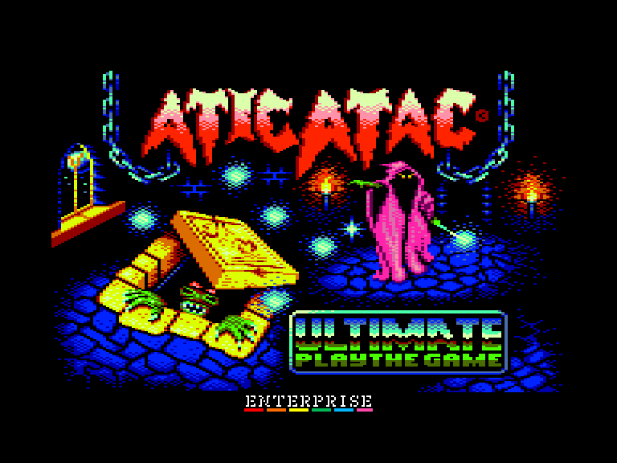
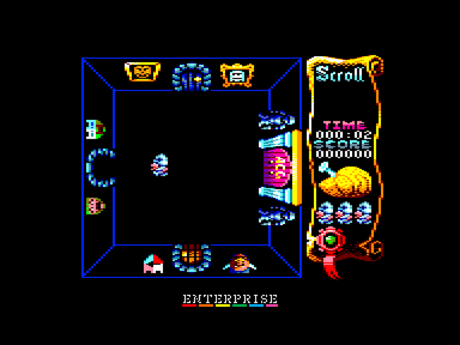
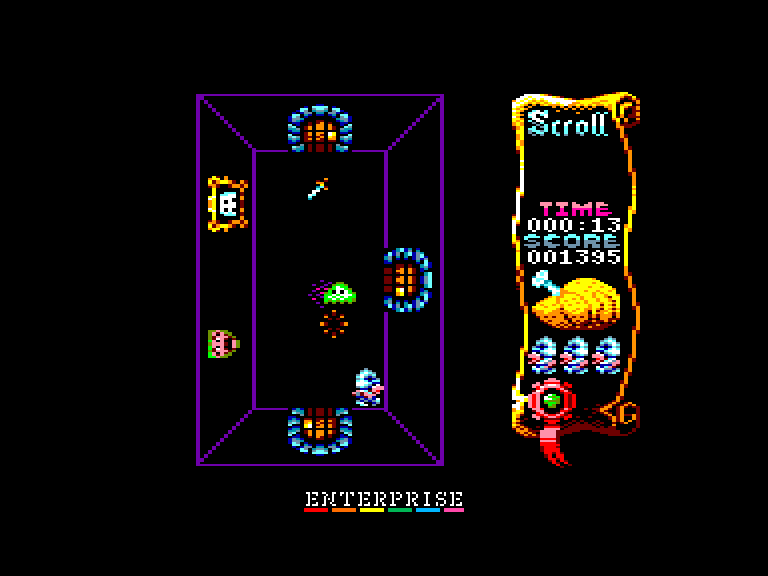
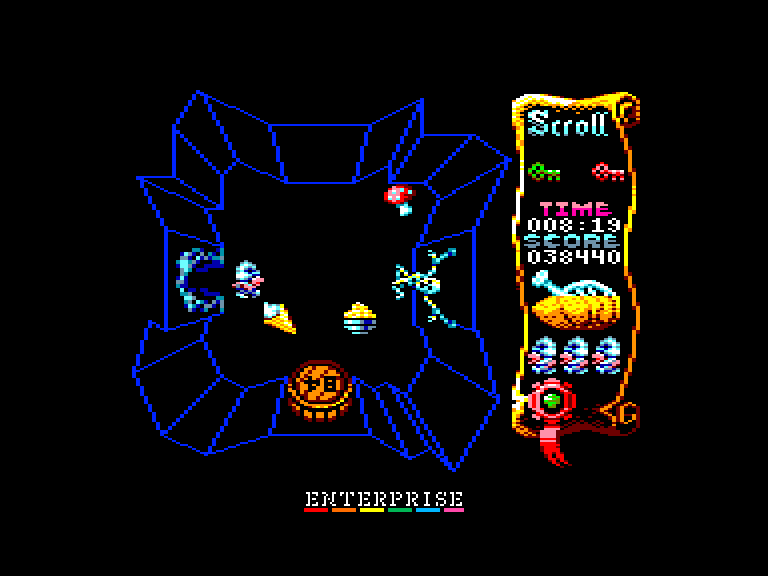

[0-9](../0/games-0.md) - [A](../a/games-a.md) - [B](../b/games-b.md) - [C](../c/games-c.md) - [D](../d/games-d.md) - [E](../e/games-e.md) - [F](../f/games-f.md) - [G](../g/games-g.md) - [H](../h/games-h.md) - [I](../i/games-i.md) - [J](../j/games-j.md) - [K](../k/games-k.md) - [L](../l/games-l.md) - [M](../m/games-m.md) - [N](../n/games-n.md) - [O](../o/games-o.md) - [P](../p/games-p.md) - [Q](../q/games-q.md) - [R](../r/games-r.md) - [S](../s/games-s.md) - [T](../t/games-t.md) - [U](../u/games-u.md) - [V](../v/games-v.md) - [W](../w/games-w.md) - [X](../x/games-x.md) - [Y](../y/games-y.md) - [Z](../z/games-z.md)

Ігри для [Enterprise 64k](../games-ep64.md) - [Enterprise 128k+RAMexp](../games-epramexp.md)

Ігри для систем [IS-DOS](../games-is-dos.md) - [SymbOS](../games-symbos.md) - [EDC Windows](../games-edcw.md)

Ігри для емуляторів [ZX Spectrum 48k/128k](../zxemu/games-zxemu.md) - [Amstrad CPC](../cpcemu/games-cpc.md) - [Sinclair ZX81](../zx81emu/games-zx81.md) - [Videoton TVC](../tvcemu/games-tvc.md) - [Commodore VIC-20](../vic20emu/games-vic20.md)

----------

# Atic Atac

**ID:** atic-atac-cpc

**Жанри:** Аркада, Лабіринт

## Примітка

ℹ Сучасна схвалена конверсія з платформи Amstrad CPC.

## Скріншоти

## Опис

Ви застрягли у замку, який має п'ять поверхів приблизно по 40 кімнат на кожному. Ціль проста — знайти три частини Великого Ключа ACG, який відімкне головні двері й дозволить вам вирватися на свободу.

## Основна інформація
- **Мови:** Англійська
- **Оригінальна платформа:** Amstrad CPC
### Загальні системні вимоги
- **Апаратні:** EP128
### Геймплей
- **Керування:** Keyboard, Internal Joy, External Joy 1, External Joy 2
- **Кількість гравців:** 1 player
- **Додаткові теги:** 16-color mode
### Розробка
- **Рік випуску:** 2020
- **Автор:** A.C.G., John Ward

## Посилання
- [Опис гри на ep128.hu (угорською)](http://www.ep128.hu/Ep_Games/Leiras/AticAtac.htm)
- [Інформація про оригінальну версію](https://www.cpc-power.com/index.php?page=detail&num=17713)
- [Завантажити гру](http://www.ep128.hu/Ep_Games/Prg/AticAtac_CPC.rar)
- [Easy Load&Play](https://t.me/EP128k_Load_n_Play/70) *(Telegram-канал Vibrant Waves)*

## Відео

<iframe src="https://www.youtube.com/embed/sRyE2Y38ugY"  
style="width:75%; aspect-ratio:16/9;" allowfullscreen></iframe>

- [Відео](https://youtu.be/T4Cd-nfHwU8)

## [Керування](../controllers.md)

`Keyboard`: `Q`, `A`, `O`, `P`, `Space`  
`Internal joystick`  
`External Joystick 1`  
`External Joystick 2`  

`Enter`: Підібрати предмет/ключ  
`Fire2`: Підібрати предмет/ключ  

`Hold`/`Pause`: Пауза  
`Stop`: Вихід з поточної гри

## Детальна інформація

### Геймплей  

Бігайте довкола, відстрілюйте все підряд, підбирайте їжу для відновлення здоров'я та шукайте уламки ключа. Також у замку є таємні проходи — те, якими саме ви зможете скористатися, залежить від обраного персонажа: лицаря, чаклуна чи селянина. Наприклад, деякі секретні проходи приховані всередині величезних винних діжок на стінах, а інші — за підлоговими годинниками, проте скористатися ними можуть лише певні класи.  

### Тонкощі запуску  

Для початку нової гри виберіть свого героя (вправо/вліво) та натисніть `Fire`.  

### Чіти  

`F7`: нескінченні життя  
`F8`: отримати усі ключі