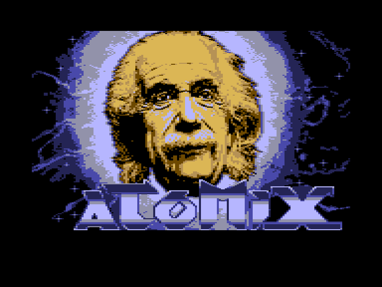
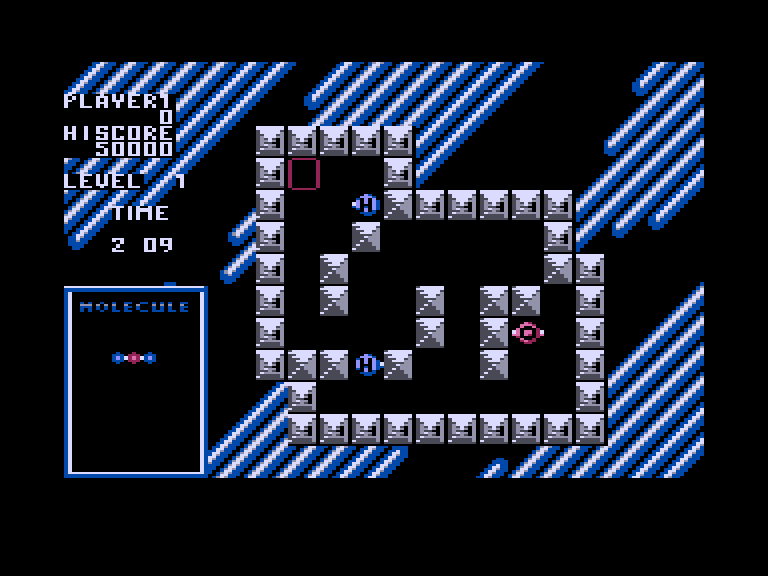
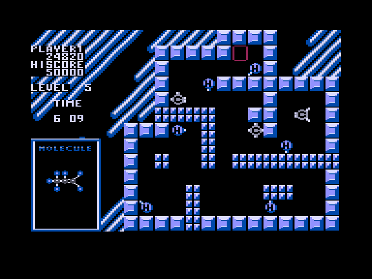

[0-9](../0/games-0.md) - [A](../a/games-a.md) - [B](../b/games-b.md) - [C](../c/games-c.md) - [D](../d/games-d.md) - [E](../e/games-e.md) - [F](../f/games-f.md) - [G](../g/games-g.md) - [H](../h/games-h.md) - [I](../i/games-i.md) - [J](../j/games-j.md) - [K](../k/games-k.md) - [L](../l/games-l.md) - [M](../m/games-m.md) - [N](../n/games-n.md) - [O](../o/games-o.md) - [P](../p/games-p.md) - [Q](../q/games-q.md) - [R](../r/games-r.md) - [S](../s/games-s.md) - [T](../t/games-t.md) - [U](../u/games-u.md) - [V](../v/games-v.md) - [W](../w/games-w.md) - [X](../x/games-x.md) - [Y](../y/games-y.md) - [Z](../z/games-z.md)

Ігри для [Enterprise 64k](../games-ep64.md) - [Enterprise 128k+RAMexp](../games-epramexp.md) - [2dfx](../games-2dfx.md)

Ігри для систем [IS-DOS](../games-is-dos.md) - [SymbOS](../games-symbos.md) - [EDC Windows](../games-edcw.md)

Ігри для емуляторів [ZX Spectrum 48k/128k](../zxemu/games-zxemu.md) - [Amstrad CPC](../cpcemu/games-cpc.md) - [Sinclair ZX81](../zx81emu/games-zx81.md) - [Videoton TVC](../tvcemu/games-tvc.md) - [Commodore VIC-20](../vic20emu/games-vic20.md)

----------

# Atomix

**ID:** atomix

**Жанри:** Логічна

## Примітка

ℹ Сучасна версія гри на основі графічних ресурсів з Commodore 64.

## Скріншоти

## Опис

Atomix — це графічна екшен-гра, яка розвиває комбінаторні здібності гравця, а також швидкість і оперативність його реакцій. Водночас гра ненав'язливо знайомить гравця з будовою базових хімічних сполук. Завдання гравця — за визначений проміжок часу зібрати правильну молекулу з окремих атомів.

## Основна інформація
- **Мови:** Англійська
- **Оригінальна платформа:** Commodore 64
### Загальні системні вимоги
- **Апаратні:** EP128
### Геймплей
- **Керування:** Internal Joy, External Joy 1
- **Кількість гравців:** 1 player
- **Додаткові теги:** 16-color mode
### Розробка
- **Рік випуску:** 1990
- **Компанія:** Thalion

## Посилання
- [Опис на ep128.hu (угорською)](https://www.ep128.hu/Ep_Games/Leiras/Atomix.htm)
- [Easy Load&Play](https://t.me/EP128k_Load_n_Play/77) *(Telegram-канал Vibrant Waves)*

## Відео

<iframe src="https://www.youtube.com/embed/On4DuonLltU"  
style="width:75%; aspect-ratio:16/9;" allowfullscreen></iframe>

- [Відео](https://www.youtube.com/watch?v=SRgwVIL5zu4)

## [Керування](../controllers.md)

`Internal Joystick`  
`External Joystick 1`  

`Hold`/`Pause`: Пауза  
`Stop`: Вихід з поточної гри  
`F2`: Зберегти гру (Y/N)  
`F3`: Завантажити гру (Y/N)  
`Esc`: Вихід у систему (Y/N)

## Детальна інформація

### Системні вимоги  

#### Мінімальні системні вимоги  

Оперативна пам'ять: **128 КБ (або більше)**  

### Геймплей  

Мета гри — зібрати відповідну молекулу так, як показано в лівому нижньому кутку. Над нею ми бачимо, як спливає наш час, і саме його витікання найбільше отруюватиме нам життя. Ще вище ми бачимо наші очки та поточний рекорд (найвищий бал). На ігровому полі ми керуємо маленьким червоним квадратом. Ним потрібно навестися на окремі атоми, щоб після натискання кнопки вогню керувати їхнім рухом. Атоми рухаються від стіни до стіни, або поки інший атом не перепинить їм шлях. Навіть частково зібрані шматочки молекули ми можемо рухати лише поодинці (по одному атому). Якщо ми зібрали молекулу за належний час, ми отримуємо бонусні очки залежно від залишку часу, після чого переходимо на наступний рівень. Кожен шостий рівень — бонусний, де потрібно розставити у вказаному порядку колби, заповнені зеленою рідиною до різних рівнів.