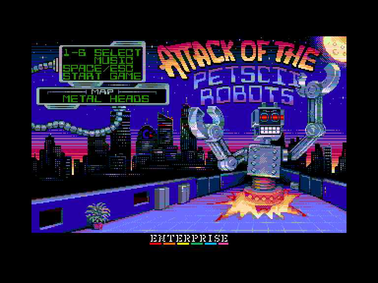
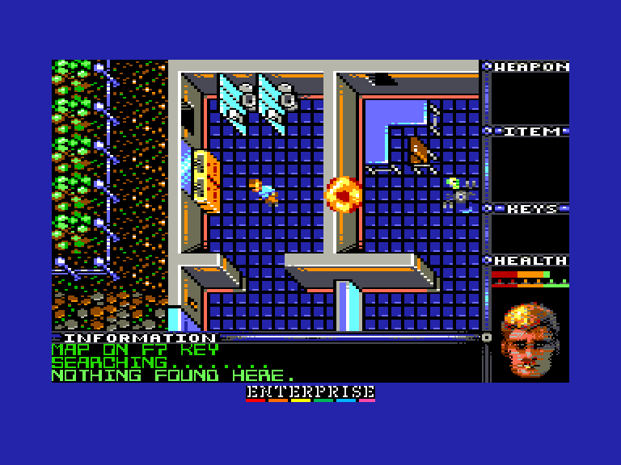
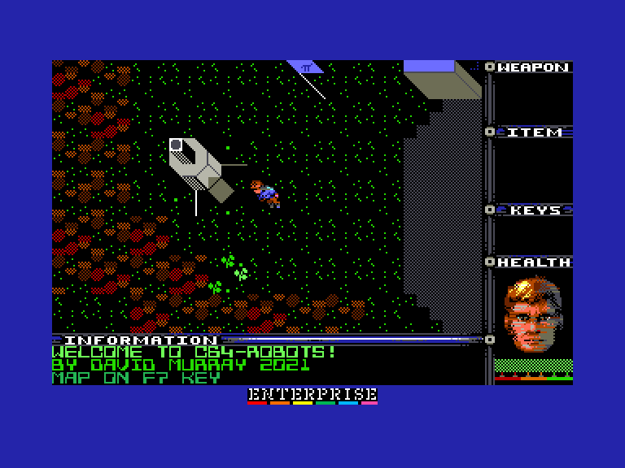
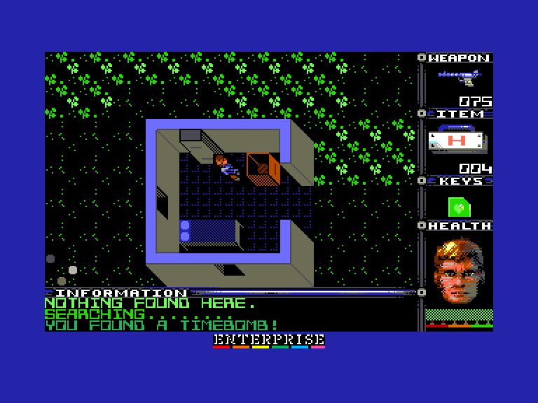

[0-9](../0/games-0.md) - [A](../a/games-a.md) - [B](../b/games-b.md) - [C](../c/games-c.md) - [D](../d/games-d.md) - [E](../e/games-e.md) - [F](../f/games-f.md) - [G](../g/games-g.md) - [H](../h/games-h.md) - [I](../i/games-i.md) - [J](../j/games-j.md) - [K](../k/games-k.md) - [L](../l/games-l.md) - [M](../m/games-m.md) - [N](../n/games-n.md) - [O](../o/games-o.md) - [P](../p/games-p.md) - [Q](../q/games-q.md) - [R](../r/games-r.md) - [S](../s/games-s.md) - [T](../t/games-t.md) - [U](../u/games-u.md) - [V](../v/games-v.md) - [W](../w/games-w.md) - [X](../x/games-x.md) - [Y](../y/games-y.md) - [Z](../z/games-z.md)

Ігри для [Enterprise 64k](../games-ep64.md) - [Enterprise 128k+RAMexp](../games-epramexp.md) - [2dfx](games-2dfx.md)

Ігри для систем [IS-DOS](../games-is-dos.md) - [SymbOS](../games-symbos.md) - [EDC Windows](../games-edcw.md)

Ігри для емуляторів [ZX Spectrum 48k/128k](../zxemu/games-zxemu.md) - [Amstrad CPC](../cpcemu/games-cpc.md) - [Sinclair ZX81](../zx81emu/games-zx81.md) - [Videoton TVC](../tvcemu/games-tvc.md) - [Commodore VIC-20](../vic20emu/games-vic20.md)

----------

# Attack of the PETSCII Robots

**Альтернативні назви:**
 - Attack of the PETSCII Robots+

**ID:** attack-of-the-petscii-robots

**Жанри:** Пригодницька

## Примітка

ℹ Сучасна схвалена конверсія з платформи Commodore PET (та використовує графічні ресурси з версій для Commodore 64 та Amiga).

## Скріншоти

## Опис

У далекому майбутньому роботи намагаються захопити людські поселення на різних планетах. Ваша мета — проникнути до цих поселень і знищити всіх роботів. Для цього вам доведеться знайти зброю та допоміжне знаряддя. У кожному поселенні є телепортаційна кімната. Однак, щоб запобігти втечі сторонніх роботів, системи телепортації віддалено запрограмовані так, що вони не активуються, доки не буде знищено останнього ворога. Щойно ви ліквідуєте всіх роботів, платформа телепорту запрацює, і ви зможете ступити на неї, щоб завершити рівень.  

На перший погляд **Attack of the PETSCII Robots** може здатися динамічним екшен-шутером. Проте це зовсім не так. Сприймайте її радше як гру про стратегію та дослідження. Хоч вам і дається зброя для бою, ви ніколи не переможете, якщо спробуєте йти на роботів напролом. Шлях до перемоги полягає в тому, щоб розглядати кожну стичку як тактичну задачу. Здебільшого завжди знайдеться спосіб здолати кожного робота без прямого лобового зіткнення. Секрет полягає в тому, щоб знайти всі необхідні інструменти та навчитися їх правильно використовувати.

## Основна інформація
- **Мови:** Англійська
- **Оригінальна платформа:** Commodore PET
### Загальні системні вимоги
- **Апаратні:** EP128, EP128+RAM
### Геймплей
- **Керування:** Keyboard, Internal Joy, External Joy 1, External Joy 2
- **Кількість гравців:** 1 player
- **Додаткові теги:** 4-color mode, Attribute mode, 16-color mode, Isometric, SID-card
### Розробка
- **Рік випуску:** 2021
- **Автор:** The 8-Bit Guy

## Посилання
- [Домашня сторінка](https://www.the8bitguy.com/25753/petscii-robot-shareware-available)
- [Опис на ep128.hu (угорською)](http://www.ep128.hu/Ep_Games/Leiras/Attack_of_the_PETSCII_Robots.htm)
- [Тема на форумі enterpriseforever](https://enterpriseforever.com/commodore-rol/attack-of-the-petscii-robots-2152/)
- [Тема на форумі enterpriseforever](https://enterpriseforever.com/commodore-rol/attack-of-the-petscii-robots/)
- [Завантажити](http://www.ep128.hu/Ep_Games/Prg/Attack_of_the_PETSCII_Robots_Plus.rar)
- [Завантажити](http://www.ep128.hu/Ep_Games/Prg/Attack_of_the_PETSCII_Robots.rar)
- [Easy Load&Play](https://t.me/EP128k_Load_n_Play/419) *(Telegram-канал Vibrant Waves)*

## Відео

<iframe src="https://www.youtube.com/embed/YiwFXQoexlg"  
style="width:75%; aspect-ratio:16/9;" allowfullscreen></iframe>

- [Відео](https://www.youtube.com/watch?v=t23FI3rXqu4)
- [Відео](https://www.youtube.com/watch?v=1YZ6bpS2gJc)

## [Керування](../controllers.md)

`Keyboard` (можна перевизначити)  
`Internal Joystick`  
`External Joystick 1`  
`External Joystick 2`  

**Клавіши за замовчуванням:**  
`I`, `K`, `J`, `L` або Джойстик: Пересування  
`W`, `A`, `S`, `D`: Стріляти (у відповідному напрямку)  
`F1`: Змінити поточну зброю  
`F2`: Змінити поточний предмет  
`Space`/`Fire`: Використати предмет  
`Z`: Обшукати об'єкт *(натиснути клавішу обшуку, а потім напрямок)*  
`M`: Посунути об'єкт *(натиснути клавішу штовхання, потім напрямок для вибору предмету, і ще раз напрямок для пересування)*  
`F7`: Відкрити карту (натисніть `F7` на цьому екрані щоб відобразити/приховати активних роботів; натисніть будь-яку іншу клавішу щоб закрити карту)  

`Stop`/`Hold`/`Pause`: Пауза/Вихід (`Y`/`N`)  
`F8`: увімкнути/вимкнути музику   
`Shift`+`F1`: Переключитись між звичайною та зеленою монохромною палітрою  
`Shift`+`F2`: Переключити пристрій для програвання музики (Dave/SID) (працює лише у емуляторі або при наявності SID-карти)

## Детальна інформація

### Системні вимоги Attack of the PETSCII Robots  
#### Мінімальні системні вимоги  
Оперативна пам'ять: **128 КБ**  
#### Рекомендовані системні вимоги  
Оперативна пам'ять: **128 КБ (або більше)**  
[EXDOS](../../software/ss-exdos.md)  
[SID card](../../hardware/hs-sidcard.md)  

### Системні вимоги Attack of the PETSCII Robots Plus (16-colour version)  
#### Мінімальні системні вимоги  
Оперативна пам'ять: **192 КБ**  
#### Рекомендовані системні вимоги  
Оперативна пам'ять: **192 КБ (або більше)**  
[EXDOS](../../software/ss-exdos.md)  
[SID card](../../hardware/hs-sidcard.md)  

### Тонкощі запуску  

**Звичайна версія**  
Після завантаження натисніть `1` або `2` для вибору графічного режиму гри.  

- `1`: **Атрибутний** (16-кольорів): у цьому випадку карти рівнів 8-15 потрібно буде дозавантажувати.  
- `2`: **4-колірний**: усі рівні завантажуються відразу  

### Чіти  

(під час гри)  
`Shift`+`F7`: Нескінченні життя  
`Shift`+`F8`: Отримати гаджети