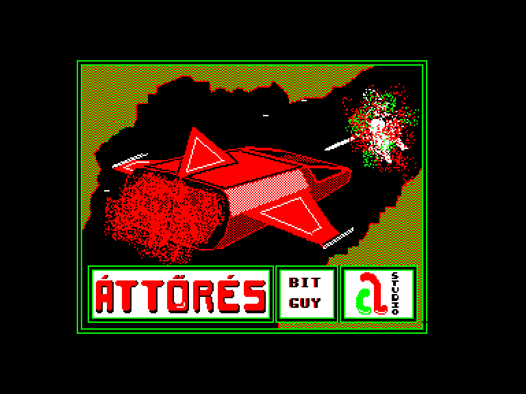
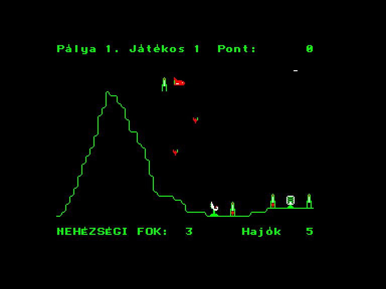
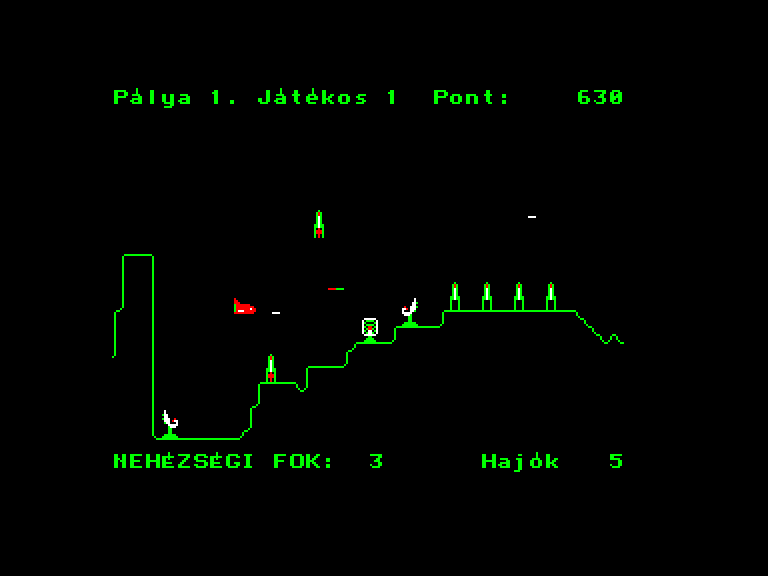

[0-9](../0/games-0.md) - [A](../a/games-a.md) - [B](../b/games-b.md) - [C](../c/games-c.md) - [D](../d/games-d.md) - [E](../e/games-e.md) - [F](../f/games-f.md) - [G](../g/games-g.md) - [H](../h/games-h.md) - [I](../i/games-i.md) - [J](../j/games-j.md) - [K](../k/games-k.md) - [L](../l/games-l.md) - [M](../m/games-m.md) - [N](../n/games-n.md) - [O](../o/games-o.md) - [P](../p/games-p.md) - [Q](../q/games-q.md) - [R](../r/games-r.md) - [S](../s/games-s.md) - [T](../t/games-t.md) - [U](../u/games-u.md) - [V](../v/games-v.md) - [W](../w/games-w.md) - [X](../x/games-x.md) - [Y](../y/games-y.md) - [Z](../z/games-z.md)

Ігри для [Enterprise 64k](../games-ep64.md) - [Enterprise 128k+RAMexp](../games-epramexp.md)

Ігри для систем [IS-DOS](../games-is-dos.md) - [SymbOS](../games-symbos.md) - [EDC Windows](../games-edcw.md)

Ігри для емуляторів [ZX Spectrum 48k/128k](../zxemu/games-zxemu.md) - [Amstrad CPC](../cpcemu/games-cpc.md) - [Sinclair ZX81](../zx81emu/games-zx81.md) - [Videoton TVC](../tvcemu/games-tvc.md) - [Commodore VIC-20](../vic20emu/games-vic20.md)

----------

# Áttörés

**ID:** attores

**Жанри:** Аркада, Скролшутер

## Примітка

ℹ Конверсія з платформи Videoton TVC.

## Скріншоти

## Опис

(temporary description generated by AI Assistant)  

**Опис гри Áttörés:**  

Áttörés — це аркадна гра, випущена в 1987 році студією 'a' на платформі Enterprise. У грі ви виступаєте в ролі космічного пілота, який повинен проникнути на ворожу базу та знищити її. Гра має просту графіку і звуки, але пропонує цікаве ігрове відчуття. Ви будете боротися з безліччю ворожих ракет, які намагаються вас знищити, поки ви подорожуєте через складну систему печер.  

**Правила гри:**  
1. Керуйте своїм космічним кораблем, рухаючи його вліво та вправо.  
2. Використовуйте клавішу **SPACE** для скидання бомб, а клавішу **J** (або **K** на легкому рівні) для стрільби.  
3. Уникайте зіткнень з ворожими ракетами та стінами печер, оскільки це призведе до втрати життя.  
4. Знищуйте ворожі ракетні установки та радари, щоб полегшити собі шлях.  
5. Гра має 9 рівнів складності, які ви можете налаштувати під час гри.  
6. На четвертому рівні вам потрібно буде знищити реактор, скинувши на нього бомбу.  
7. Гра дозволяє грати вдвох, де один гравець керує кораблем, а інший скидає бомби.  

Успіхів у вашій місії!

## Основна інформація
- **Мови:** Угорська
### Геймплей
- **Додаткові теги:** 4-color mode

## Посилання
- [Опис гри на ep128.hu (угорською)](http://www.ep128.hu/Ep_Games/Leiras/Attores.htm)
- [Завантажити гру](http://www.ep128.hu/Ep_Games/Prg/Attores.rar)

## Відео

<iframe src="https://www.youtube.com/embed/kwbRTt7MhdU"  
style="width:75%; aspect-ratio:16/9;" allowfullscreen></iframe>

- [Відео](https://youtu.be/JXY87ERP05I)

