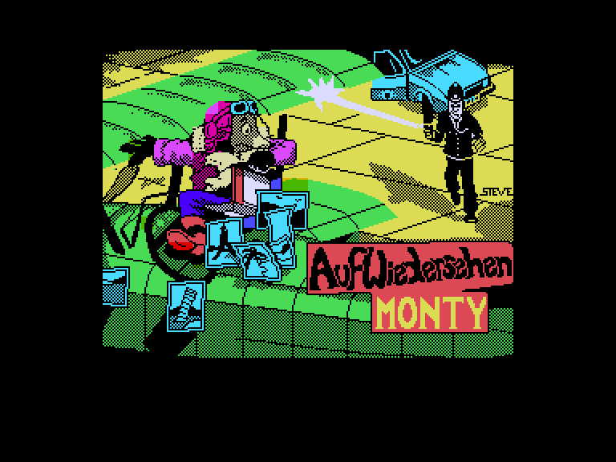
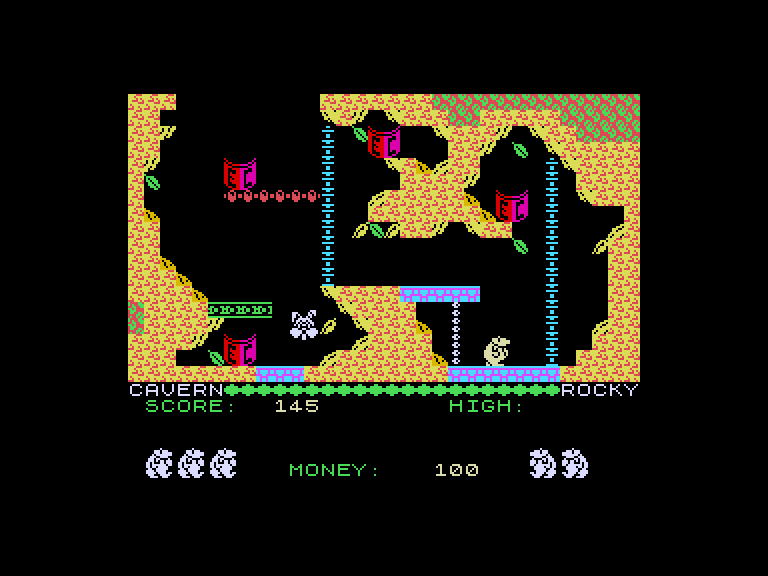
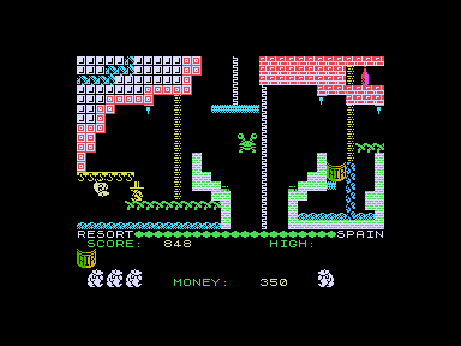
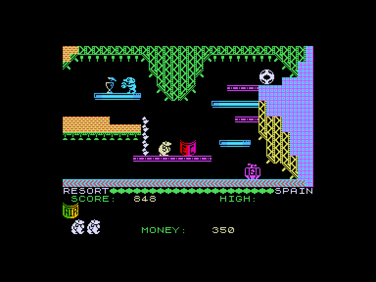

[0-9](../0/games-0.md) - [A](../a/games-a.md) - [B](../b/games-b.md) - [C](../c/games-c.md) - [D](../d/games-d.md) - [E](../e/games-e.md) - [F](../f/games-f.md) - [G](../g/games-g.md) - [H](../h/games-h.md) - [I](../i/games-i.md) - [J](../j/games-j.md) - [K](../k/games-k.md) - [L](../l/games-l.md) - [M](../m/games-m.md) - [N](../n/games-n.md) - [O](../o/games-o.md) - [P](../p/games-p.md) - [Q](../q/games-q.md) - [R](../r/games-r.md) - [S](../s/games-s.md) - [T](../t/games-t.md) - [U](../u/games-u.md) - [V](../v/games-v.md) - [W](../w/games-w.md) - [X](../x/games-x.md) - [Y](../y/games-y.md) - [Z](../z/games-z.md)

Ігри для [Enterprise 64k](../games-ep64.md) - [Enterprise 128k+RAMexp](../games-epramexp.md) - [2dfx](../games-2dfx.md)

Ігри для систем [IS-DOS](../games-is-dos.md) - [SymbOS](../games-symbos.md) - [EDC Windows](../games-edcw.md)

Ігри для емуляторів [ZX Spectrum 48k/128k](../zxemu/games-zxemu.md) - [Amstrad CPC](../cpcemu/games-cpc.md) - [Sinclair ZX81](../zx81emu/games-zx81.md) - [Videoton TVC](../tvcemu/games-tvc.md) - [Commodore VIC-20](../vic20emu/games-vic20.md)

----------

# Auf Wiedersehen Monty

**ID:** auf-wiedersehen-monty-zx

**Жанри:** Аркада, Платформер

## Примітка

ℹ Стара неофіційна конверсія з платформи ZX Spectrum.

## Скріншоти

## Опис

Сховавшись після втечі з в'язниці у Гібралтарі, Кріт Монті виявляє, що й тут він не в безпеці від уваги Intermole — міжнародної організації з боротьби зі злочинністю. Єдина надія Монті на порятунок — грецький острів, але купити його можна лише за наявності достатньої суми грошей. Перш ніж зробити це, Монті має пройти крізь усю Європу, виконавши бодай по одній місії в кожній із її країн.

## Основна інформація
- **Мови:** Англійська
- **Оригінальна платформа:** ZX Spectrum
### Геймплей
- **Додаткові теги:** Attribute mode

## Посилання
- [Опис на ep128.hu (угорською)](http://www.ep128.hu/Games/Auf_W_Monty.htm)
- [Інформація про оригінальну версію](https://spectrumcomputing.co.uk/entry/328/ZX-Spectrum/Auf_Wiedersehen_Monty)
- [Завантажити](http://www.ep128.hu/Ep_Games/Prg/Auf_Wiedersehen_Monty.rar)
- [Easy Load&Play](https://t.me/EP128k_Load_n_Play/1034) *(Telegram-канал Vibrant Waves)*

## Детальна інформація

### Геймплей  

Усього на вас чекає 80 екранів, заповнених платформами. Досліджуючи їх, ви знаходитимете предмети, що допоможуть Монті виконати необхідні завдання. Слід підбирати ці речі (просто наступивши на них) і відносити у потрібне місце для використання. Одночасно можна нести до чотирьох предметів — вони відображаються у лівому нижньому кутку екрана.  

Гроші збираються у вигляді єврочеків або нараховуються щоразу, коли Монті виконує завдання. Очки також даються за підбором предметів. Ваш банківський рахунок показується внизу екрана. Авіаквитки дають доступ до аеропортів, звідки можна вилетіти в іншу локацію — і потрапити прямісінько в повітряний бій із ВПС Intermole. Додаткові очки можна отримати, зрізаючи хвостове оперення ворожих літаків.  

Лише тоді, коли буде виконано кожне завдання у грі, зібрано кожен єврочек та здобуто номер швейцарського банківського рахунку Монті, гроші можна буде вважати збереженими, а острів — купленим.