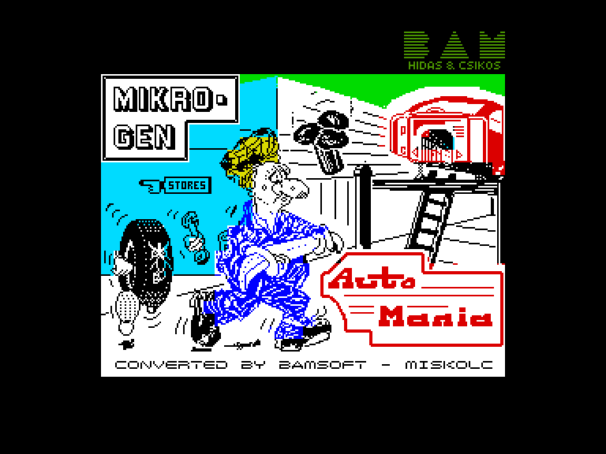
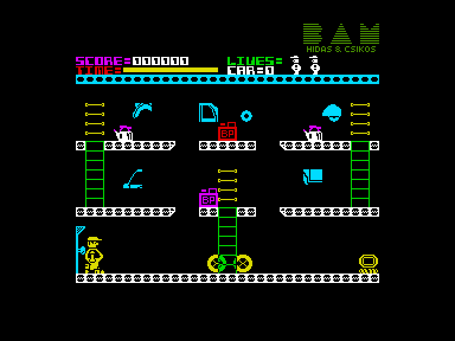
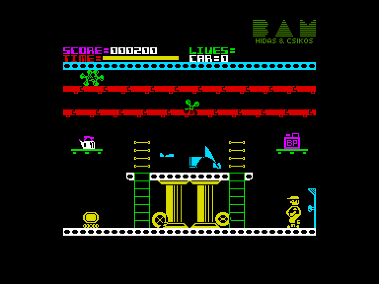

[0-9](../0/games-0.md) - [A](../a/games-a.md) - [B](../b/games-b.md) - [C](../c/games-c.md) - [D](../d/games-d.md) - [E](../e/games-e.md) - [F](../f/games-f.md) - [G](../g/games-g.md) - [H](../h/games-h.md) - [I](../i/games-i.md) - [J](../j/games-j.md) - [K](../k/games-k.md) - [L](../l/games-l.md) - [M](../m/games-m.md) - [N](../n/games-n.md) - [O](../o/games-o.md) - [P](../p/games-p.md) - [Q](../q/games-q.md) - [R](../r/games-r.md) - [S](../s/games-s.md) - [T](../t/games-t.md) - [U](../u/games-u.md) - [V](../v/games-v.md) - [W](../w/games-w.md) - [X](../x/games-x.md) - [Y](../y/games-y.md) - [Z](../z/games-z.md)

Ігри для [Enterprise 64k](../games-ep64.md) - [Enterprise 128k+RAMexp](../games-epramexp.md)

Ігри для систем [IS-DOS](../games-is-dos.md) - [SymbOS](../games-symbos.md) - [EDC Windows](../games-edcw.md)

Ігри для емуляторів [ZX Spectrum 48k/128k](../zxemu/games-zxemu.md) - [Amstrad CPC](../cpcemu/games-cpc.md) - [Sinclair ZX81](../zx81emu/games-zx81.md) - [Videoton TVC](../tvcemu/games-tvc.md) - [Commodore VIC-20](../vic20emu/games-vic20.md)

----------

# Automania

**Альтернативні назви:**
 - Manic Mechanic

**ID:** automania-zx

**Жанри:** Аркада, Платформер

## Примітка

ℹ Стара неофіційна конверсія з платформи ZX Spectrum.

## Скріншоти

## Опис

Ви повинні допомогти Воллі Уїку зібрати серію автомобілів.

## Основна інформація
- **Мови:** Англійська
- **Оригінальна платформа:** ZX Spectrum
### Геймплей
- **Додаткові теги:** Attribute mode

## Посилання
- [Опис гри на ep128.hu (угорською)](http://www.ep128.hu/Games/Automania.htm)
- [Інформація про оригінальну версію](https://spectrumcomputing.co.uk/entry/339/ZX-Spectrum/Automania)
- [Завантажити гру](http://www.ep128.hu/Ep_Games/Prg/Automania.rar)

## Детальна інформація

### Геймплей  

Гра складається з двох основних екранів. Перший — це склад запчастин: Воллі має збирати деталі авто по одній та відносити їх через двері до складального цеху. Саме тут і формується готовий автомобіль (перший дуже схожий на Citroën 2CV!). Воллі достатньо лише пройтися над відповідною ділянкою машини з деталлю в руках, щоб вона встановилася на місце. Після цього — знову назад на склад.  

Гра, як зазвичай, ускладнюється різноманітними небезпеками: роботами, некерованими шинами та лопатями вентиляторів, що падають. На щастя, Воллі може їх перестрибувати. Крім того, підвісні платформи на складі постійно висуваються та засуваються, а довкола розкидані всілякі бонуси, як-от маслянки чи чайники.  

Усього в грі 10 рівнів. Щойно Воллі закінчує складання авто, воно виїжджає з цеху, і він має ставати до побудови нової моделі. Чим далі ви просуваєтеся, тим складніше стає...