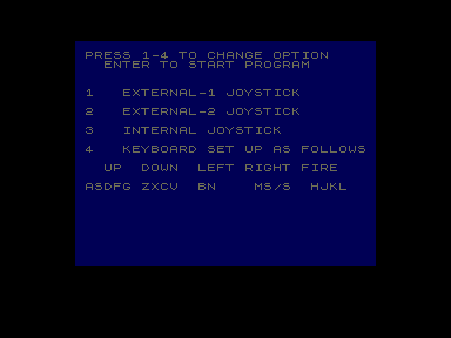
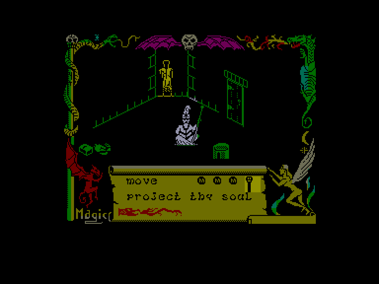
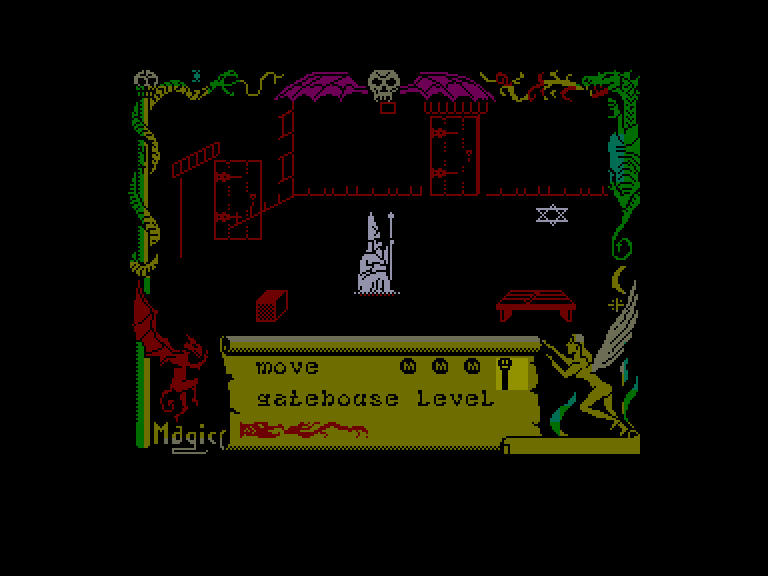
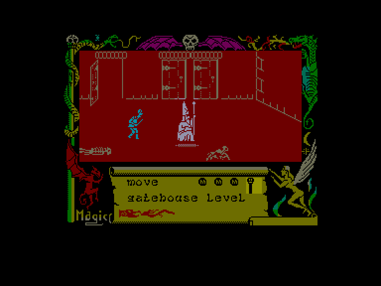

[0-9](../0/games-0.md) - [A](../a/games-a.md) - [B](../b/games-b.md) - [C](../c/games-c.md) - [D](../d/games-d.md) - [E](../e/games-e.md) - [F](../f/games-f.md) - [G](../g/games-g.md) - [H](../h/games-h.md) - [I](../i/games-i.md) - [J](../j/games-j.md) - [K](../k/games-k.md) - [L](../l/games-l.md) - [M](../m/games-m.md) - [N](../n/games-n.md) - [O](../o/games-o.md) - [P](../p/games-p.md) - [Q](../q/games-q.md) - [R](../r/games-r.md) - [S](../s/games-s.md) - [T](../t/games-t.md) - [U](../u/games-u.md) - [V](../v/games-v.md) - [W](../w/games-w.md) - [X](../x/games-x.md) - [Y](../y/games-y.md) - [Z](../z/games-z.md)

Ігри для [Enterprise 64k](../games-ep64.md) - [Enterprise 128k+RAMexp](../games-epramexp.md)

Ігри для систем [IS-DOS](../games-is-dos.md) - [SymbOS](../games-symbos.md) - [EDC Windows](../games-edcw.md)

Ігри для емуляторів [ZX Spectrum 48k/128k](../zxemu/games-zxemu.md) - [Amstrad CPC](../cpcemu/games-cpc.md) - [Sinclair ZX81](../zx81emu/games-zx81.md) - [Videoton TVC](../tvcemu/games-tvc.md) - [Commodore VIC-20](../vic20emu/games-vic20.md)

----------

# Avalon

**Альтернативні назви:**
 - The Legend of Avalon

**ID:** avalon-zx

**Жанри:** Пригодницька, Лабіринт

## Примітка

ℹ Стара неофіційна конверсія з платформи ZX Spectrum.

## Скріншоти

## Опис

Чаклуну Мароку доручено знищити Володаря Хаосу, який мешкає в самій глибині лабіринту Авалон. Ваше завдання — зробити все, щоб Марок досяг успіху.

## Основна інформація
- **Мови:** Англійська
- **Оригінальна платформа:** ZX Spectrum
### Геймплей
- **Додаткові теги:** Attribute mode

## Посилання
- [Інформація про оригінальну версію](https://spectrumcomputing.co.uk/entry/348/ZX-Spectrum/Avalon)
- [Завантажити гру](http://www.ep128.hu/Ep_Games/Prg/Avalon.rar)

## Детальна інформація

### Геймплей  

Мароку протистоять кілька видів створінь. Найпоширеніші — ґобліни-воїни: вони нападають юрбою, і втектися від них можна лише швидко пробігши крізь дві кімнати або спустившись у тунель. Також є привиди, які жбурляють вогняні кулі та часто переслідують вас навіть крізь стіни; охоронці хаосу — настільки ж мерзотні, як і їхня назва; і, нарешті, чаклуни-варлоки, яких можна підкупити для допомоги, якщо дати їм бажане.  

На допомогу в цій місії стане безліч заклять та корисних предметів. Деякі з них підбираються, якщо просто наступити на них, а для інших знадобиться допомога слуги (якого можна закликати одним із перших заклинань). Сам процес пересування також є закляттям — ви ніби ширяєте над землею, але воно доступне вам від самого початку гри. Зібрані заклинання відображаються у вигляді рухомого сувою внизу екрана та вибираються клавішами «вгору/вниз» і кнопкою «вогонь». Деякі закляття можна використовувати одночасно — наприклад, «MOVE» (Рух) та «UNSEEN» (Невидимість). Надзвичайно корисним є заклинання «FREEZE» (Заморозка), яке ненадовго зупиняє час, дозволяючи Мароку втекти від ворогів.  

Усі кімнати мають двері: відчинені, зачинені або замкнені. Для останніх, звісно ж, потрібні ключі. Щоб відчинити зачинені двері, необхідно підвести Марока впритул і легенько штовхнути їх, після чого трохи відступити назад, даючи їм розчинитися, і лише потім проходити. Зачиняються двері таким самим чином.