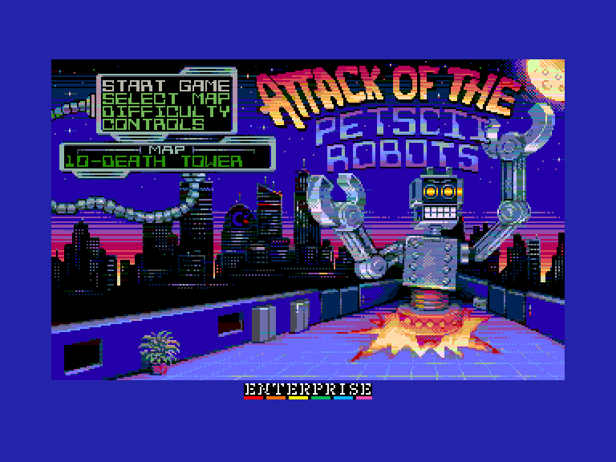
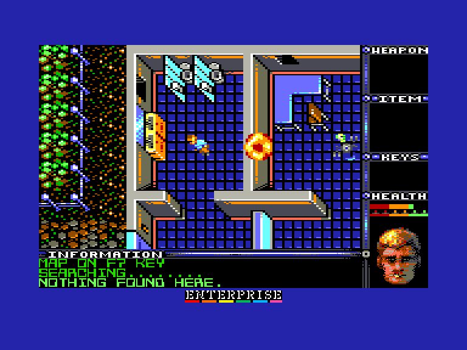
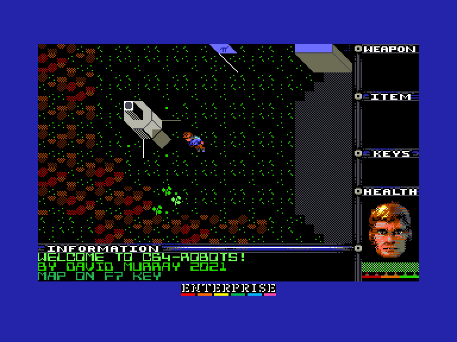
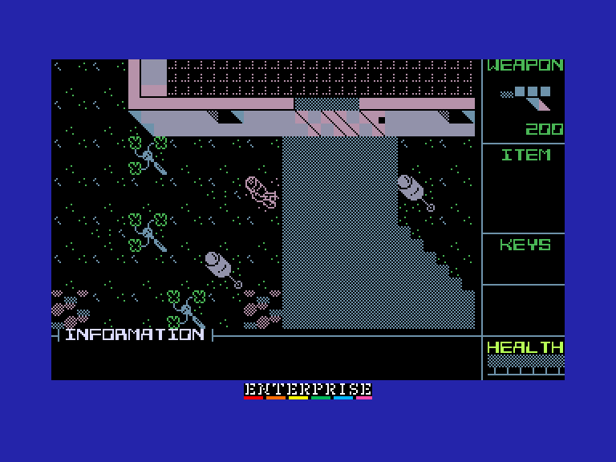

# Attack of the PETSCII Robots

 
 
 

Жанр: аркада, пригода, стратегія  
Кількість гравців: 1  
Мова гри: англійська  

## Опис

Десь у майбутньому роботи намагаються захопити людські поселення на різних планетах. Ваша мета - проникнути в ці поселення і знищити всіх роботів.

Для цього вам потрібно знайти зброю та інші інструменти. У кожному поселенні є кімната для телепортації. Однак, щоб запобігти несанкціонованому виходу роботів з поселень, системи транспортування були дистанційно запрограмовані на те, щоб не активуватися, доки всіх роботів не буде знищено. Після того, як ви знищите всіх роботів, ви побачите, як активується телепортаційний майданчик, на який ви можете ступити, щоб завершити рівень.

На перший погляд, Attack of the PETSCII Robots може виглядати як екшн-шутер. Однак насправді це не так. Думайте про неї більше як про стратегію та дослідницьку гру. Хоча вам дається зброя для боротьби, ви ніколи не переможете, якщо спробуєте битися з роботами в лоб. Шлях до перемоги лежить через стратегічне вивчення кожної ситуації з роботом.

У більшості випадків є спосіб перемогти кожного робота, не вступаючи з ним у лобову сутичку. Хитрість полягає в тому, щоб навчитися знаходити всі необхідні інструменти і навчитися ними користуватися.

<iframe width="560" height="315" src="https://www.youtube.com/embed/t23FI3rXqu4" title="YouTube video player" frameborder="0" allowfullscreen></iframe>

## Системні вимоги Attack of the PETSCII Robots
### Мінімальні системні вимоги
Оперативна пам'ять: **128 КБ**  
### Рекомендовані системні вимоги
Оперативна пам'ять: **128 КБ (або більше)**  
[EXDOS](../../software/ss-exdos.md)  
[SID card](../../hardware/hs-sidcard.md)  

## Системні вимоги Attack of the PETSCII Robots Plus (16-colour version)
### Мінімальні системні вимоги
Оперативна пам'ять: **192 КБ**  
### Рекомендовані системні вимоги
Оперативна пам'ять: **192 КБ (або більше)**  
[EXDOS](../../software/ss-exdos.md)  
[SID card](../../hardware/hs-sidcard.md)

## Керування та тонкощі запуску
### Завантаження та запуск

Після завантаження натисніть 1 чи 2 щоб вибрати графічний режим гри (тільки для звичайної версії гри):  
 `1`: **Атрибутний** (16-кольорів): у цьому випадку карти рівнів 8-15 потрібно буде дозавантажувати.  
 `2`: **4-колірний**: усі рівні завантажуються відразу  

### Основні [елементи керування](../controllers.md):
Пересування:  
⌨ Клавіатура (`I`, `J`, `K`, `L`)  
🕹 Вбудований джойстик   
🎮 Зовнішній джойстик 1/2  

`W` ,`S`, `A`, `D`: Здійснити постріл у відповідному напрямку *(при наявності зброї)*  
`Space`, `Fire`: Використати обладнання  

`F1`: Зміна озброєння  
`F2`: Зміна обладнання  
`Z`: Обшукати об'єкт *(натиснути клавішу обшуку, а потім напрямок)*  
`M`: Посунути об'єкт *(натиснути клавішу штовхання, потім напрямок для вибору предмету, і ще раз напрямок для пересування)*  

`F7`: Мапа *(натисніть `F7` на цьому екрані ще раз для відображення роботів, чи будь-яку іншу клавішу для повернення)*  

### Додаткові клавіши:
`F8`: Музика вимкн./увімкн.  
`Shift`+`F1`: Змінити режим відображення *(звичайна палітра чи зелений монохром)*  
`Shift`+`F2`: Змінити тип відтворення музики *(Dave чи SID)*  

`Stop`, `Hold`/`Pause`:	Пауза / вихід  з гри (Y/N)  

## Чіт-коди та допомога у проходженні

### Комбінація клавіш під час гри:
`Shift`+`F7`: Безкінечна кількість життів  
`Shift`+`F8`: Отримати усе обладнання  

## Посилання

▶ [Easy Load&Play](https://t.me/EP128k_Load_n_Play/419) *(Telegram-канал Vibrant Waves)*    
💾 [Завантажити гру](http://www.ep128.hu/Ep_Games/Prg/Attack_of_the_PETSCII_Robots.rar)    
💾 [Завантажити гру («Плюс» версія)](http://www.ep128.hu/Ep_Games/Prg/Attack_of_the_PETSCII_Robots_Plus.rar)    
📃 [Опис гри](http://www.ep128.hu/Ep_Games/Leiras/Attack_of_the_PETSCII_Robots.htm) (угорська)    
🗨 [Тема на форумі enterpriseforever.com](https://enterpriseforever.com/commodore-rol/attack-of-the-petscii-robots/)    
🏡 [Домашня сторінка гри](https://www.the8bitguy.com/25753/petscii-robot-shareware-available)  

## Автори
### Оригінальний реліз
🖥 Платформа: [Commodore PET / Commodore 64]  
👨‍💻 Автор: David Murray (The 8-Bit Guy)  
📅 Рік релізу: 2021  

### Версія гри для Enterprise
👨‍💻 Портування: [Geco](../../community/geco.md)    
📅 Рік релізу: [2023](../release_years/2023.md)  