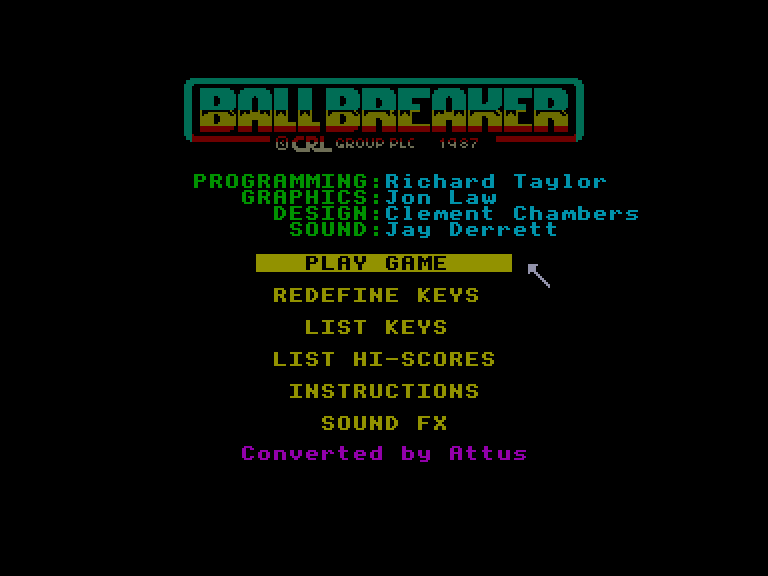
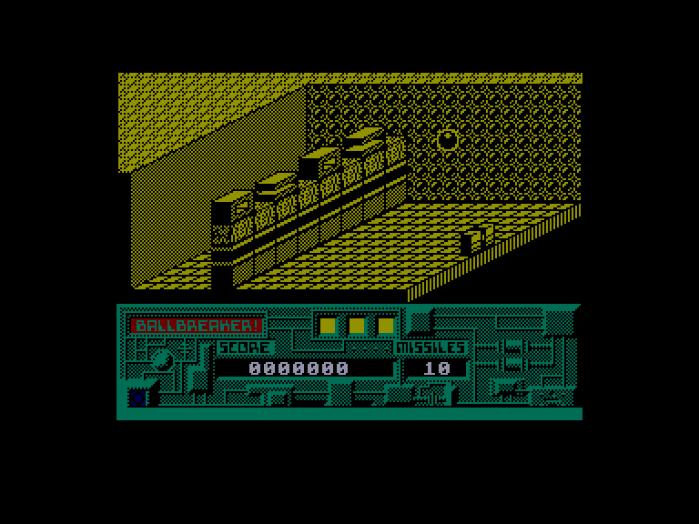
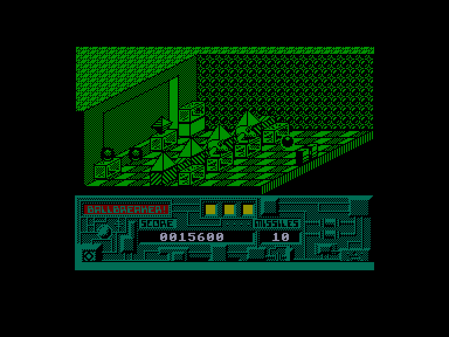
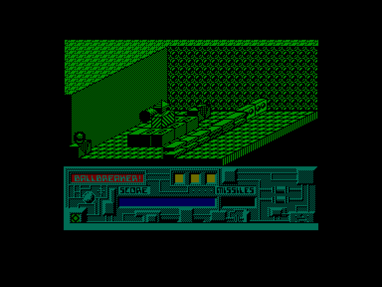

[0-9](../0/games-0.md) - [A](../a/games-a.md) - [B](../b/games-b.md) - [C](../c/games-c.md) - [D](../d/games-d.md) - [E](../e/games-e.md) - [F](../f/games-f.md) - [G](../g/games-g.md) - [H](../h/games-h.md) - [I](../i/games-i.md) - [J](../j/games-j.md) - [K](../k/games-k.md) - [L](../l/games-l.md) - [M](../m/games-m.md) - [N](../n/games-n.md) - [O](../o/games-o.md) - [P](../p/games-p.md) - [Q](../q/games-q.md) - [R](../r/games-r.md) - [S](../s/games-s.md) - [T](../t/games-t.md) - [U](../u/games-u.md) - [V](../v/games-v.md) - [W](../w/games-w.md) - [X](../x/games-x.md) - [Y](../y/games-y.md) - [Z](../z/games-z.md)

Ігри для [Enterprise 64k](../games-ep64.md) - [Enterprise 128k+RAMexp](../games-epramexp.md)

Ігри для систем [IS-DOS](../games-is-dos.md) - [SymbOS](../games-symbos.md) - [EDC Windows](../games-edcw.md)

Ігри для емуляторів [ZX Spectrum 48k/128k](../zxemu/games-zxemu.md) - [Amstrad CPC](../cpcemu/games-cpc.md) - [Sinclair ZX81](../zx81emu/games-zx81.md) - [Videoton TVC](../tvcemu/games-tvc.md) - [Commodore VIC-20](../vic20emu/games-vic20.md)

----------

# Ball Breaker

**ID:** ball-breaker-zx

**Жанри:** Аркада, Арканоідо-подібна

## Примітка

ℹ Стара неофіційна конверсія з платформи ZX Spectrum.

## Скріншоти

## Опис

(temporary description generated by AI Assistant)  

**Опис гри BallBreaker:**  

BallBreaker — це аркадна гра, випущена в 1987 році компанією CRL Group для платформ Spectrum (128k) та Enterprise. Це гра у стилі "блокбастер", яка намагається внести новизну в жанр, пропонуючи 3D-графіку. Гравець повинен знищити всі блоки на екрані, використовуючи м'яч, який відскакує від платформи. Гра забезпечує простий і зрозумілий геймплей, що дозволяє насолоджуватися процесом.  

**Правила гри:**  
1. Після завантаження програми натисніть будь-яку клавішу, щоб потрапити в головне меню.  
2. Використовуйте курсорні клавіші для вибору опцій:  
   - **PLAY GAME** — почати гру.  
   - **REDEFINE KEYS** — налаштувати управління (можливість вибору між джойстиками або клавіатурою).  
   - **LIST KEYS** — переглянути контролери.  
   - **LIST HI-SCORES** — переглянути таблицю рекордів.  
   - **INSTRUCTIONS** — ознайомитися з інструкціями та елементами гри.  
   - **SOUND FX / MUSIC** — вибрати звук або музику під час гри.  
3. Використовуйте клавіші **UP** і **DOWN** для переміщення в меню, а **SPACE** для вибору.  
4. Під час гри рухайте платформу вліво та вправо, щоб відбивати м'яч.  
5. Стріляйте ракети, використовуючи відповідну кнопку (кількість ракет обмежена).  
6. Мета гри — знищити всі блоки на екрані, використовуючи м'яч або ракети.  
7. Збирайте бонуси, щоб отримати додаткові можливості.  
8. Уникайте зіткнень з блоками, оскільки це призведе до втрати життя.  

Гра має просте управління і приємний геймплей, що робить її цікавою для всіх шанувальників жанру.

## Основна інформація
- **Мови:** Англійська
- **Оригінальна платформа:** ZX Spectrum
### Геймплей
- **Керування:** Internal Joy, External Joy 1, External Joy 2
- **Кількість гравців:** 1 player
- **Додаткові теги:** Isometric
### Розробка
- **Рік випуску:** 1987
- **Автор:** Richard M. Taylor, Jon Law, Jay Derrett, Jared Derrett [Jayenne Montana]
- **Компанія:** The Zen Room

## Посилання
- [Опис гри на ep128.hu (угорською)](http://www.ep128.hu/Games/BallBreaker.htm)
- [Інформація про оригінальну версію](https://spectrumcomputing.co.uk/entry/383/ZX-Spectrum/Ball_Breaker)
- [Завантажити гру](http://www.ep128.hu/Ep_Games/Prg/Ball_Breaker.rar)

