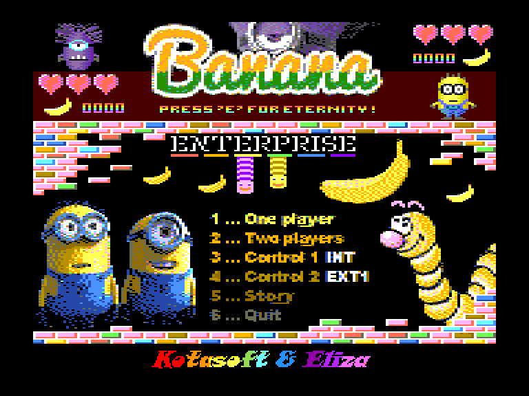
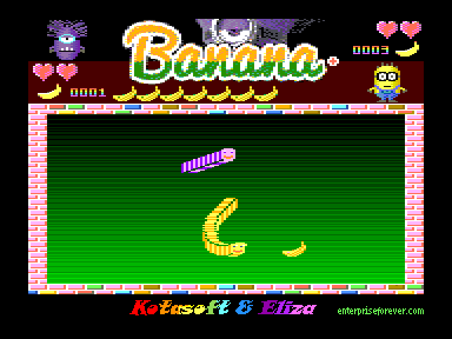
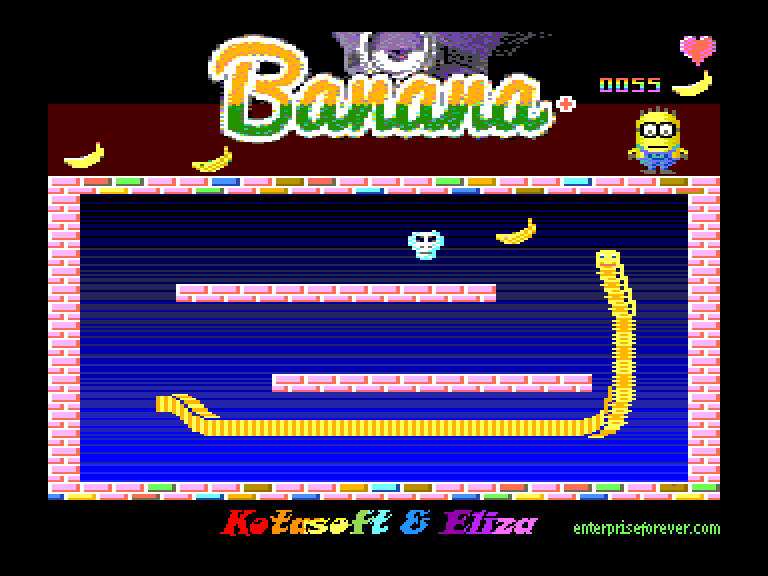
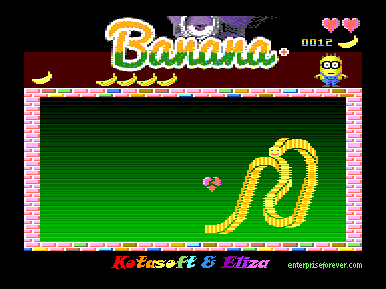

[0-9](../0/games-0.md) - [A](../a/games-a.md) - [B](../b/games-b.md) - [C](../c/games-c.md) - [D](../d/games-d.md) - [E](../e/games-e.md) - [F](../f/games-f.md) - [G](../g/games-g.md) - [H](../h/games-h.md) - [I](../i/games-i.md) - [J](../j/games-j.md) - [K](../k/games-k.md) - [L](../l/games-l.md) - [M](../m/games-m.md) - [N](../n/games-n.md) - [O](../o/games-o.md) - [P](../p/games-p.md) - [Q](../q/games-q.md) - [R](../r/games-r.md) - [S](../s/games-s.md) - [T](../t/games-t.md) - [U](../u/games-u.md) - [V](../v/games-v.md) - [W](../w/games-w.md) - [X](../x/games-x.md) - [Y](../y/games-y.md) - [Z](../z/games-z.md)

Ігри для [Enterprise 64k](../games-ep64.md) - [Enterprise 128k+RAMexp](../games-epramexp.md)

Ігри для систем [IS-DOS](../games-is-dos.md) - [SymbOS](../games-symbos.md) - [EDC Windows](../games-edcw.md)

Ігри для емуляторів [ZX Spectrum 48k/128k](../zxemu/games-zxemu.md) - [Amstrad CPC](../cpcemu/games-cpc.md) - [Sinclair ZX81](../zx81emu/games-zx81.md) - [Videoton TVC](../tvcemu/games-tvc.md) - [Commodore VIC-20](../vic20emu/games-vic20.md)

----------

# Banana

**ID:** banana

**Жанри:** Аркада, Змійко-подібна

## Скріншоти

## Опис

(temporary description generated by AI Assistant)

**Опис гри Banana:**

Banana — це аркадна гра, випущена в 2018 році компанією Kotasoft та Eliza. У цій грі ви керуєте вегетаріанською змією, яка повинна з'їсти певну кількість бананів на кожному рівні. Змія росте в довжину, коли їсть банани, і гравець повинен уникати зіткнень з власним хвостом. Гра має 12 рівнів, і з кожним новим рівнем з'являється більше перешкод.

**Правила гри:**
1. Керуйте змією, щоб з'їсти необхідну кількість бананів на кожному рівні.
2. Змія може рухатися в будь-якому напрямку, але будьте обережні, щоб не натрапити на власний хвіст.
3. Банани з'являються випадковим чином, а вгорі екрана ви можете бачити, скільки бананів ще потрібно з'їсти.
4. Життя гравця позначаються сердечками в правій частині екрану.
5. Після з'їдання трьох бананів можуть з'явитися випадкові "екстра" предмети, які можуть вплинути на гру.
6. Гра має два режими: один гравець або два гравці, які можуть грати одночасно.
7. Управління здійснюється за допомогою джойстика або клавіатури (A — поворот ліворуч, S — поворот праворуч).
8. Використовуйте клавіші HOLD/PAUSE для паузи гри, STOP для завершення гри, а N для переходу на наступний рівень.

Успіхів у зборі бананів!

## Основна інформація
- **Мови:** Англійська
- **Оригінальна платформа:** Enterprise
### Геймплей
- **Керування:** Keyboard, Internal Joy, External Joy 1, External Joy 2
- **Кількість гравців:** 1 player, 2 players (versus)
- **Додаткові теги:** 16-color mode
### Розробка
- **Рік випуску:** 2018
- **Автор:** Kotasoft, Eliza

## Посилання
- [Опис гри на ep128.hu (угорською)](http://www.ep128.hu/Ep_Games/Leiras/Banana.htm)
- [Тема на форумі enterpriseforever](https://enterpriseforever.com/jatekok/banana/)
- [Завантажити гру](http://www.ep128.hu/Ep_Games/Prg/Banana.rar)
- [Завантажити гру](http://www.ep128.hu/Ep_Games/Prg/Banana_Plus.rar)
- [Easy Load&Play](https://t.me/EP128k_Load_n_Play/81) *(Telegram-канал Vibrant Waves)*

**Дата генерації:** 28.07.2026

## Відео

<iframe src="https://www.youtube.com/embed/DsvuVHIMsac"  
style="width:75%; aspect-ratio:16/9;" allowfullscreen></iframe>

- [Відео](https://youtu.be/bweTA1xrf3M)