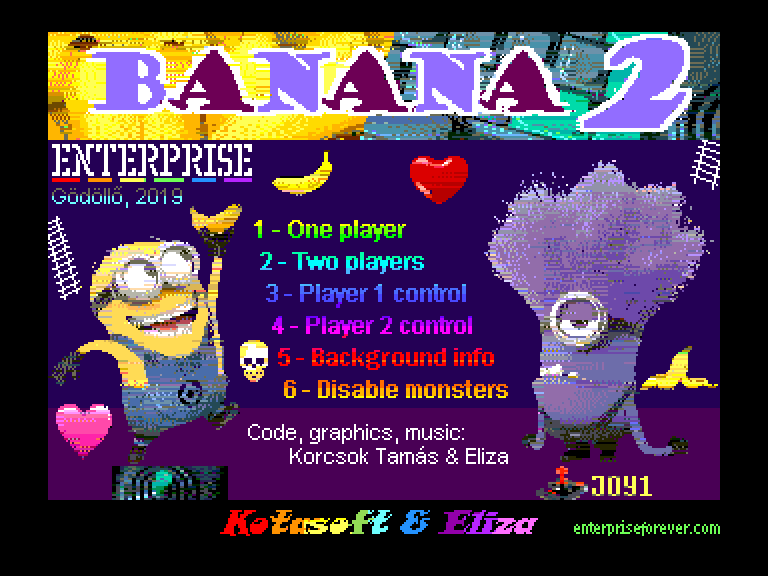
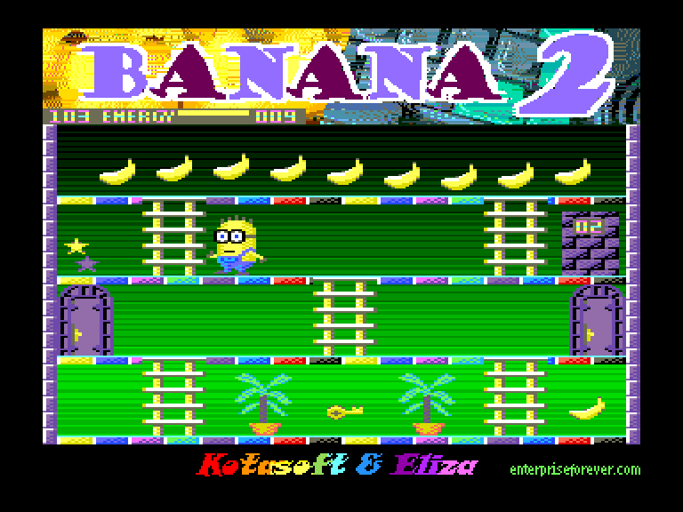
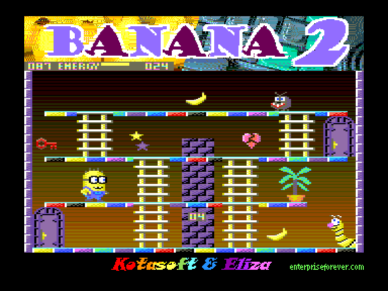
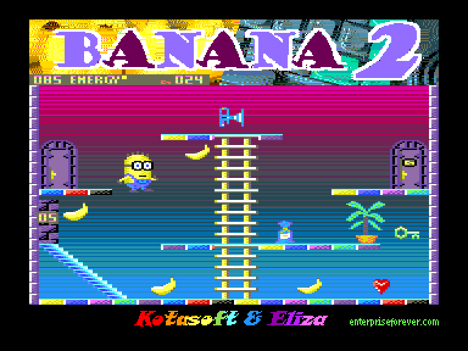

[0-9](../0/games-0.md) - [A](../a/games-a.md) - [B](../b/games-b.md) - [C](../c/games-c.md) - [D](../d/games-d.md) - [E](../e/games-e.md) - [F](../f/games-f.md) - [G](../g/games-g.md) - [H](../h/games-h.md) - [I](../i/games-i.md) - [J](../j/games-j.md) - [K](../k/games-k.md) - [L](../l/games-l.md) - [M](../m/games-m.md) - [N](../n/games-n.md) - [O](../o/games-o.md) - [P](../p/games-p.md) - [Q](../q/games-q.md) - [R](../r/games-r.md) - [S](../s/games-s.md) - [T](../t/games-t.md) - [U](../u/games-u.md) - [V](../v/games-v.md) - [W](../w/games-w.md) - [X](../x/games-x.md) - [Y](../y/games-y.md) - [Z](../z/games-z.md)

Ігри для [Enterprise 64k](../games-ep64.md) - [Enterprise 128k+RAMexp](../games-epramexp.md)

Ігри для систем [IS-DOS](../games-is-dos.md) - [SymbOS](../games-symbos.md) - [EDC Windows](../games-edcw.md)

Ігри для емуляторів [ZX Spectrum 48k/128k](../zxemu/games-zxemu.md) - [Amstrad CPC](../cpcemu/games-cpc.md) - [Sinclair ZX81](../zx81emu/games-zx81.md) - [Videoton TVC](../tvcemu/games-tvc.md) - [Commodore VIC-20](../vic20emu/games-vic20.md)

----------

# Banana 2

**ID:** banana2

**Жанри:** Аркада, Платформер, Лабіринт

## Примітка

ℹ Хоумбрю-гра.

## Скріншоти

## Опис

Посіпаки, які, як відомо, дуже люблять банани, і тепер вони самі збирають банани в різних кімнатах. Також є можливість гри для двох гравців, що відкриває фантастичні перспективи для того, щоб підставити один одного...

## Основна інформація
- **Мови:** Англійська
- **Оригінальна платформа:** Enterprise
### Загальні системні вимоги
- **Апаратні:** EP128
### Геймплей
- **Керування:** Keyboard, Internal Joy, External Joy 1, External Joy 2
- **Кількість гравців:** 1 player, 2 players (versus)
- **Додаткові теги:** 16-color mode
### Розробка
- **Рік випуску:** 2019
- **Автор:** Korcsok Tamás (Kotasoft), Eliza

## Посилання
- [Опис гри на ep128.hu (угорською)](http://www.ep128.hu/Ep_Games/Leiras/Banana_2.htm)
- [Тема на форумі enterpriseforever](https://enterpriseforever.com/jatekok/banana-2/)
- [Завантажити гру](http://www.ep128.hu/Ep_Games/Prg/Banana_2.rar)
- [Easy Load&Play](https://t.me/EP128k_Load_n_Play/85) *(Telegram-канал Vibrant Waves)*

## Відео

<iframe src="https://www.youtube.com/embed/uVIQ_sS5iew"  
style="width:75%; aspect-ratio:16/9;" allowfullscreen></iframe>

- [Відео](https://youtu.be/rBWwq4FIwSM)

## [Керування](../controllers.md)

`Keyboard`: `R`, `D`, `F`, `G`, `Q`  
`Internal Joystick`  
`External Joystick 1`  
`External Joystick 2`  

`Hold`/`Pause`: Пауза  
`Stop`/`Esc`: вийти з поточної гри (Y/N)

## Детальна інформація

### Системні вимоги  

#### Мінімальні системні вимоги  

Оперативна пам'ять: **128 КБ (або більше)**  

### Геймплей  

Ми можемо вільно переміщатися між кімнатами через двері. За винятком дверей, позначених ключем: для них потрібно знайти ключ відповідного кольору. Ключі є одноразовими, але відімкнені двері залишаються відкритими до кінця гри. Не дивуйтеся, якщо, увійшовши в двері та повернувшись назад, ви потрапите не обов'язково туди, звідки прийшли. Це відбувається не випадково: кожні двері ведуть до певної конкретної кімнати — це своєрідне ускладнення. Крізь стіни проходити не можна, а також посіпаки бережуть рослини. Однак якщо підійти до гусениці, вона зжере в одній із кімнат квітку, що заважає проходу (одна гусениця погоджується зжерти лише одну квітку). У деяких кімнатах бігають монстри (собака, череп, смердюча зброя), які відбирають енергію. У нас є лише одне життя, і якщо енергія закінчується — гра завершується! Від них можна захиститися банановою шкіркою, яку кидають кнопкою вогню, але тільки якщо у вас є банан. Одночасно в одній кімнаті можна покласти лише одну бананову шкірку, і вона на короткий час створює перешкоду для монстрів. У режимі для двох гравців посіпаки також заважають один одному скинутою ними банановою шкіркою (різного кольору), проте за кожну кинуту шкірку зменшується кількість очок.  

Стрибати ми не вміємо, але якщо звідкись падаємо, то можемо керувати собою прямо під час падіння.  

Тут не обійшлося і без предметів, які можна підбирати:  

- **Серце:** додає енергію.  
- **Розбите серце:** відбирає енергію.  
- **Ключі:** ними можна відмикати двері.  
- **Зірки:** міняють посіпак місцями. Це цікаво насамперед у режимі для двох гравців — тоді можна знищити іншого посіпаку, але й банани в такому разі збираються для іншого гравця.  
- **Кіт у мішку (сюрприз):** дає щось випадковим чином, це може бути навіть ключ. Але тільки не кота...  

Мета гри в одиночному режимі — зібрати всі 112 бананів, які є в кімнатах. У режимі для двох гравців перемагає той, хто не загине і збере більше бананів. Для спрощення можна прибрати монстрів (опція **DISABLE MONSTERS** у меню).  

### Чіти  

В меню натисніть `E` для незкінченної енергії.